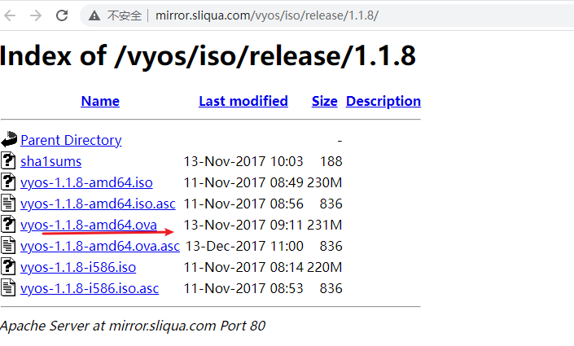
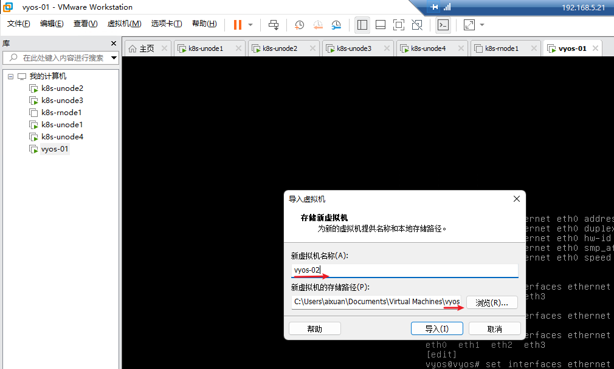
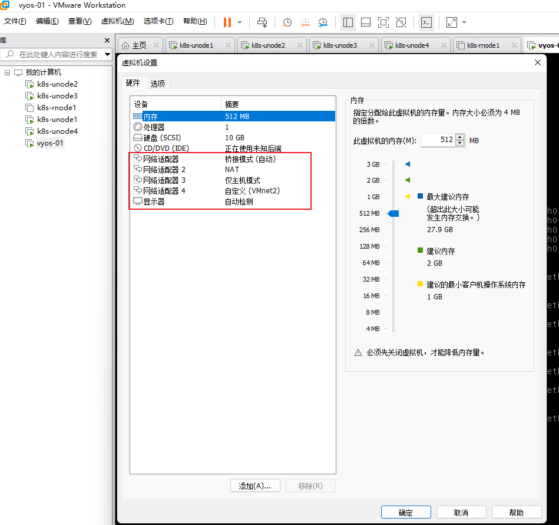
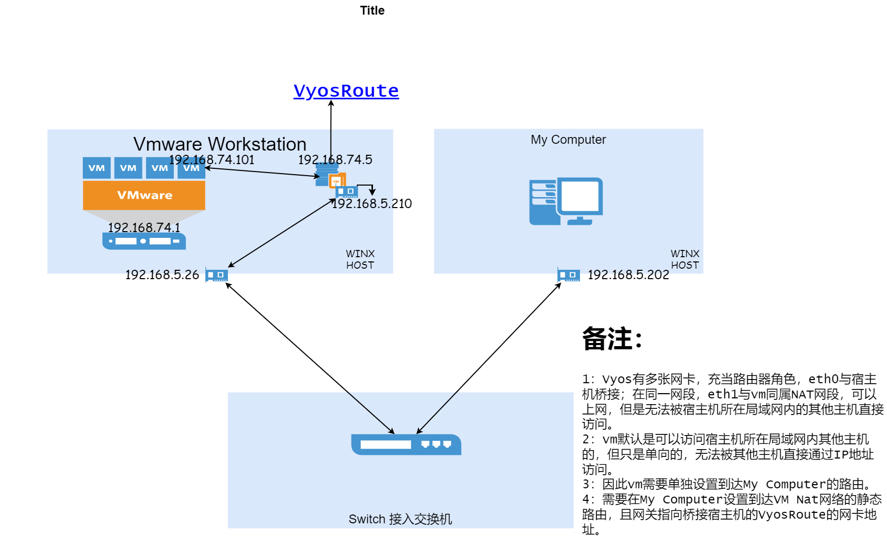
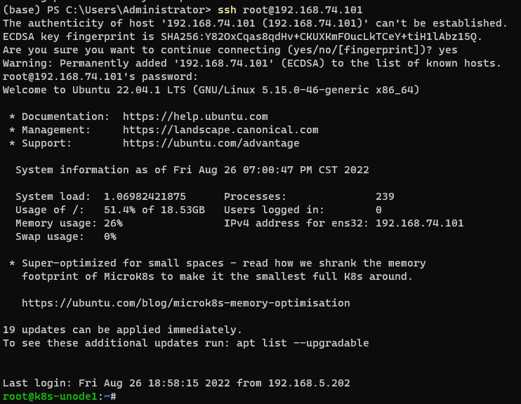

## Vyos(软路由)结合Vmware Workstation跨三层网络互通

## 安装vyos

1. 下载ovn

```plain
#下载地址
http://mirror.sliqua.com/vyos/iso/release/1.1.8/
```


这里我们选择1.1.8版本即可，如果想要详细学习vyos的话，可以去官网下载最新版本的ISO镜像进行安装。





2. 直接打开ovn文件



3. 依据您的需求添加网卡即可



**如上图所示，这里我们添加了4块网卡**

| 网卡                | 模式                         | 功能                                                         |
| ------------------- | ---------------------------- | ------------------------------------------------------------ |
| 网络适配器（eth0）  | 桥接模式                     | 使用VMnet0虚拟交换机，此时虚拟机相当于网络上的一台独立计算机与主机一样，拥有一个独立的IP地址。 |
| 网络适配器2（eth1） | NAT                          | 使用Vmnet8虚拟交换机，此时虚拟机可以通过主机单向访问网络上的其他工作站，其他工作站不能访问虚拟机。 |
| 网络适配器3（eth2） | 仅主机模式（Host-Only）      | 使用Vmnet1虚拟交换机，此时虚拟机只能与虚拟机、主机互访。也就是不能上Internet。 |
| 网络适配器4（eth3） | 自定义（这里选择的是Vmnet2） | 使用Vmnet2虚拟交换机，此时虚拟机只能与统一虚拟交换机（Vmnet2）下的虚拟机互访。 |

## 配置vyos

**操作模式和配置模式**

操作模式的命令提示符为：”$”，类似Cisco设备里面的特权模式，用于查看系统和服务状态。

配置模式的命令提示符为：”#“，在操作模式下输入“configure”命令进入配置模式，命令提示符会有”$”变成“#“；


配置eth0的IP地址，并设置SSH远程连接

vyos与我们常用的硬件路由器和交换机一样，使用`tab`键补全命令

```plain
# eth0为桥接网络
vyos@vyos:~$ configure    //进入配置模式
vyos@vyos# set system host-name vyos01  //设置路由器名称为：R1
vyos@vyos# delete interfaces ethernet eth0 address dhcp  //删除默认eth0网络接口IP地址自动获得
vyos@vyos# set interfaces ethernet eth0 address 192.168.5.210/24  //设置eth1网络接口IP地址为192.168.5.210
vyos@vyos# set protocols static route 0.0.0.0/0 next-hop 192.168.5.1  //设置静态路由
vyos@vyos# set service ssh port 22  //开通ssh服务
vyos@vyos# commit   //提交命令。运行完操作完命令后，再运行此命令用于之前命令的提交，使之生效。
vyos@vyos# save    //保存命令。将配置保存到配置文件中，不运行重启新增配置丢失，和Cisco中 write华为中save类似
vyos@vyos# exit //退出配置模式
vyos@vyos# exit discard 强制退出，放弃新修改的配置。
# 重新登录之后，可以看到hostname更改已经生效
vyos@vyos01# compare //查看历史变更版本
Possible completions:
  <Enter>	Compare working & active configurations
  saved		Compare working & saved configurations
  <N>		Compare working with revision N
  <N> <M>	Compare revision N with M

  Revisions:
    0	2022-08-26 18:03:36 vyos by cli
    1	2022-08-26 18:00:27 vyos by cli
    2	2022-08-26 17:56:12 vyos by cli
    3	2022-08-26 17:54:12 vyos by cli
    4	2022-08-26 17:46:22 vyos by cli
    5	2022-08-26 17:45:02 vyos by cli
    6	2022-08-26 17:40:49 vyos by cli
    7	2022-08-26 17:38:00 root by other
    8	2022-08-26 17:36:20 vyos by cli
    9	2022-08-26 17:34:23 vyos by cli
    10	2022-08-26 17:33:13 vyos by cli
    11	2022-08-26 17:31:54 vyos by cli
    12	2022-08-26 17:28:27 vyos by cli
    13	2022-08-26 17:24:47 vyos by cli
    14	2022-08-26 16:31:35 root by boot-config-loader
    15	2022-08-26 16:31:35 root by init

      
[edit]
```

查看设置

```plain
vyos@vyos01# compare 3 //查看编号3变更信息
[edit service ssh]
+allow-root  //”+”表示新增内容
-listen-address 192.168.5.210  //”-”表示删除内容
[edit system]
>host-name vyos01
[edit]
vyos@vyos01# rollback 3  //回滚到配置3 
vyos@vyos01:~$ configure   //进入配置模式
vyos@vyos01:~$ show configuration    //查看现有配置
vyos@vyos01:~$ show configuration commands    //以命令形式输出现有配置
vyos@vyos01:~$ show configuration commands  | strip-private  //隐藏隐私数据输出现有配置
vyos@vyos01:~$ show interfaces    //查看接口信息
vyos@vyos01:~$ show version    //查看系统软硬件信息
vyos@vyos01:~$ show configuration
vyos@vyos01:~$ show configuration commands | match eth0
```

删除配置

```plain
vyos@vyos01#delete protocols static route 0.0.0.0/0  //删除静态路由
vyos@vyos01# delete service telnet  //关闭telnet服务
vyos@vyos01# delete service ssh  //关闭ssh服务
vyos@vyos01# delete interfaces ethernet eth1 address  //删除接口地址
```

恢复默认配置

```plain
vyos@vyos01#load /opt/vyatta/etc/config.boot.default 
```

当我们配置完成之后，我们就可以使用xshell通过ssh连接到vyos进行配置。

设置时区以及时间服务器

```plain
vyos@vyos01# set system time-zone Asia/Shanghai
vyos@vyos01# set system ntp server ntp.aliyun.com
```

## 实现三层互通

#### 网络架构



#### 进行配置

1. 配置eth1（NAT模式）

```plain
vyos@vyos01# set interfaces ethernet eth1 address 192.168.74.5/24
vyos@vyos01# set interfaces ethernet eth1 description "TO NAT Vmnet8"
vyos@vyos01# commit
vyos@vyos01# save
```

1. 配置vmware workstation上虚拟机的路由

```plain
route add -host 192.168.5.202/32 gw 192.168.74.5
```

1. 配置工作站上的Windows机器的路由

```plain
PS C:\Users\Administrator> route ADD 192.168.74.0 MASK 255.255.255.0 192.168.5.210
```

1. 进行测试

```plain
PS C:\Users\Administrator> ssh root@192.168.74.101
```

1. 验证成功

