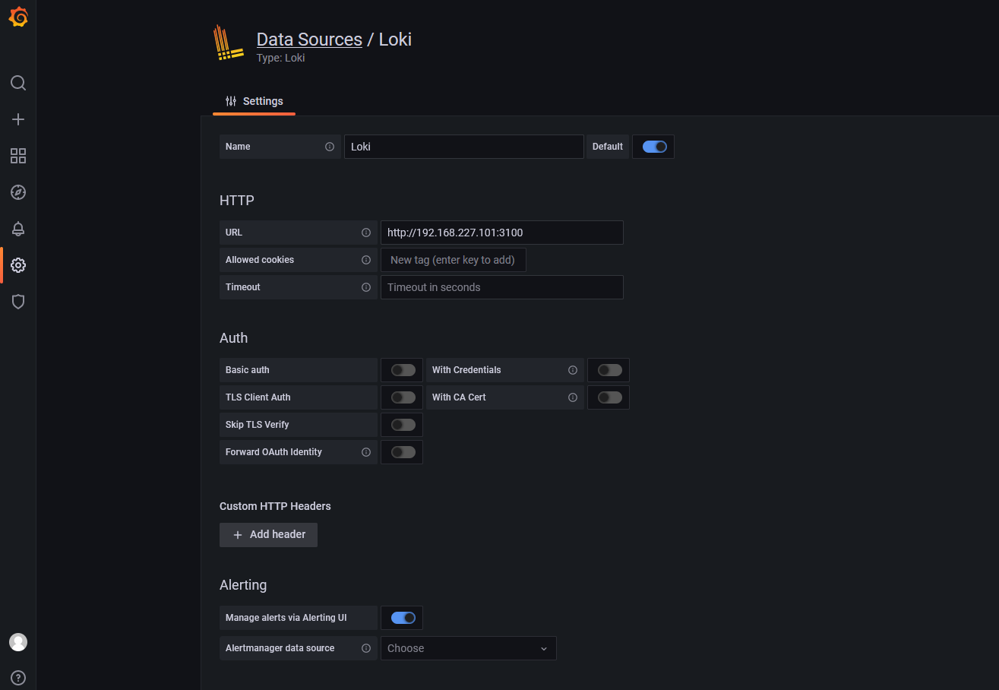
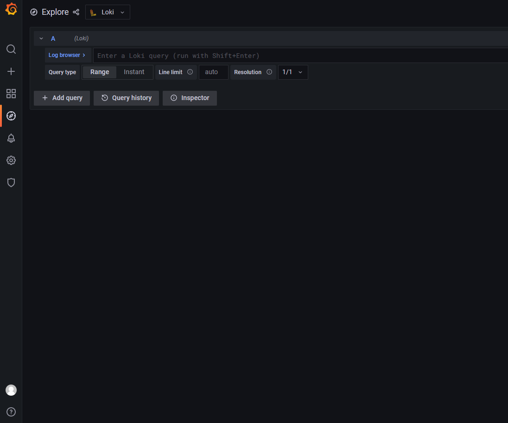
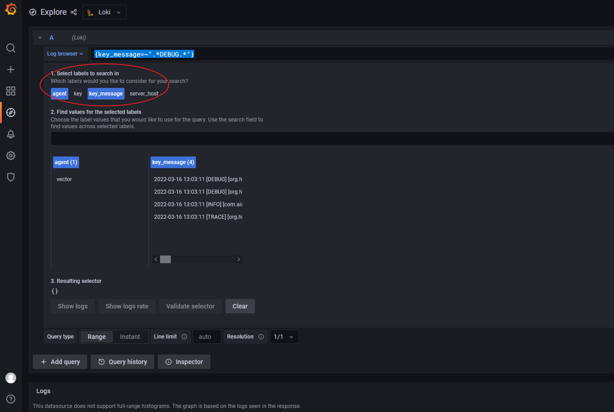
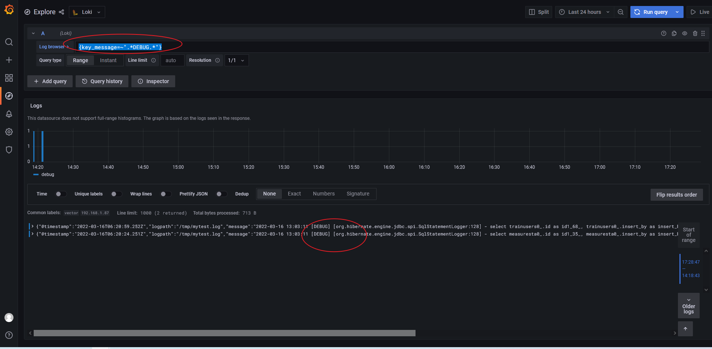

## Vector 处理kafka中日志并转发给loki


### 背景


由于之前我们使用的是elk框架，日志量较大时，感觉elasticsearch压力较大，且es集群在动态索引上遇到一些问题。

错误日志告警，使用的是[elastalert-docker](https://github.com/anjia0532/elastalert-docker)，此项目目前已暂停维护，官方的[elastalert](https://github.com/Yelp/elastalert)是不支持企业微信以及钉钉的。

之前在各种博文中，看到过关于[loki](https://github.com/grafana/loki)的介绍，此次我们想进行一些新的尝试。

由于我们之前已经使用了`Filebeat+Kafka+Logstach+Elasticsearch+Kibana`这套日志整合套件。所以我们现在保持Filebeat+Kafka的日志采集不变，现使用[vector](https://vector.dev/)替代`Logstach`进行日志过滤和标签处理，然后传给`loki`进行日志存储，再用`grafana`进行日志查询和展示。


### vector

#### 部署

这里我们使用docker-compose进行部署，更多部署细节，可参考[官方文档](https://vector.dev/docs/setup/installation/)。


```bash
root@unode1:/tools/vector# cat docker-compose.yml
```

```yaml
version: '3'

services:
  vector:
    image: timberio/vector:0.20.0-alpine
    hostname: vector
    container_name: vector
    restart: always
    network_mode: "bridge"
    volumes:
      - /etc/localtime:/etc/localtime:ro
      - ./vector.toml:/etc/vector/vector.toml
    ports:
      - 8383:8383
```

在当前目录下，定义配置文件`vector.toml`.

```toml
[sources.my_source_id]
type = "kafka"
bootstrap_servers = "172.17.123.213:9092,172.17.123.214:9092,172.17.123.215:9092"
commit_interval_ms = 1_000
fetch_wait_max_ms = 100
group_id = "consumer-vector-wwbgroup-test"
key_field = "message_key"
topic_key = "topic"
partition_key = "partition"
offset_key = "offset"
headers_key = "headers"
session_timeout_ms = 10_000
socket_timeout_ms = 60_000
topics = [ "logstash-log-test" ]


[transforms.my_transform_id]
type = "remap"
inputs = [ "my_source_id" ]
timezone = "local"
source = """
. = parse_json!(string!(.message))
.timestamp = to_unix_timestamp(to_timestamp!(.@timestamp))
del(.@metadata)
.serverhost = string!(.host.name)
del(.host)
.logpath = string!(.log.file.path)
del(.log)
.message = string!(.message)
.service_name = string!(.fields.service_name)
.topci =  string!(.fields.topic)
del(.fields) """


[sinks.my_sink_id]
type = "loki"
inputs = [ "my_transform_id" ]
endpoint = "http://192.168.227.101:3100"
compression = "none"
out_of_order_action = "drop"
remove_timestamp = true
encoding = "json"
labels.agent = "vector"
labels.service_name = "{{ service_name }}"
labels.server_host = "{{ serverhost }}"
labels.key_message = "{{ message }}"
```

这里我们的处理逻辑是，先进过`sources`读取`kafka`中的`topic`,然后通过`transforms`进行日志的过滤和处理，在通过`sinks`将日志发送到loki服务器，进行持久化存储。


#### 调试

Filebeat---->Kafka  这个过程，我们想获取到原生日志的格式，可以通过kafka的consumer脚本进行消费和测试。然后取出的格式，如下：

```bash
/usr/local/kafka262/bin/kafka-console-consumer.sh --bootstrap-server 172.17.123.213:9093,172.17.123.214:9093,172.17.123.215:9093 --topic logstash-log-test --from-beginning --group testgroup
```

```json
{
    "@timestamp":"2022-03-15T09:00:31.201Z",
    "@metadata":{
        "beat":"filebeat",
        "type":"_doc",
        "version":"7.12.1"
    },
    "host":{
        "name":"192.168.1.87"
    },
    "log":{
        "file":{
            "path":"/tmp/mytest.log"
        },
        "offset":153
    },
    "message":"2022-03-15 14:42:33 [TRACE] [org.hibernate.type.descriptor.sql.BasicBinder:64] - binding parameter [2] as [INTEGER] - [1] ",
    "fields":{
        "service_name":"abc",
        "topic":"logstash-log-test"
    }
}
```

 这是我们从kafka中读取到的原有的日志格式。可以看到，filebeat自定义了很多的字段，然后将文件按行读取的内容存储在`message`字段中，这里我们的日志是`java spring`应用的日志.

这里我们通过`vector`去`kafka`中读取日志，肯定也会附加一些其他的字段，这里我们在进行vector调试的时候，可以通过`vector`的`sink`到`console`中，进行日志格式的调试。此时`vector`的配置文件如下：

```toml
[sources.my_source_id]
type = "kafka"
bootstrap_servers = "172.17.123.213:9092,172.17.123.214:9092,172.17.123.215:9092"
commit_interval_ms = 1_000
fetch_wait_max_ms = 100
group_id = "consumer-vector-wwbgroup-test"
key_field = "message_key"
topic_key = "topic"
partition_key = "partition"
offset_key = "offset"
headers_key = "headers"
session_timeout_ms = 10_000
socket_timeout_ms = 60_000
topics = [ "logstash-log-test" ]

[sinks.my_sink_id]
type = "console"
inputs = [ "my_source_id" ]
target = "stdout"
encoding = "json"
```

我们通过`stdout`获取的源日志格式如下所示:

```json
{
    "headers":{

    },
    "message":"{\"@timestamp\":\"2022-03-15T08:53:36.194Z\",\"@metadata\":{\"beat\":\"filebeat\",\"type\":\"_doc\",\"version\":\"7.12.1\"},\"log\":{\"file\":{\"path\":\"/tmp/mytest.log\"},\"offset\":0},\"message\":\"2022-03-15 14:42:33 [TRACE] [org.hibernate.type.descriptor.sql.BasicBinder:64] - binding parameter [1] as [VARCHAR] - [2c9280857e4e10f9017f8c4c24300ac4]\",\"fields\":{\"service_name\":\"\",\"topic\":\"logstash-log-test\"},\"host\":{\"name\":\"192.168.1.87\"}}",
    "message_key":null,
    "offset":244,
    "partition":0,
    "source_type":"kafka",
    "timestamp":"2022-03-15T08:53:36.194Z",
    "topic":"logstash-log-test"
}
```

然后此时我们需要通过`transforms`进行源日志处理，由上可以看出有很多字段是我们不需要的，而且我们此时可能还需要对message中的内容进行解析。此时我们依然可以选择stdout进行调试;此时vector的配置文件如下:

```toml
[sources.my_source_id]
type = "kafka"
bootstrap_servers = "172.17.123.213:9092,172.17.123.214:9092,172.17.123.215:9092"
commit_interval_ms = 1_000
fetch_wait_max_ms = 100
group_id = "consumer-vector-wwbgroup-test"
key_field = "message_key"
topic_key = "topic"
partition_key = "partition"
offset_key = "offset"
headers_key = "headers"
session_timeout_ms = 10_000
socket_timeout_ms = 60_000
topics = [ "logstash-log-test" ]


[transforms.my_transform_id]
type = "remap"
inputs = [ "my_source_id" ]
timezone = "local"
source = """
. = parse_json!(string!(.message))
.timestamp = to_unix_timestamp(to_timestamp!(.@timestamp))
del(.@metadata)
.serverhost = string!(.host.name)
del(.host)
.logpath = string!(.log.file.path)
del(.log)
.message = string!(.message)
.service_name = string!(.fields.service_name)
.topci =  string!(.fields.topic)
del(.fields)"""


[sinks.my_sink_id]
type = "console"
inputs = [ "my_transform_id" ]
target = "stdout"
encoding = "json"
```

这里当我们调试完成之后，就可以将我们的日志往我们需要存储的地方进行`sink`了；sink到loki的完整配置文件，在部署阶段已经给出。

PS: 这里面我们使用的kafka中的groupid一直是同一个，当我们进行vector 重建时；之前消费的日志，不会再重新进行消费。

```bash
docker-compose up -d #启动vector
docker-compose down # 停止并删除vector
```

### loki

#### loki组成

- loki是主服务器，负责存储日志和处理查询。
- promtail是代理，agent，负责搜集日志并将其发送给loki。
- grafana是UI，可通过页面中的Explore，进行日志的查询。

#### 部署

通过docker-compose 快速部署loki。

如果是生产环境中，不建议这样部署。本文是为了快速进行测试以及查询。

```bash
root@unode1:/tools/loki# pwd
/tools/loki
root@unode1:/tools/loki# ls
docker-compose.yml  etc
root@unode1:/tools/loki# cat docker-compose.yml
```

```yaml
version: "3"

services:
  loki:
    image: grafana/loki:2.4.2
    hostname: loki
    container_name: loki
    restart: always
    network_mode: "bridge"
    ports:
      - "3100:3100"
    volumes:
      - ./etc:/etc/loki
      - /etc/localtime:/etc/localtime:ro
    command: -config.file=/etc/loki/loki-config.yaml


  grafana:
    image: grafana/grafana:8.3.3
    hostname: grafana
    container_name: grafana
    restart: always
    network_mode: "bridge"
    ports:
      - "3000:3000"
    volumes:
      - /etc/localtime:/etc/localtime:ro
    environment:
      GF_EXPLORE_ENABLED: "true"
```

loki的配置文件，这里loki的存储，采用的是本地文件系统，这里我们甚至都没有将存储挂载出来，因此当容器删除的时候，数据会丢失。这里的alertmanager我们没有安装。

```bash
root@unode1:/tools/loki# ls etc/loki-config.yaml
etc/loki-config.yaml
```

```yaml
auth_enabled: false

server:
  http_listen_port: 3100
  grpc_listen_port: 9096

common:
  path_prefix: /tmp/loki
  storage:
    filesystem:
      chunks_directory: /tmp/loki/chunks
      rules_directory: /tmp/loki/rules
  replication_factor: 1
  ring:
    instance_addr: 127.0.0.1
    kvstore:
      store: inmemory

schema_config:
  configs:
    - from: 2020-10-24
      store: boltdb-shipper
      object_store: filesystem
      schema: v11
      index:
        prefix: index_
        period: 24h

ruler:
  alertmanager_url: http://localhost:9093
```

#### 通过grafana查询

登录grafana，定义数据源为loki。



然后再grafana界面找到explore，默认应该就是loki，接下来，我们可以通过此页面进行日志查询。



在此界面中，我可以看到我们在vector中自己定义的标签，进行标签选择。



这里我们可以通过标签进行正则匹配，或者=好进行选择，来筛选日志。这类似于prometheus。

例如上图中：

```
{key_message=~".*DEBUG.*"}
```

查询结果如下：




#### 选择器

对于查询表达式的标签部分，将其包装在花括号中`{}`，然后使用键值对的语法来选择标签，多个标签表达式用逗号分隔，比如：

```
{key_message=~".*DEBUG.*",server_host="192.168.1.87"}
```

目前支持以下标签匹配运算符：

- `=`等于
- `!=`不相等
- `=~`正则表达式匹配
- `!~`不匹配正则表达式

### 参考文档

- vector官方文档：`https://vector.dev/docs/reference/configuration/sources/kafka/`

- loki的docker-compose安装文档：`https://grafana.com/docs/loki/latest/installation/docker/`

- vector定义sinks到loki中`labels.*` 的定义：`https://github.com/vectordotdev/vector/issues/6435`

- loki官方的local配置文件：`https://github.com/grafana/loki/blob/main/cmd/loki/loki-local-config.yaml`

- vector官方的vrl语言处理日志：`https://vector.dev/docs/reference/vrl/`

- vector官方安装：`https://vector.dev/docs/setup/installation/`

- vector sink to loki：`https://vector.dev/docs/reference/configuration/sinks/loki/`
- grafana日志聚合工具：`https://www.qikqiak.com/post/grafana-log-tool-loki/`


