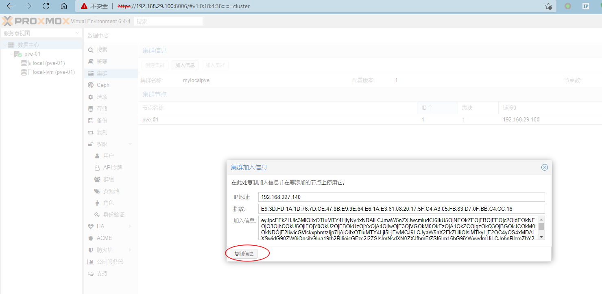

## 基于proxmox6.4搭建cephfs集群

本文档是实验环境。

基于vmware搭建的3台虚拟机。双网卡，双硬盘。

参考的PDF文档：`https://qabwmobile.com.au/wp-content/uploads/2021/04/proxmox-%E6%90%AD%E5%BB%BAceph%E6%9C%8D%E5%8A%A1.pdf`

### 修改国内源


```bash
sed -i 's|ftp.debian.org|mirrors.aliyun.com|g' /etc/apt/sources.list
sed -i 's|security.debian.org|mirrors.aliyun.com/debian-security|g' /etc/apt/sources.list
rm /etc/apt/sources.list.d/pve-enterprise.list
echo "deb http://download.proxmox.wiki/debian buster pve-no-subscription" >> /etc/apt/sources.list.d/pve-no-subscription.list
apt update
```

修改ceph安装时的源

```bash
#这里安装ceph的时候，会通过该perl5的脚本文件，进行安装源的初始化。这里我们修改为国内的源
cp /usr/share/perl5/PVE/CLI/pveceph.pm /usr/share/perl5/PVE/CLI/pveceph.pm_back
sed -i 's|http://download.proxmox.com|http://download.proxmox.wiki|g' /usr/share/perl5/PVE/CLI/pveceph.pm
```

**参考proxmox中文社区**

**https://www.proxmox.wiki/**

**http://download.proxmox.wiki  此为中文社区的同步镜像源**


### 配置集群

这里我们基于web UI来进行集群的管理和配置。





如上图所示，安装完成。

### 安装ceph

先基于管理网络创建集群，这里我们采用的是双网卡。

IP地址： 192.168.29.100/24 这里我们认为是管理网段，集群网段。

IP地址：192.168.227.140/24 这里我们认为是集群的虚拟机以及ceph集群的数据通信网段。


这里我们先基于管理网段创建集群。可直接在web-ui中直接创建。如下图所示：


安装完成后，可以进行配置，我这里web UI 安装时，发生了错误，导致无法进行下一步，进行配置，此时我们需要使用命令进行配置

### 配置ceph

如果我们不选择如上web UI界面进行安装，可以采用命令行的方式进行安装。

以下命令3个节点都需要执行：

```bash
pveceph install
pveceph init --network 192.168.227.0/24 --cluster-network 192.168.29.0/24
```

创建监控以及MGR，MGR必须要运行，一个ceph集群最少需要三个mon.在没有创建mon的服务器上需要单独创建mgr。

```bash
pveceph createmon
pveceph createmgr
```

创建osd

```bash
#这里的sdb是一块单独的硬盘，三个节点上都需运行。
pveceph createosd /dev/sdb
```

创建osd的存储池

```bash
ceph osd pool create pve-pool 128 128
```

少于 5 个 OSD 时可把 pg_num 设置为 128;OSD 数量在 5 到 10 个时，可把 pg_num 设置为 512;OSD 数量在 10 到 50 个时，可把 pg_num 设置为 4096.

后续关于ceph的概念和基础还需要继续了解；暂时更新到这。