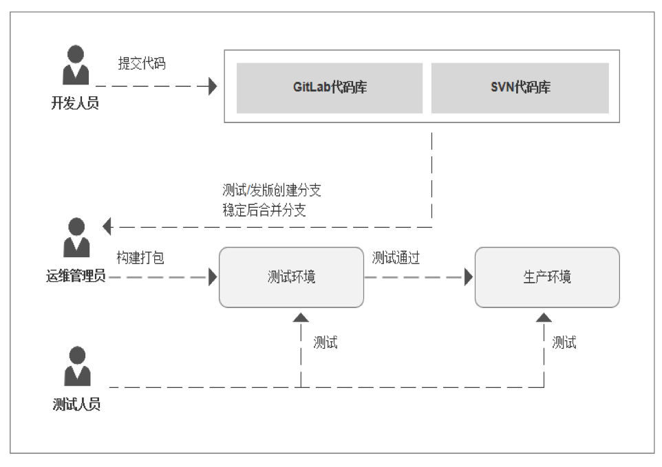
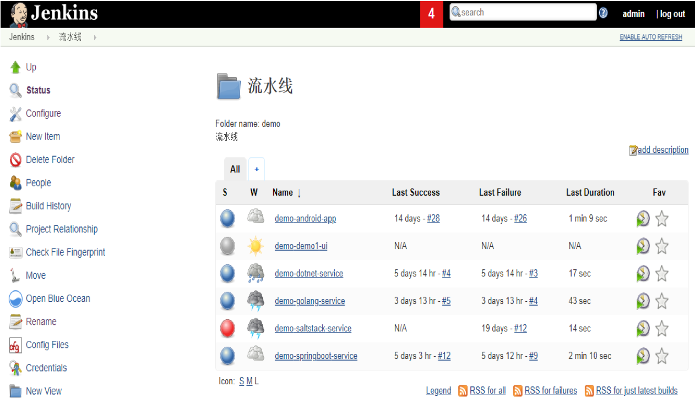
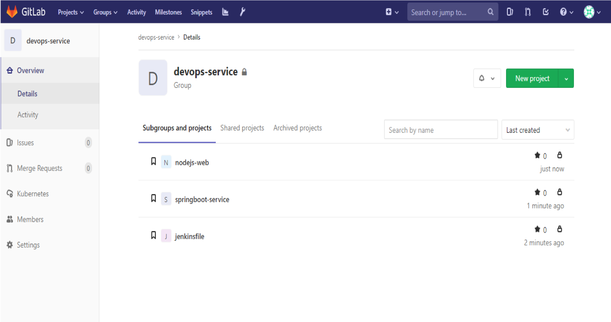

# 01-为什么要做CI/CD？

## 背景-传统的应用开发发布模式

**开发团队** 在开发环境中完成软件开发，单元测试，测试通过，提交到代码版本管理库。

**运维团队** 把应用部署到测试环境，供QA团队测试，测试通过后部署生产环境。

**QA 团队** 进行测试，测试通过后通知部署人员发布到生产环境。

### 问题

**错误发现不及时**  很多 错误在项目的早期可能就存在，到最后集成的时候才发现问题。

**人工低级错误发生** 产品和服务交付中的关键活动全都需要手动操作。

**团队工作效率低** 需要等待他人的工作完成后才能进行自己的工作。

**开发运维对立 **  开发人员想要快速更新，运维人员追求稳定，各自的针对的方向不同。

经过上述问题我们需要作出改变，如何改变？

---

## 持续集成与持续交付

软件开发的连续方法基于自动执行脚本，以最大程度地减少在开发应用程序时引入错误的机会。从开发新代码到部署新代码，他们几乎不需要人工干预，甚至根本不需要干预。

它涉及到在每次小的迭代中就不断地构建，测试和部署代码更改，从而减少了基于错误或失败的先前版本开发新代码的机会。

此方法有三种主要方法，每种方法都将根据最适合您的策略的方式进行应用。

### 持续集成 （CI）

持续合并开发人员正在开发编写的所有代码的一种做法。通常一天内进行多次合并和提交代码，从存储库或生产环境中进行构建和自动化测试，以确保没有集成问题并及早发现任何问题。

**开发人员提交代码的时候一般先在本地测试验证，只要开发人员提交代码到版本控制系统就会触发一条提交流水线，对本次提交进行验证。**

### 持续交付 （CD）

[持续交付](https://continuousdelivery.com/)是超越持续集成的一步。不仅会在推送到代码库的每次代码更改时都进行构建和测试，而且，作为附加步骤，即使部署是手动触发的，它也可以连续部署。此方法可确保自动检查代码，但需要人工干预才能从策略上手动触发更改的部署。

### 持续部署   (CD)

通常可以通过将更改自动推送到发布系统来随时将软件发布到生产环境中。持续部署 会更进一步，并自动将更改推送到生产中。类似于持续交付，[持续部署](https://www.airpair.com/continuous-deployment/posts/continuous-deployment-for-practical-people)也是超越持续集成的又一步。不同之处在于，您无需将其手动部署，而是将其设置为自动部署。部署您的应用程序完全不需要人工干预。

---

## CICD的价值体现

- 尽早反馈，尽早发现错误。
- 减少集成问题，每次发现问题当时解决，避免问题堆积。
- 每次更改都能成功发布，降低发布风险。
- 更加频繁的交付价值，客户反馈。

---

## 推荐常用的CI/CD工具

### Jenkins

专业的CI工具，可扩展自动化服务器、安装配置简单、丰富的插件库、分布式架构设计、支持所有的平台、可视化的管理页面。

### GitLab

端到端DevOps工具，常用功能：代码审查、问题跟踪、动态订阅、易于扩展、项目wiki、多角色项目管理、项目代码在线编译预览、CI工具集成。

提交合并代码集成 ：通过git push 进行操作或者在GitLab Web页面操作。

发布应用到服务器 ： 获取制品库中的应用，然后用salt、ansible发布部署到服务器。

完全自动化： 提交代码-> 构建部署 -> 发布

