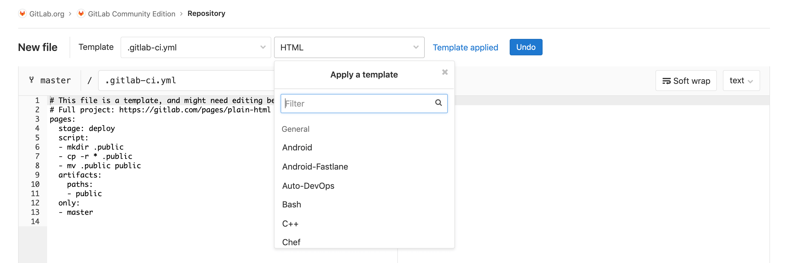
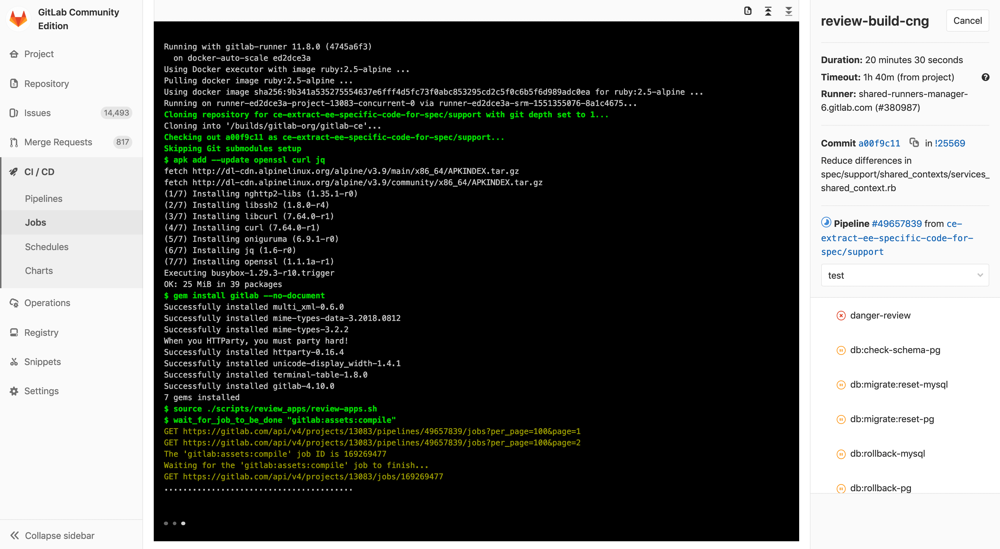

# 02-GitLab CI/CD功能简介

## GitLab 内置持续集成功能

### 持续集成 （CI）
- 集成团队中每个开发人员提交的代码到代码存储库中。
- 开发人员在Merge或者Pull请求中合并拉取新代码。
- 在提交或者合并更改到代码存储库之前，会触发了构建，测试和新代码验证的管道。
- CI可帮助您在开发周期的早期发现并减少错误

### 连续交付 （CD） 
- 可通过结构化的部署管道确保将经过CI验证的代码交付给您的应用程序。
- CD可以将经过验证的代码更快地移至您的应用程序。

CI/CD 一起 可以加快团队为客户和利益相关者交付成果的速度。CI和CD必须无缝协作，以使您的团队快速有效地进行构建，并且对于确保完全优化的开发实践至关重要。

---

## GitLab CI/CD优势

- 开源： CI/CD是开源GitLab社区版和专有GitLab企业版的一部分。

- 易于学习： 具有详细的入门文档。

- 无缝集成： GitLab CI / CD是GitLab的一部分，支持从计划到部署,具有出色的用户体验。

- 可扩展： 测试可以在单独的计算机上分布式运行，可以根据需要添加任意数量的计算机。

- 更快的结果： 每个构建可以拆分为多个作业，这些作业可以在多台计算机上并行运行。

- 针对交付进行了优化： 多个阶段，手动部署， 环境 和 变量。

  

---

## GitLab CI/CD特点

- 多平台： Unix，Windows，macOS和任何其他支持Go的平台上执行构建。
- 多语言： 构建脚本是命令行驱动的，并且可以与Java，PHP，Ruby，C和任何其他语言一起使用。
- 稳定构建： 构建在与GitLab不同的机器上运行。
- 并行构建： GitLab CI / CD在多台机器上拆分构建，以实现快速执行。
- 实时日志记录： 合并请求中的链接将您带到动态更新的当前构建日志。
- 灵活的管道： 您可以在每个阶段定义多个并行作业，并且可以 触发其他构建。

- 版本管道： 一个 .gitlab-ci.yml文件 包含您的测试，整个过程的步骤，使每个人都能贡献更改，并确保每个分支获得所需的管道。
- 自动缩放： 您可以 自动缩放构建机器，以确保立即处理您的构建并将成本降至最低。
- 构建工件： 您可以将二进制文件和其他构建工件上载到 GitLab并浏览和下载它们。
- Docker支持： 可以使用自定义Docker映像， 作为测试的一部分启动 服务， 构建新的Docker映像，甚至可以在Kubernetes上运行。
- 容器注册表： 内置的容器注册表， 用于存储，共享和使用容器映像。
- 受保护的变量： 在部署期间使用受每个环境保护的变量安全地存储和使用机密。
- 环境： 定义多个环境。

---

## GitLab CI/CD架构

### GitLab CI / CD 

GitLab的一部分，GitLab是一个Web应用程序，具有将其状态存储在数据库中的API。
除了GitLab的所有功能之外，它还管理项目/构建并提供一个不错的用户界面。

### GitLab Runner 

是一个处理构建的应用程序。
它可以单独部署，并通过API与GitLab CI / CD一起使用。

### .gitlab-ci.yml

定义流水线作业运行，位于应用项目根目录下 。

**为了运行测试，至少需要一个 GitLab 实例、一个 GitLab Runner、一个gitlab-ci文件**

---

## GitLab CI/CD工作原理

- 将代码托管到Git存储库。

- 在项目根目录创建ci文件 `.gitlab-ci.yml` ，在文件中指定构建，测试和部署脚本。

- GitLab将检测到它并使用名为GitLab Runner的工具运行脚本。

- 脚本被分组为**作业**，它们共同组成了一个**管道**。

  

管道状态也会由GitLab显示：

最后，如果出现任何问题，可以轻松地 [回滚](https://docs.gitlab.com/12.9/ee/ci/environments.html#retrying-and-rolling-back)所有更改：

---

