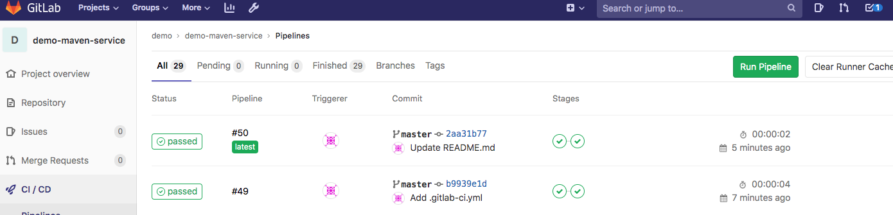

# 运行流水线任务


## 编写一个简单的yaml文件

```
stages:
  - build
  - deploy
 

build:
  stage: build
  tags:
    - build
  only:
    - master
  script:
    - echo "mvn clean "
    - echo "mvn install"


deploy:
  stage: deploy
  tags:
    - deploy
  only:
    - master
  script:
    - echo "hello deploy"

```


## 测试流水线




