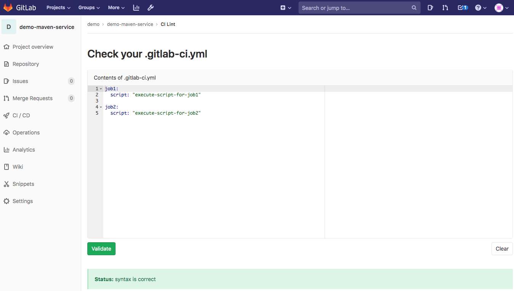

# 流水线语法

https://zhuanlan.zhihu.com/p/122449725  k8s发布

https://zhuanlan.zhihu.com/p/82303318  GitlabCI/CD

这里写一些流水线语法的总结

- 注意事项
- 学习方法
- 编写思路
- 问题解决
- 学完目的

### 流水线语法有哪些？ 流水线参数列表

| Keyword                                                      | Description                                                  |
| :----------------------------------------------------------- | :----------------------------------------------------------- |
| [`script`](http://s0docs0gitlab0com.icopy.site/12.9/ee/ci/yaml/README.html#script) | 运行的Shell命令或脚本。                                      |
| [`image`](http://s0docs0gitlab0com.icopy.site/12.9/ee/ci/yaml/README.html#image) | 使用docker映像。                                             |
| [`services`](http://s0docs0gitlab0com.icopy.site/12.9/ee/ci/yaml/README.html#services) | 使用docker服务映像。                                         |
| [`before_script`](http://s0docs0gitlab0com.icopy.site/12.9/ee/ci/yaml/README.html#before_script-and-after_script) | 在作业运行前运行脚本。                                       |
| [`after_script`](http://s0docs0gitlab0com.icopy.site/12.9/ee/ci/yaml/README.html#before_script-and-after_script) | 在作业运行后运行脚本。                                       |
| [`stages`](http://s0docs0gitlab0com.icopy.site/12.9/ee/ci/yaml/README.html#stages) | 定义管道中的阶段，运行顺序。                                 |
| [`stage`](http://s0docs0gitlab0com.icopy.site/12.9/ee/ci/yaml/README.html#stage) | 为job定义一个阶段，可选，未指定默认为test阶段。              |
| [`only`](http://s0docs0gitlab0com.icopy.site/12.9/ee/ci/yaml/README.html#onlyexcept-basic) | 限制创建作业的条件。                                         |
| [`except`](http://s0docs0gitlab0com.icopy.site/12.9/ee/ci/yaml/README.html#onlyexcept-basic) | 限制未创建作业的条件。                                       |
| [`rules`](http://s0docs0gitlab0com.icopy.site/12.9/ee/ci/yaml/README.html#rules) | 条件列表，用于评估和确定作业的选定属性，以及是否创建该作业。不能`only`与/ `except`一起使用。 |
| [`tags`](http://s0docs0gitlab0com.icopy.site/12.9/ee/ci/yaml/README.html#tags) | 用于选择Runner的标签列表。                                   |
|                                                              |                                                              |
| [`allow_failure`](http://s0docs0gitlab0com.icopy.site/12.9/ee/ci/yaml/README.html#allow_failure) | 允许作业失败，失败的job不会影响提交状态。                    |
| [`when`](http://s0docs0gitlab0com.icopy.site/12.9/ee/ci/yaml/README.html#when) | 什么时候开始运行工作。                                       |
| [`environment`](http://s0docs0gitlab0com.icopy.site/12.9/ee/ci/yaml/README.html#environment) | 作业部署到的环境的名称。                                     |
| [`cache`](http://s0docs0gitlab0com.icopy.site/12.9/ee/ci/yaml/README.html#cache) | 在后续运行之间应缓存的文件列表。                             |
| [`artifacts`](http://s0docs0gitlab0com.icopy.site/12.9/ee/ci/yaml/README.html#artifacts) | 成功时附加到作业的文件和目录列表。                           |
| [`dependencies`](http://s0docs0gitlab0com.icopy.site/12.9/ee/ci/yaml/README.html#dependencies) | 通过提供要从中获取工件的作业列表，限制将哪些工件传递给特定作业。 |
| [`retry`](http://s0docs0gitlab0com.icopy.site/12.9/ee/ci/yaml/README.html#retry) | 发生故障时可以自动重试作业的时间和次数。                     |
| [`timeout`](http://s0docs0gitlab0com.icopy.site/12.9/ee/ci/yaml/README.html#timeout) | 定义自定义作业级别的超时，该超时优先于项目范围的设置。       |
| [`parallel`](http://s0docs0gitlab0com.icopy.site/12.9/ee/ci/yaml/README.html#parallel) | 多个作业并行运行。                                           |
| [`trigger`](http://s0docs0gitlab0com.icopy.site/12.9/ee/ci/yaml/README.html#trigger) | 定义下游管道触发。                                           |
| [`include`](http://s0docs0gitlab0com.icopy.site/12.9/ee/ci/yaml/README.html#include) | 允许此作业包括外部YAML文件。                                 |
| [`extends`](http://s0docs0gitlab0com.icopy.site/12.9/ee/ci/yaml/README.html#extends) | 该作业将要继承的配置条目。                                   |
| [`pages`](http://s0docs0gitlab0com.icopy.site/12.9/ee/ci/yaml/README.html#pages) | 上载作业结果以用于GitLab页面。                               |
| [`variables`](http://s0docs0gitlab0com.icopy.site/12.9/ee/ci/yaml/README.html#variables) | 在作业级别上定义作业变量。                                   |

### 如何检查语法错误？ 流水线语法检测

GitLab CI的每个实例都有一个称为Lint的嵌入式调试工具，该工具可以验证`.gitlab-ci.yml`文件的内容. 

---

