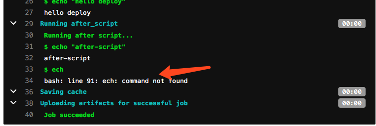
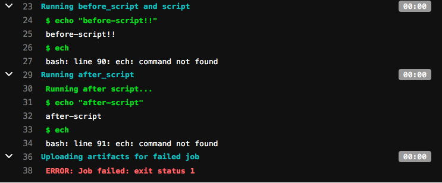
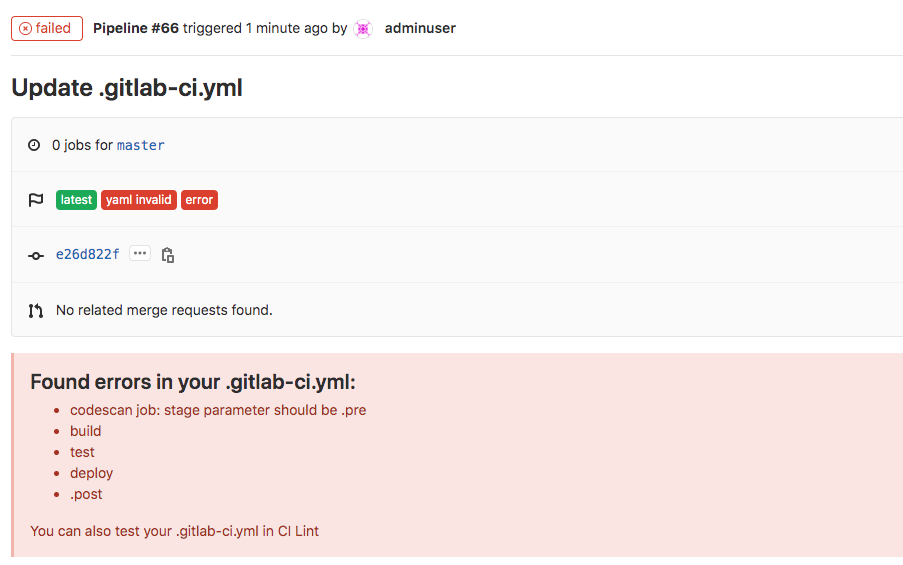
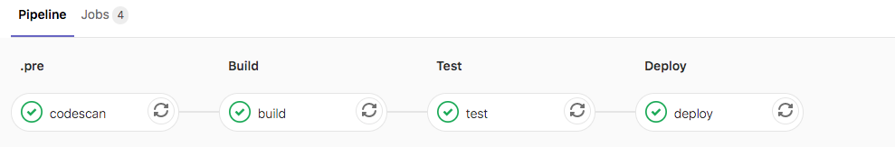
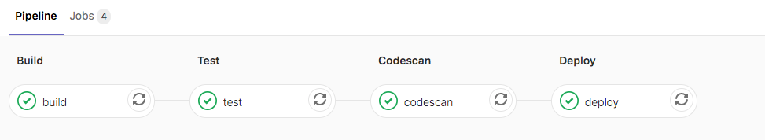
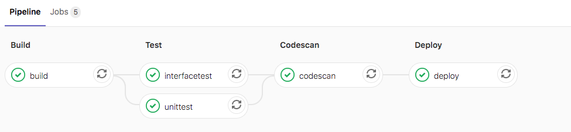
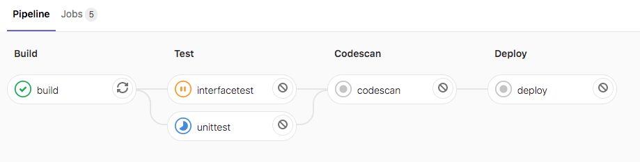
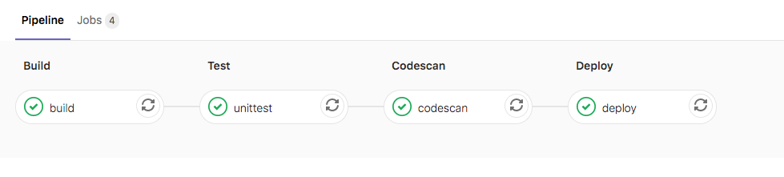
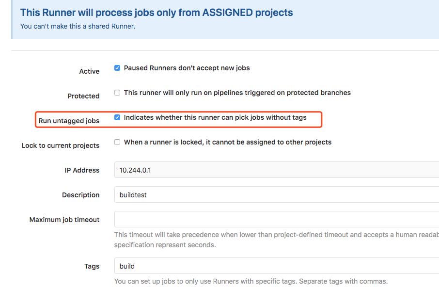

# Pipeline 基础语法


### job

在每个项目中，我们使用名为`.gitlab-ci.yml`的YAML文件配置GitLab CI / CD 管道。

- 可以定义一个或多个作业(job)。
- 每个作业必须具有唯一的名称（不能使用关键字）。
- 每个作业是独立执行的。
- 每个作业至少要包含一个script。 


```
job1:
  script: "execute-script-for-job1"

job2:
  script: "execute-script-for-job2"
```


注释： 这里在pipeline中定义了两个作业，每个作业运行不同的命令。命令可以是shell或脚本。


---

### script

```
job:
  script:
    - uname -a
    - bundle exec rspec
```

**注意：**有时， `script`命令将需要用单引号或双引号引起来. 例如，包含冒号命令（ `:` ）需要加引号，以便被包裹的YAML解析器知道来解释整个事情作为一个字符串，而不是一个"键：值"对. 使用特殊字符时要小心： `:` ， `{` ， `}` ， `[` ， `]` ， `,` ， `&` ， `*` ， `#` ， `?` ， `|` ， `-` ， `<` ， `>` ， `=` `!` ， `%` ， `@` ， ``` .


### before_script

用于定义一个命令，该命令在每个作业之前运行。必须是一个数组。指定的[`script`](http://s0docs0gitlab0com.icopy.site/12.9/ee/ci/yaml/README.html#script)与主脚本中指定的任何脚本串联在一起，并在单个shell中一起执行。


### after_script

用于定义将在每个作业（包括失败的作业）之后运行的命令。这必须是一个数组。指定的脚本在新的shell中执行，与任何`before_script`或`script`脚本分开。

可以在全局定义，也可以在job中定义。在job中定义会覆盖全局。

```
before_script:
  - echo "before-script!!"

variables:
  DOMAIN: example.com

stages:
  - build
  - deploy
 

build:
  before_script:
    - echo "before-script in job"
  stage: build
  script:
    - echo "mvn clean "
    - echo "mvn install"
  after_script:
    - echo "after script in job"


deploy:
  stage: deploy
  script:
    - echo "hello deploy"
    
after_script:
  - echo "after-script"
```


after_script失败不会影响作业失败。



before_script失败导致整个作业失败，其他作业将不再执行。作业失败不会影响after_script运行。




---

### stages

用于定义作业可以使用的阶段，并且是全局定义的。同一阶段的作业并行运行，不同阶段按顺序执行。

```
stages：
  - build
  - test
  - deploy
```

这里定义了三个阶段，首先build阶段并行运行，然后test阶段并行运行，最后deploy阶段并行运行。deploy阶段运行成功后将提交状态标记为passed状态。如果任何一个阶段运行失败，最后提交状态为failed。

**未定义stages**

全局定义的stages是来自于每个job。如果job没有定义stage则默认是test阶段。如果全局未定义stages,则按顺序运行 build,test,deploy。 



如果作业中定义了其他阶段，例如"codescan"则会出现错误。原因是因为除了build test deploy阶段外的其他阶段作为.pre运行（也就是作为第一个阶段运行，需要将此作业的stage指定为.pre）。



```
codescan:
  stage: .pre
  script:
    - echo "codescan"
```


**定义stages控制stage运行顺序**

一个标准的yaml文件中是需要定义stages，可以帮助我们对每个stage进行排序。

```
stages:
  - build
  - test
  - codescan
  - deploy
```





### .pre & .post

.pre始终是整个管道的第一个运行阶段，.post始终是整个管道的最后一个运行阶段。 用户定义的阶段都在两者之间运行。`.pre`和`.post`的顺序无法更改。如果管道仅包含`.pre`或`.post`阶段的作业，则不会创建管道。


---


### stage

是按JOB定义的，并且依赖于全局定义的[`stages`](http://s0docs0gitlab0com.icopy.site/12.9/ee/ci/yaml/README.html#stages) 。 它允许将作业分为不同的阶段，并且同一`stage`作业可以并行执行（取决于[特定条件](http://s0docs0gitlab0com.icopy.site/12.9/ee/ci/yaml/README.html#using-your-own-runners) ）。

```
unittest:
  stage: test
  script:
    - echo "run test"
    
interfacetest:
  stage: test
  script:
    - echo "run test"
```



可能遇到的问题： 阶段并没有并行运行。

在这里我把这两个阶段在同一个runner运行了，所以需要修改runner每次运行的作业数量。默认是1，改为10.



vim /etc/gitlab-runner/config.toml 更改后自动加载无需重启。

```
concurrent = 10
```


---


### variables

定义变量，pipeline变量、job变量、Runner变量。job变量优先级最大。

---


## 综合实例

综合实例:

```
before_script:
  - echo "before-script!!"

variables:
  DOMAIN: example.com
  
stages:
  - build
  - test
  - codescan
  - deploy

build:
  before_script:
    - echo "before-script in job"
  stage: build
  script:
    - echo "mvn clean "
    - echo "mvn install"
    - echo "$DOMAIN"
  after_script:
    - echo "after script in buildjob"

unittest:
  stage: test
  script:
    - echo "run test"

deploy:
  stage: deploy
  script:
    - echo "hello deploy"
    - sleep 2;
  
codescan:
  stage: codescan
  script:
    - echo "codescan"
    - sleep 5;
 
after_script:
  - echo "after-script"
  - ech
```


实验效果




可能遇到的问题： pipeline卡主,为降低复杂性目前没有学习tags，所以流水线是在共享的runner中运行的。需要设置共享的runner运行没有tag的作业。




