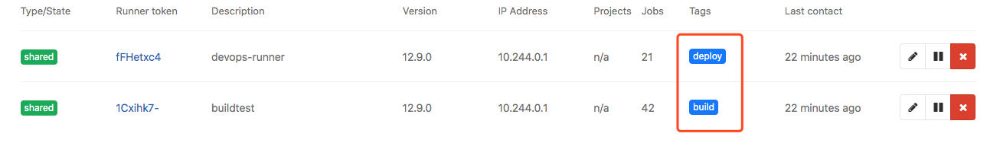
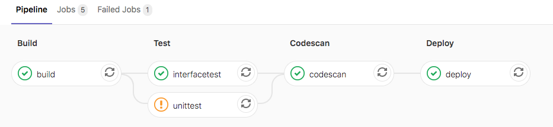
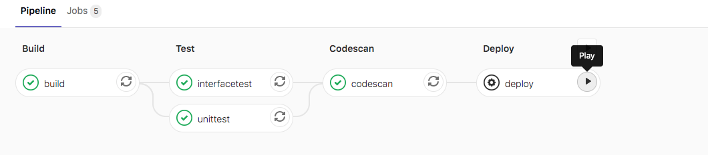
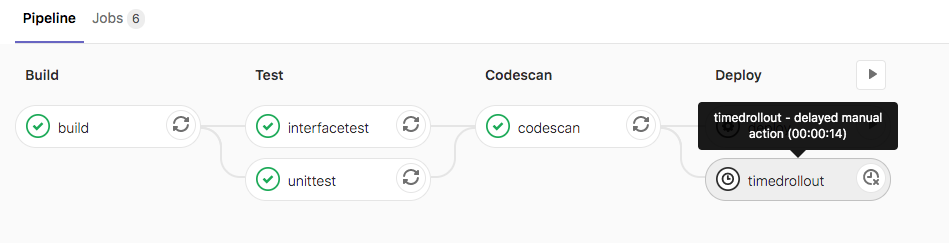
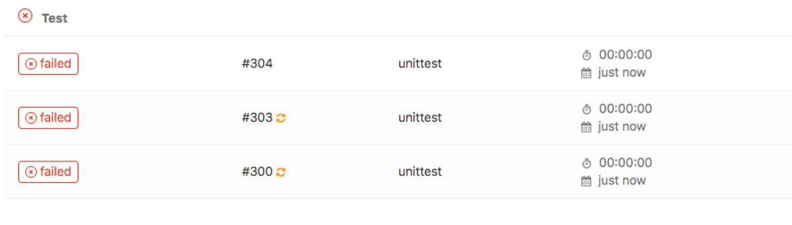
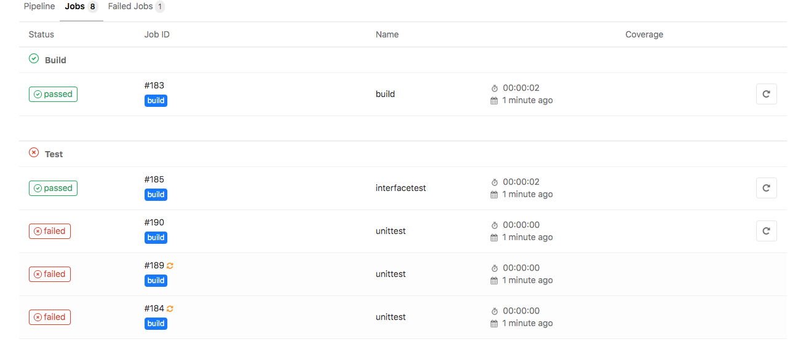
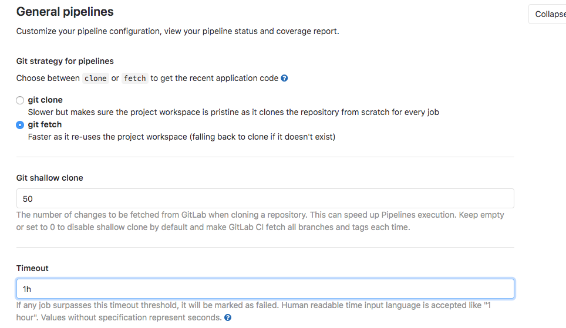
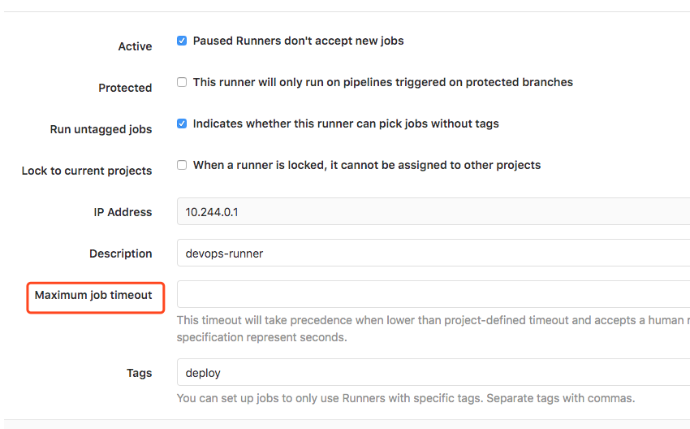
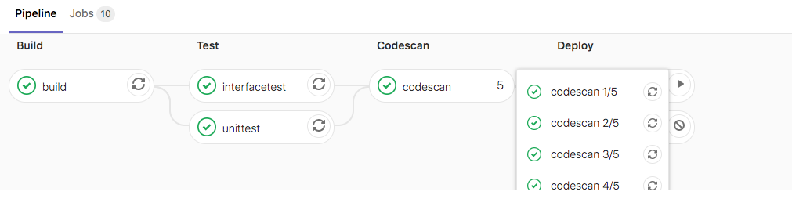

# pipeline 语法


### tags

用于从允许运行该项目的所有Runner列表中选择特定的Runner,在Runner注册期间，您可以指定Runner的标签。

`tags`可让您使用指定了标签的跑步者来运行作业,此runner具有ruby和postgres标签。

```
job:
  tags:
    - ruby
    - postgres
```


给定带有`osx`标签的OS X Runner和带有`windows`标签的Windows Runner，以下作业将在各自的平台上运行。

```
windows job:
  stage:
    - build
  tags:
    - windows
  script:
    - echo Hello, %USERNAME%!

osx job:
  stage:
    - build
  tags:
    - osx
  script:
    - echo "Hello, $USER!"
```




---


### allow_failure

`allow_failure`允许作业失败，默认值为`false` 。启用后，如果作业失败，该作业将在用户界面中显示橙色警告. 但是，管道的逻辑流程将认为作业成功/通过，并且不会被阻塞。 假设所有其他作业均成功，则该作业的阶段及其管道将显示相同的橙色警告。但是，关联的提交将被标记为"通过"，而不会发出警告。

```
job1:
  stage: test
  script:
    - execute_script_that_will_fail
  allow_failure: true
```




---


### when

`on_success`前面阶段中的所有作业都成功（或由于标记为`allow_failure`而被视为成功）时才执行作业。 这是默认值。

`on_failure`当前面阶段出现失败则执行。

`always` -执行作业，而不管先前阶段的作业状态如何，放到最后执行。总是执行。


#### manual 手动

`manual` -手动执行作业,不会自动执行，需要由用户显式启动. 手动操作的示例用法是部署到生产环境. 可以从管道，作业，环境和部署视图开始手动操作。

此时在deploy阶段添加manual，则流水线运行到deploy阶段为锁定状态，需要手动点击按钮才能运行deploy阶段。




#### delayed 延迟

`delayed` 延迟一定时间后执行作业（在GitLab 11.14中已添加）。 

有效值`'5',10 seconds,30 minutes, 1 day, 1 week` 。




实验demo

```
before_script:
  - echo "before-script!!"

variables:
  DOMAIN: example.com
  
stages:
  - build
  - test
  - codescan
  - deploy

build:
  before_script:
    - echo "before-script in job"
  stage: build
  script:
    - echo "mvn clean "
    - echo "mvn install"
    - echo "$DOMAIN"
  after_script:
    - echo "after script in buildjob"

unittest:
  stage: test
  script:
    - ech "run test"
  when: delayed
  start_in: '30'
  allow_failure: true
  

deploy:
  stage: deploy
  script:
    - echo "hello deploy"
    - sleep 2;
  when: manual
  
codescan:
  stage: codescan
  script:
    - echo "codescan"
    - sleep 5;
  when: on_success
 
after_script:
  - echo "after-script"
  - ech
  

```


----


### retry

配置在失败的情况下重试作业的次数。

当作业失败并配置了`retry` ，将再次处理该作业，直到达到`retry`关键字指定的次数。如果`retry`设置为2，并且作业在第二次运行成功（第一次重试），则不会再次重试. `retry`值必须是一个正整数，等于或大于0，但小于或等于2（最多两次重试，总共运行3次）.

```
unittest:
  stage: test
  retry: 2
  script:
    - ech "run test"
```





默认情况下，将在所有失败情况下重试作业。为了更好地控制`retry`哪些失败，可以是具有以下键的哈希值：

- `max` ：最大重试次数.
- `when` ：重试失败的案例.

根据错误原因设置重试的次数。

```
always ：在发生任何故障时重试（默认）.
unknown_failure ：当失败原因未知时。
script_failure ：脚本失败时重试。
api_failure ：API失败重试。
stuck_or_timeout_failure ：作业卡住或超时时。
runner_system_failure ：运行系统发生故障。
missing_dependency_failure: 如果依赖丢失。
runner_unsupported ：Runner不受支持。
stale_schedule ：无法执行延迟的作业。
job_execution_timeout ：脚本超出了为作业设置的最大执行时间。
archived_failure ：作业已存档且无法运行。
unmet_prerequisites ：作业未能完成先决条件任务。
scheduler_failure ：调度程序未能将作业分配给运行scheduler_failure。
data_integrity_failure ：检测到结构完整性问题。
```


### 实验

定义当出现脚本错误重试两次，也就是会运行三次。

```
unittest:
  stage: test
  tags:
    - build
  only:
    - master
  script:
    - ech "run test"
  retry:
    max: 2
    when:
      - script_failure
```

效果



---


### timeout 超时

特定作业配置超时，作业级别的超时可以超过[项目级别的超时，](http://s0docs0gitlab0com.icopy.site/12.9/ee/ci/pipelines/settings.html#timeout)但不能超过Runner特定的超时。

```
build:
  script: build.sh
  timeout: 3 hours 30 minutes

test:
  script: rspec
  timeout: 3h 30m
```


#### 项目设置流水线超时时间

超时定义了作业可以运行的最长时间（以分钟为单位）。 这可以在项目的**"设置">" CI / CD">"常规管道"设置下进行配置** 。 默认值为60分钟。




#### runner超时时间

此类超时（如果小于[项目定义的超时](http://s0docs0gitlab0com.icopy.site/12.9/ee/ci/pipelines/settings.html#timeout) ）将具有优先权。此功能可用于通过设置大超时（例如一个星期）来防止Shared Runner被项目占用。未配置时，Runner将不会覆盖项目超时。



此功能如何工作：

**示例1-运行程序超时大于项目超时**

runner超时设置为24小时，项目的*CI / CD超时*设置为**2小时。该工作将在2小时后超时。

**示例2-未配置运行程序超时**

runner不设置超时时间，项目的*CI / CD超时*设置为**2小时**。该工作将在**2小时**后超时。

**示例3-运行程序超时小于项目超时**

runner超时设置为30分钟，项目的CI / CD超时设置为2小时。工作在30分钟后将超时


---


### parallel

配置要并行运行的作业实例数,此值必须大于或等于2并且小于或等于50。

这将创建N个并行运行的同一作业实例. 它们从`job_name 1/N`到`job_name N/N`依次命名。

```
codescan:
  stage: codescan
  tags:
    - build
  only:
    - master
  script:
    - echo "codescan"
    - sleep 5;
  parallel: 5
```





---


## 综合实例

```
before_script:
  - echo "before-script!!"

variables:
  DOMAIN: example.com
  
stages:
  - build
  - test
  - codescan
  - deploy

build:
  before_script:
    - echo "before-script in job"
  stage: build
  script:
    - echo "mvn clean "
    - echo "mvn install"
    - echo "$DOMAIN"
  after_script:
    - echo "after script in buildjob"

unittest:
  stage: test
  script:
    - ech "run test"
  when: delayed
  start_in: '5'
  allow_failure: true
  retry:
    max: 1
    when:
      - script_failure
  timeout: 1 hours 10 minutes
  
  

deploy:
  stage: deploy
  script:
    - echo "hello deploy"
    - sleep 2;
  when: manual
  
codescan:
  stage: codescan
  script:
    - echo "codescan"
    - sleep 5;
  when: on_success
  parallel: 5
 
after_script:
  - echo "after-script"
  - ech
```


---


### only & except

only`和except是两个参数用分支策略来限制jobs构建：

1. `only`定义哪些分支和标签的git项目将会被job执行。
2. `except`定义哪些分支和标签的git项目将不会被job执行。


```
job:
  # use regexp
  only:
    - /^issue-.*$/
  # use special keyword
  except:
    - branches
```


---


### rules

`rules`允许*按顺序*评估单个规则对象的列表，直到一个匹配并为作业动态提供属性. 请注意， `rules`不能`only/except`与`only/except`组合使用。

可用的规则条款包括：

- [`if`](http://s0docs0gitlab0com.icopy.site/12.9/ee/ci/yaml/README.html#rulesif) （类似于[`only:variables`](http://s0docs0gitlab0com.icopy.site/12.9/ee/ci/yaml/README.html#onlyvariablesexceptvariables) ）
- [`changes`](http://s0docs0gitlab0com.icopy.site/12.9/ee/ci/yaml/README.html#ruleschanges) （ [`only:changes`](http://s0docs0gitlab0com.icopy.site/12.9/ee/ci/yaml/README.html#onlychangesexceptchanges)相同）
- [`exists`](http://s0docs0gitlab0com.icopy.site/12.9/ee/ci/yaml/README.html#rulesexists)


#### rules:if

如果`DOMAIN`的值匹配，则需要手动运行。不匹配`on_success`。 条件判断从上到下，匹配即停止。多条件匹配可以使用`&& ||`

```
variables:
  DOMAIN: example.com

codescan:
  stage: codescan
  tags:
    - build
  script:
    - echo "codescan"
    - sleep 5;
  #parallel: 5
  rules:
    - if: '$DOMAIN == "example.com"'
      when: manual
    - when: on_success
```


#### rules:changes

接受文件路径数组。 如果提交中`Jenkinsfile`文件发生的变化则为true。

```
codescan:
  stage: codescan
  tags:
    - build
  script:
    - echo "codescan"
    - sleep 5;
  #parallel: 5
  rules:
    - changes:
      - Jenkinsfile
      when: manual
    - if: '$DOMAIN == "example.com"'
      when: on_success
    - when: on_success
```


#### rules:exists

接受文件路径数组。当仓库中存在指定的文件时操作。

```
codescan:
  stage: codescan
  tags:
    - build
  script:
    - echo "codescan"
    - sleep 5;
  #parallel: 5
  rules:
    - exists:
      - Jenkinsfile
      when: manual 
    - changes:
      - Jenkinsfile
      when: on_success
    - if: '$DOMAIN == "example.com"'
      when: on_success
    - when: on_success
```


#### rules:allow_failure

使用[`allow_failure: true`](http://s0docs0gitlab0com.icopy.site/12.9/ee/ci/yaml/README.html#allow_failure) `rules:`在不停止管道本身的情况下允许作业失败或手动作业等待操作. 

```
job:
  script: "echo Hello, Rules!"
  rules:
    - if: '$CI_MERGE_REQUEST_TARGET_BRANCH_NAME == "master"'
      when: manual
      allow_failure: true
```

在此示例中，如果第一个规则匹配，则作业将具有以下`when: manual`和`allow_failure: true`。

----


### workflow:rules

顶级`workflow:`关键字适用于整个管道，并将确定是否创建管道。[`when`](http://s0docs0gitlab0com.icopy.site/12.9/ee/ci/yaml/README.html#when) ：可以设置为`always`或`never` . 如果未提供，则默认值`always`。

```
variables:
  DOMAIN: example.com

workflow:
  rules:
    - if: '$DOMAIN == "example.com"'
    - when: always
```


----


## 综合实例

```
before_script:
  - echo "before-script!!"

variables:
  DOMAIN: example.com
  
workflow:
  rules:
    - if: '$DOMAIN == "example.com"'
      when: always
    - when: never
    
stages:
  - build
  - test
  - codescan
  - deploy

build:
  before_script:
    - echo "before-script in job"
  stage: build
  script:
    - echo "mvn clean "
    - echo "mvn install"
    - ech "$DOMAIN"
  after_script:
    - echo "after script in buildjob"
  rules:
    - exists:
      - Dockerfile
      when: on_success 
      allow_failure: true

    - changes:
      - Dockerfile
      when: manual
    - when: on_failure

unittest:
  stage: test
  script:
    - ech "run test"
  when: delayed
  start_in: '5'
  allow_failure: true
  retry:
    max: 1
    when:
      - script_failure
  timeout: 1 hours 10 minutes
  
  

deploy:
  stage: deploy
  script:
    - echo "hello deploy"
    - sleep 2;
  rules:
    - if: '$DOMAIN == "example.com"'
      when: manual
    - if: '$DOMAIN == "aexample.com"'
      when: delayed
      start_in: '5'
    - when: on_failure
  
codescan:
  stage: codescan
  script:
    - echo "codescan"
    - sleep 5;
  when: on_success
  parallel: 5
 
after_script:
  - echo "after-script"
  - ech
```

