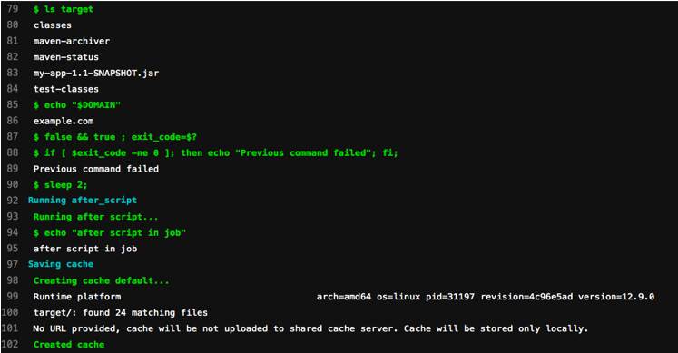
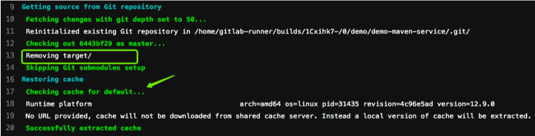
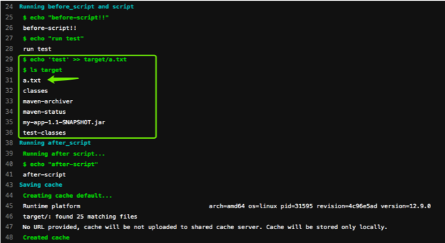
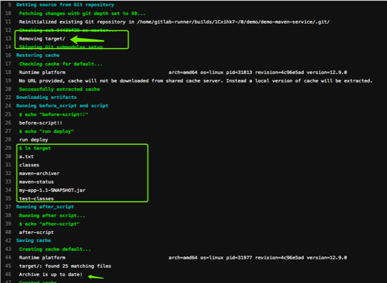
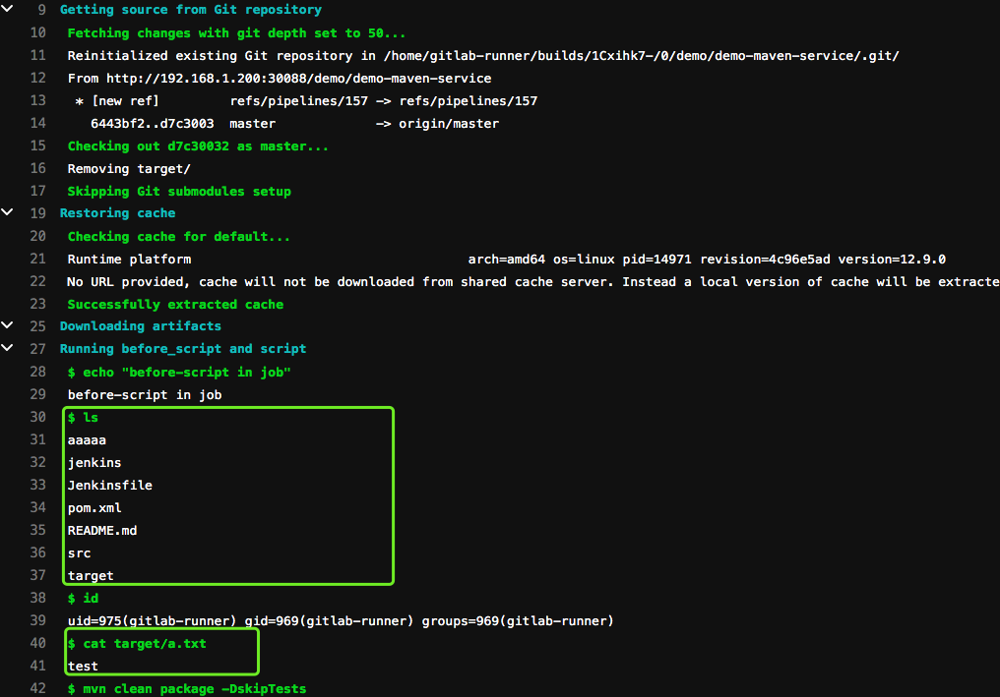
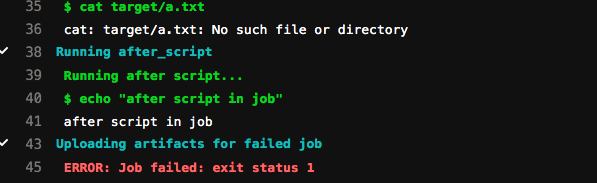

#  Pipeline基础语法（三）

[TOC]


### cache 缓存

用来指定需要在job之间缓存的文件或目录。只能使用该项目工作空间内的路径。不要使用缓存在阶段之间传递工件，因为缓存旨在存储编译项目所需的运行时依赖项。

如果在job范围之外定义了`cache` ，则意味着它是全局设置，所有job都将使用该定义。如果未全局定义或未按job定义则禁用该功能。


#### cache:paths

使用`paths`指令选择要缓存的文件或目录，路径是相对于项目目录，不能直接链接到项目目录之外。

 `$CI_PROJECT_DIR`  项目目录


在job build中定义缓存，将会缓存target目录下的所有.jar文件。

```
build:
  script: test
  cache:
    paths:
      - target/*.jar
```


当在全局定义了cache:paths会被job中覆盖。以下实例将缓存binaries目录。

```
cache:
  paths:
    - my/files

build:
  script: echo "hello"
  cache:
    key: build
    paths:
      - target/
```


由于缓存是在job之间共享的，如果不同的job使用不同的路径就出现了缓存覆盖的问题。如何让不同的job缓存不同的cache呢？设置不同的`cache:key`。

---


#### cache:key  缓存标记

为缓存做个标记，可以配置job、分支为key来实现分支、作业特定的缓存。为不同 job 定义了不同的 `cache:key` 时， 会为每个 job 分配一个独立的 cache。cache:key`变量可以使用任何预定义变量，默认`default ，从GitLab 9.0开始，默认情况下所有内容都在管道和作业之间共享。


按照分支设置缓存

```
cache:
  key: ${CI_COMMIT_REF_SLUG}
```


files： 文件发生变化自动重新生成缓存(files最多指定两个文件)，提交的时候检查指定的文件。

根据指定的文件生成密钥计算SHA校验和，如果文件未改变值为default。

```
cache:
  key:
    files:
      - Gemfile.lock
      - package.json
  paths:
    - vendor/ruby
    - node_modules
```


prefix: 允许给定prefix的值与指定文件生成的秘钥组合。 

在这里定义了全局的cache，如果文件发生变化则值为 rspec-xxx111111111222222   ，未发生变化为rspec-default。

```
cache:
  key:
    files:
      - Gemfile.lock
    prefix: ${CI_JOB_NAME}
  paths:
    - vendor/ruby

rspec:
  script:
    - bundle exec rspec
```

例如，添加`$CI_JOB_NAME` `prefix`将使密钥看起来像： `rspec-feef9576d21ee9b6a32e30c5c79d0a0ceb68d1e5` ，并且作业缓存在不同分支之间共享，如果分支更改了`Gemfile.lock` ，则该分支将为`cache:key:files`具有新的SHA校验和. 将生成一个新的缓存密钥，并为该密钥创建一个新的缓存. 如果`Gemfile.lock`未发生变化 ，则将前缀添加`default` ，因此示例中的键为`rspec-default` 。

---


#### cache:policy  策略

默认：在执行开始时下载文件，并在结束时重新上传文件。称为" `pull-push`缓存策略.

`policy: pull` 跳过下载步骤

`policy: push`  跳过上传步骤

```
stages:
  - setup
  - test

prepare:
  stage: setup
  cache:
    key: gems
    paths:
      - vendor/bundle
  script:
    - bundle install --deployment

rspec:
  stage: test
  cache:
    key: gems
    paths:
      - vendor/bundle
    policy: pull
  script:
    - bundle exec rspec ...
```


---


### 综合实例(一) 全局缓存


```
before_script:
  - echo "before-script!!"

variables:
  DOMAIN: example.com

cache: 
  paths:
   - target/

stages:
  - build
  - test
  - deploy
  
build:
  before_script:
    - echo "before-script in job"
  stage: build
  tags:
    - build
  only:
    - master
  script:
    - ls
    - id
    - mvn clean package -DskipTests
    - ls target
    - echo "$DOMAIN"
    - false && true ; exit_code=$?
    - if [ $exit_code -ne 0 ]; then echo "Previous command failed"; fi;
    - sleep 2;
  after_script:
    - echo "after script in job"


unittest:
  stage: test
  tags:
    - build
  only:
    - master
  script:
    - echo "run test"
    - echo 'test' >> target/a.txt
    - ls target
  retry:
    max: 2
    when:
      - script_failure
  
deploy:
  stage: deploy
  tags:
    - build
  only:
    - master
  script:
    - echo "run deploy"
    - ls target
  retry:
    max: 2
    when:
      - script_failure
      

after_script:
  - echo "after-script"

```


---


Pipeline日志分析

build作业运行时会对项目代码打包，然后生成target目录。作业结束创建缓存。




开始第二个作业test，此时会把当前目录中的target目录删除掉（因为做了git 对比）。



获取到第一个作业生成的缓存target目录。




开始第三个作业，同样先删除了target目录，然后获取了第二个作业的缓存。最后生成了当前的缓存。



---


Runner缓存

在做本次实验的时候我现在本地runner清除了项目的工作目录和历史缓存。

```
[root@zeyang-nuc-service ~]# cd /home/gitlab-runner/builds/1Cxihk7-/0/demo/demo-maven-service/
[root@zeyang-nuc-service demo-maven-service]# ls
Jenkinsfile  README.md  aaaaa  jenkins  pom.xml  src  target
[root@zeyang-nuc-service demo-maven-service]# cd ..
[root@zeyang-nuc-service demo]# ls
demo-maven-service  demo-maven-service.tmp
[root@zeyang-nuc-service demo]# rm -fr demo-maven-service
[root@zeyang-nuc-service demo]# rm -fr demo-maven-service.tmp/
[root@zeyang-nuc-service demo]# cd
[root@zeyang-nuc-service ~]# cd /home/gitlab-runner/cache/
[root@zeyang-nuc-service cache]# ls
demo
[root@zeyang-nuc-service cache]# rm -rf *
```


项目代码默认不会删除，可以发现是第二次作业的缓存。（因为上面的例子中第三次作业并没有修改缓存内容）

```
[root@zeyang-nuc-service cache]# cd /home/gitlab-runner/builds/1Cxihk7-/0/demo/demo-maven-service/
[root@zeyang-nuc-service demo-maven-service]# ls
Jenkinsfile  README.md  aaaaa  jenkins  pom.xml  src  target
[root@zeyang-nuc-service demo-maven-service]# cd ..
[root@zeyang-nuc-service demo]# ls
demo-maven-service  demo-maven-service.tmp
[root@zeyang-nuc-service demo]# rm -fr *
[root@zeyang-nuc-service demo]# ls
[root@zeyang-nuc-service demo]# ls
demo-maven-service  demo-maven-service.tmp
[root@zeyang-nuc-service demo]# cd demo-maven-service
[root@zeyang-nuc-service demo-maven-service]# ls
Jenkinsfile  README.md  aaaaa  jenkins  pom.xml  src  target
[root@zeyang-nuc-service demo-maven-service]# cat target/a.txt
test
```


进入runner缓存目录中查看缓存。

```
[root@zeyang-nuc-service ~]# cd /home/gitlab-runner/cache/demo/demo-maven-service/default/
[root@zeyang-nuc-service default]# ls
cache.zip
[root@zeyang-nuc-service default]# unzip cache.zip
Archive:  cache.zip
   creating: target/
  inflating: target/a.txt
   creating: target/classes/
   creating: target/classes/com/
   creating: target/classes/com/mycompany/
   creating: target/classes/com/mycompany/app/
  inflating: target/classes/com/mycompany/app/App.class
   creating: target/maven-archiver/
  inflating: target/maven-archiver/pom.properties
   creating: target/maven-status/
   creating: target/maven-status/maven-compiler-plugin/
   creating: target/maven-status/maven-compiler-plugin/compile/
   creating: target/maven-status/maven-compiler-plugin/compile/default-compile/
  inflating: target/maven-status/maven-compiler-plugin/compile/default-compile/createdFiles.lst
  inflating: target/maven-status/maven-compiler-plugin/compile/default-compile/inputFiles.lst
   creating: target/maven-status/maven-compiler-plugin/testCompile/
   creating: target/maven-status/maven-compiler-plugin/testCompile/default-testCompile/
  inflating: target/maven-status/maven-compiler-plugin/testCompile/default-testCompile/createdFiles.lst
  inflating: target/maven-status/maven-compiler-plugin/testCompile/default-testCompile/inputFiles.lst
  inflating: target/my-app-1.1-SNAPSHOT.jar
   creating: target/test-classes/
   creating: target/test-classes/com/
   creating: target/test-classes/com/mycompany/
   creating: target/test-classes/com/mycompany/app/
  inflating: target/test-classes/com/mycompany/app/AppTest.class
[root@zeyang-nuc-service default]# ls
cache.zip  target
[root@zeyang-nuc-service default]# cd target/
[root@zeyang-nuc-service target]# ls
a.txt  classes  maven-archiver  maven-status  my-app-1.1-SNAPSHOT.jar  test-classes
[root@zeyang-nuc-service target]# cat a.txt
test
```


此时此刻再次运行流水线作业，第一个作业用的是上个作业最后生成的缓存。




进入runner缓存目录查看,cache.zip时间已经发生的变化。

```
[root@zeyang-nuc-service default]# ll
total 12
-rw------- 1 gitlab-runner gitlab-runner 9172 Apr 29 10:27 cache.zip
drwxrwxr-x 6 root          root           127 Apr 29 10:05 target
```


结论： 全局缓存生效于未在作业中定义缓存的所有作业，这种情况如果每个作业都对缓存目录做了更改，会出现缓存被覆盖的场景。


---


### 综合实例（二）

控制缓存策略

例如build阶段我们需要生成新的target目录内容，可以优化设置job运行时不下载缓存。




```
before_script:
  - echo "before-script!!"

variables:
  DOMAIN: example.com

cache: 
  paths:
   - target/

stages:
  - build
  - test
  - deploy
  
build:
  before_script:
    - echo "before-script in job"
  stage: build
  tags:
    - build
  only:
    - master
  script:
    - ls
    - id
    - cat target/a.txt
    - mvn clean package -DskipTests
    - ls target
    - echo "$DOMAIN"
    - false && true ; exit_code=$?
    - if [ $exit_code -ne 0 ]; then echo "Previous command failed"; fi;
    - sleep 2;
  after_script:
    - echo "after script in job"
  cache:
    policy: pull   #不下载缓存


unittest:
  stage: test
  tags:
    - build
  only:
    - master
  script:
    - echo "run test"
    - echo 'test' >> target/a.txt
    - ls target
    - cat target/a.txt
  retry:
    max: 2
    when:
      - script_failure
  
deploy:
  stage: deploy
  tags:
    - build
  only:
    - master
  script:
    - cat target/a.txt
    - echo "run deploy"
    - ls target
    - echo "deploy" >> target/a.txt
  retry:
    max: 2
    when:
      - script_failure
      

after_script:
  - echo "after-script"
  
  

```


---


