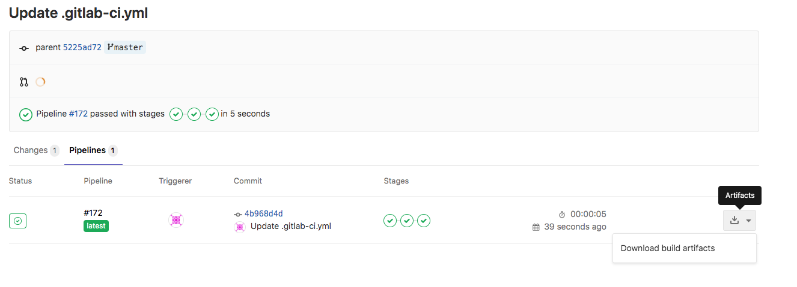
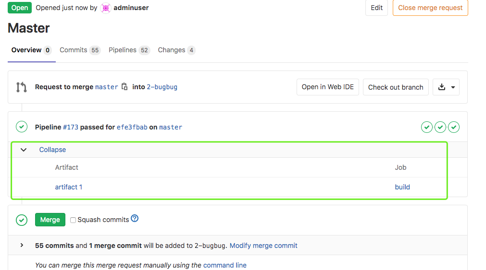
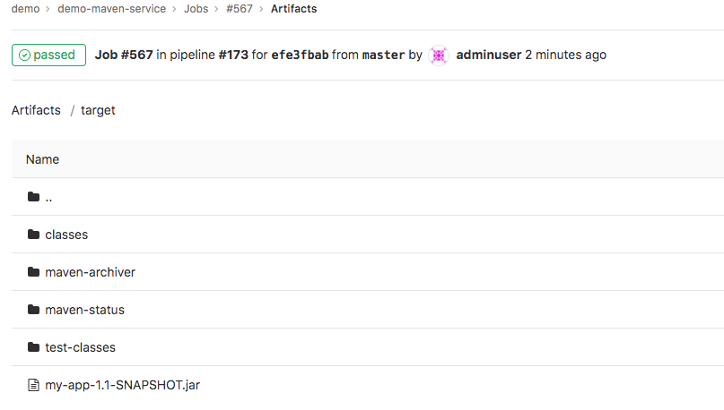
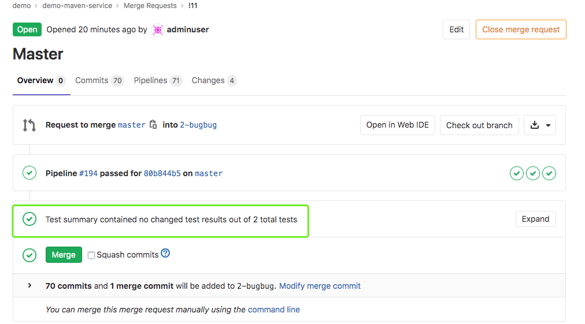
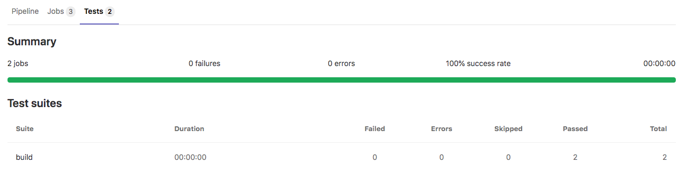
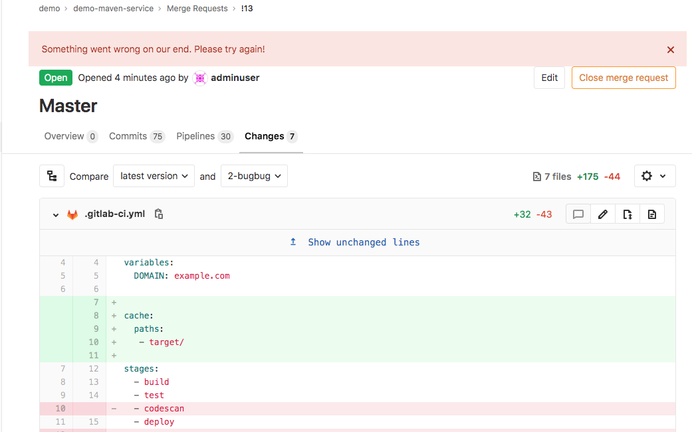
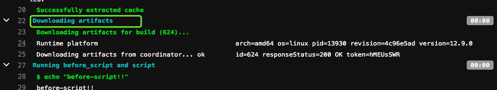

### artifacts

用于指定在作业成功或者失败时应附加到作业的文件或目录的列表。作业完成后，工件将被发送到GitLab，并可在GitLab UI中下载。


#### artifacts:paths

路径是相对于项目目录的，不能直接链接到项目目录之外。

将制品设置为target目录

```
artifacts:
  paths:
    - target/
```



禁用工件传递

```
job:
  stage: build
  script: make build
  dependencies: []
```


您可能只想为标记发行版的创建构件，以避免用临时构建构件填充构建服务器存储。仅为标签创建工件（ `default-job`不会创建工件）：

```
default-job:
  script:
    - mvn test -U
  except:
    - tags

release-job:
  script:
    - mvn package -U
  artifacts:
    paths:
      - target/*.war
  only:
    - tags
```

---


#### artifacts:expose_as

关键字`expose_as`可用于在合并请求 UI中公开作业工件。

例如，要匹配单个文件：

```
test:
  script: 
    - echo 1
  artifacts:
    expose_as: 'artifact 1'
    paths: 
      - path/to/file.txt
```

使用此配置，GitLab将在指向的相关合并请求中添加链接`file1.txt`。



制品浏览




请注意以下几点：

- 每个合并请求最多可以公开10个作业工件。
- 如果指定了目录，那么如果目录中有多个文件，则该链接将指向指向作业工件浏览器。
- 如果开启GitlabPages可以对.html .htm .txt .json .log扩展名单个文件工件渲染工件。

---


#### artifacts:name

通过`name`指令定义所创建的工件存档的名称。可以为每个存档使用唯一的名称。 `artifacts:name`变量可以使用任何[预定义变量](http://s0docs0gitlab0com.icopy.site/12.9/ee/ci/variables/README.html)。默认名称是`artifacts`，下载`artifacts`改为`artifacts.zip`。


使用当前作业的名称创建存档

```
job:
  artifacts:
    name: "$CI_JOB_NAME"
    paths:
      - binaries/
```

使用内部分支或标记的名称（仅包括binaries目录）创建存档，

```
job:
  artifacts:
    name: "$CI_COMMIT_REF_NAME"
    paths:
      - binaries/
```


使用当前作业的名称和当前分支或标记（仅包括二进制文件目录）创建存档

```
job:
  artifacts:
    name: "$CI_JOB_NAME-$CI_COMMIT_REF_NAME"
    paths:
      - binaries/
```


要创建一个具有当前[阶段](http://s0docs0gitlab0com.icopy.site/12.9/ee/ci/yaml/README.html#stages)名称和分支名称的存档

```
job:
  artifacts:
    name: "$CI_JOB_STAGE-$CI_COMMIT_REF_NAME"
    paths:
      - binaries/
```

---


#### artifacts:when

用于在作业失败时或尽管失败而上传工件。on_success仅在作业成功时上载工件。这是默认值。on_failure仅在作业失败时上载工件。always 上载工件，无论作业状态如何。

要仅在作业失败时上传工件：

```
job:
  artifacts:
    when: on_failure
```


---


#### artifacts:expire_in

制品的有效期，从上传和存储到GitLab的时间开始算起。如果未定义过期时间，则默认为30天。

`expire_in`的值以秒为单位的经过时间，除非提供了单位。可解析值的示例：

```
‘42’
‘3 mins 4 sec’
‘2 hrs 20 min’
‘2h20min’
‘6 mos 1 day’
‘47 yrs 6 mos and 4d’
‘3 weeks and 2 days’
```


一周后过期

```
job:
  artifacts:
    expire_in: 1 week
```


---

#### artifacts:reports

用于从作业中收集测试报告，代码质量报告和安全报告. 在GitLab的UI中显示这些报告。

**注意：**无论作业结果（成功或失败），都将收集测试报告。


##### `artifacts:reports:junit`

收集junit单元测试报告，收集的JUnit报告将作为工件上传到GitLab，并将自动显示在合并请求中。

```
build:
  stage: build
  tags:
    - build
  only:
    - master
  script:
    - mvn test
    - mvn cobertura:cobertura
    - ls target
  artifacts:
    name: "$CI_JOB_NAME-$CI_COMMIT_REF_NAME"
    when: on_success
    expose_as: 'artifact 1'
    paths:
      - target/*.jar
    reports:
      junit: target/surefire-reports/TEST-*.xml
```


**注意：**如果您使用的JUnit工具导出到多个XML文件，则可以在一个作业中指定多个测试报告路径，它们将被自动串联到一个文件中. 使用文件名模式（ `junit: rspec-*.xml` ），文件名数组（ `junit: [rspec-1.xml, rspec-2.xml, rspec-3.xml]` ）或其组合（ `junit: [rspec.xml, test-results/TEST-*.xml]` ）。






如果无法显示此页面，需要更改系统设置。此选项可能会加大资源占用，默认禁用了需要启用。

```
登录gitlab
su -  git
$ gitlab-rails console
--------------------------------------------------------------------------------
 GitLab:       12.9.0 (9a382ff2c82) FOSS
 GitLab Shell: 12.0.0
 PostgreSQL:   10.12
--------------------------------------------------------------------------------
Feature.enable(:junit_pipeline_view)Loading production environment (Rails 6.0.2)
irb(main):001:0>
irb(main):002:0>
irb(main):003:0> Feature.enable(:junit_pipeline_view)
=> true
irb(main):004:0>
```

参考链接：https://docs.gitlab.com/ee/ci/junit_test_reports.html

---


##### `artifacts:reports:cobertura`

收集的Cobertura覆盖率报告将作为工件上传到GitLab，并在合并请求中自动显示。

```
build:
  stage: build
  tags:
    - build
  only:
    - master
  script:
    - mvn test
    - mvn cobertura:cobertura
    - ls target
  artifacts:
    name: "$CI_JOB_NAME-$CI_COMMIT_REF_NAME"
    when: on_success
    expose_as: 'artifact 1'
    paths:
      - target/*.jar
    reports:
      junit: target/surefire-reports/TEST-*.xml
      cobertura: target/site/cobertura/coverage.xml
```


```
$ gitlab-rails console
--------------------------------------------------------------------------------
 GitLab:       12.9.0 (9a382ff2c82) FOSS
 GitLab Shell: 12.0.0
 PostgreSQL:   10.12
--------------------------------------------------------------------------------


Loading production environment (Rails 6.0.2)
irb(main):001:0>
irb(main):002:0>
irb(main):003:0> Feature.enable(:coverage_report_view)
=> true
```


#### maven集成cobertura插件

```
<plugins>       
  <!--  cobertura plugin start -->
  <plugin>
    <groupId>org.codehaus.mojo</groupId>  
    <artifactId>cobertura-maven-plugin</artifactId>  
    <version>2.7</version>  
    <configuration>  
      <formats>  
          <format>html</format>  
          <format>xml</format>  
      </formats>  
  	</configuration>  
  </plugin>       
  <!--  cobertura plugin end -->

</plugins>
```

执行 mvn cobertura:cobertura 运行测试并产生 Cobertura 覆盖率报告。

参考链接：https://docs.gitlab.com/12.9/ee/user/project/merge_requests/test_coverage_visualization.html

备注实验未做出效果，具体问题待排查。



---


### dependencies

定义要获取工件的作业列表，只能从当前阶段之前执行的阶段定义作业。定义一个空数组将跳过下载该作业的任何工件不会考虑先前作业的状态，因此，如果它失败或是未运行的手动作业，则不会发生错误。




如果设置为依赖项的作业的工件已过期或删除，那么依赖项作业将失败。


---


### 综合实例

```
before_script:
  - echo "before-script!!"

variables:
  DOMAIN: example.com


cache: 
  paths:
   - target/

stages:
  - build
  - test
  - deploy
  
build:
  before_script:
    - echo "before-script in job"
  stage: build
  tags:
    - build
  only:
    - master
  script:
    - ls
    - id
    - mvn test
    - mvn cobertura:cobertura
    - ls target
    - echo "$DOMAIN"
    - false && true ; exit_code=$?
    - if [ $exit_code -ne 0 ]; then echo "Previous command failed"; fi;
    - sleep 2;
  after_script:
    - echo "after script in job"
  artifacts:
    name: "$CI_JOB_NAME-$CI_COMMIT_REF_NAME"
    when: on_success
    #expose_as: 'artifact 1'
    paths:
      - target/*.jar
      #- target/surefire-reports/TEST*.xml
    reports:
      junit: target/surefire-reports/TEST-*.xml
      cobertura: target/site/cobertura/coverage.xml
  coverage: '/Code coverage: \d+\.\d+/'


unittest:
  dependencies:
    - build
  stage: test
  tags:
    - build
  only:
    - master
  script:
    - echo "run test"
    - echo 'test' >> target/a.txt
    - ls target
  retry:
    max: 2
    when:
      - script_failure
  
deploy:
  stage: deploy
  tags:
    - build
  only:
    - master
  script:
    - echo "run deploy"
    - ls target
  retry:
    max: 2
    when:
      - script_failure
      
      

after_script:
  - echo "after-script"
  

```


---


