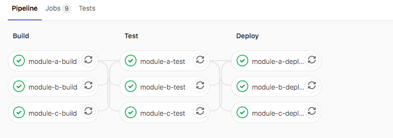
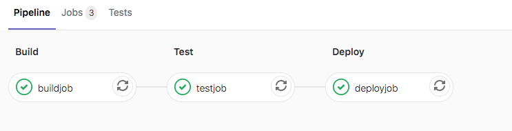
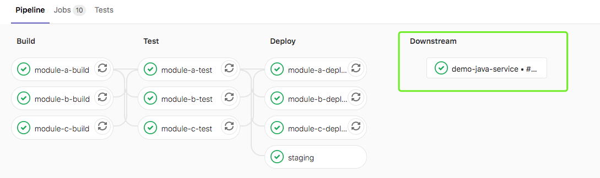
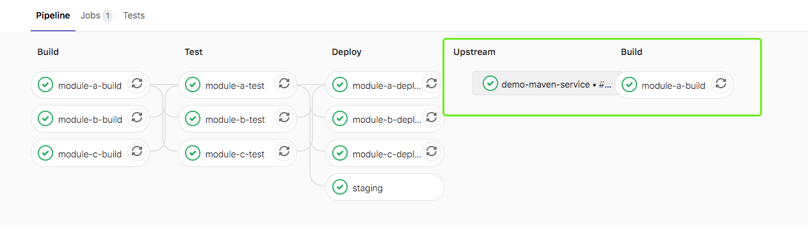
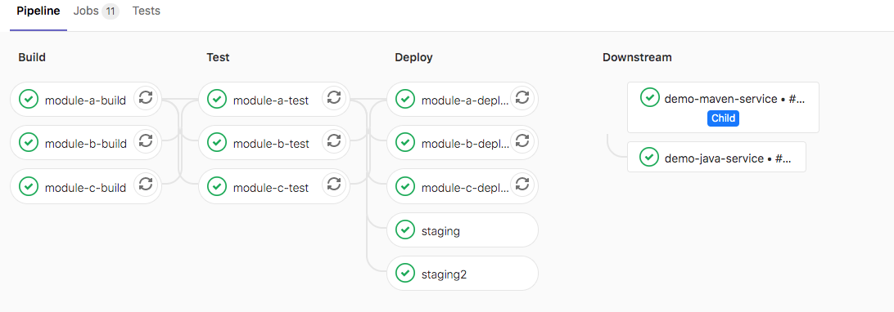

# Pipeline 基础语法


### needs 并行阶段

可无序执行作业，无需按照阶段顺序运行某些作业，可以让多个阶段同时运行。

```
stages:
  - build
  - test
  - deploy

module-a-build:
  stage: build
  script: 
    - echo "hello3a"
    - sleep 10
    
module-b-build:
  stage: build
  script: 
    - echo "hello3b"
    - sleep 10

module-a-test:
  stage: test
  script: 
    - echo "hello3a"
    - sleep 10
  needs: ["module-a-build"]
    
module-b-test:
  stage: test
  script: 
    - echo "hello3b"
    - sleep 10
  needs: ["module-b-build"]
    

```





如果`needs:`设置为指向因`only/except`规则而未实例化的作业，或者不存在，则创建管道时会出现YAML错误。

暂时限制了作业在`needs:`可能需要的最大作业数分配,`ci_dag_limit_needs`功能标志已启用（默认）分配10个，如果功能被禁用为50。

```
Feature::disable(:ci_dag_limit_needs)   # 50
Feature::enable(:ci_dag_limit_needs)  #10
```

---


### 制品下载

在使用`needs`，可通过`artifacts: true`或`artifacts: false`来控制工件下载。 默认不指定为true。

```
module-a-test:
  stage: test
  script: 
    - echo "hello3a"
    - sleep 10
  needs: 
    - job: "module-a-build"
      artifacts: true

```

相同项目中的管道制品下载,通过将`project`关键字设置为当前项目的名称，并指定引用，可以使用`needs`从当前项目的不同管道中下载工件。在下面的示例中，`build_job`将使用`other-ref`ref下载最新成功的`build-1`作业的工件：

```
build_job:
  stage: build
  script:
    - ls -lhR
  needs:
    - project: group/same-project-name
      job: build-1
      ref: other-ref
      artifacts: true
```

不支持从[`parallel:`](http://s0docs0gitlab0com.icopy.site/12.9/ee/ci/yaml/README.html#parallel)运行的作业中下载工件。

---


### include

https://gitlab.com/gitlab-org/gitlab/-/tree/master/lib/gitlab/ci/templates


可以允许引入外部YAML文件，文件具有扩展名`.yml`或`.yaml` 。使用合并功能可以自定义和覆盖包含本地定义的CI / CD配置。相同的job会合并，参数值以源文件为准。

#### local

引入同一存储库中的文件，使用相对于根目录的完整路径进行引用，与配置文件在同一分支上使用。

ci/localci.yml: 定义一个作业用于发布。

```
stages:
  - deploy
  
deployjob:
  stage: deploy
  script:
    - echo 'deploy'
```


.gitlab-ci.yml 引入本地的CI文件'ci/localci.yml'。

```
include:
  local: 'ci/localci.yml'
  

stages:
  - build
  - test
  - deploy
  

buildjob:
  stage: build
  script: ls
  
 
testjob:
  stage: test
  script: ls

```

效果



---


#### file

包含来自另一个项目的文件

```
include:
  - project: demo/demo-java-service
    ref: master
    file: '.gitlab-ci.yml'
```


#### template 

只能使用官方提供的模板 https://gitlab.com/gitlab-org/gitlab/tree/master/lib/gitlab/ci/templates

```
include:
  - template: Auto-DevOps.gitlab-ci.yml
```


#### remote

用于通过HTTP / HTTPS包含来自其他位置的文件，并使用完整URL进行引用. 远程文件必须可以通过简单的GET请求公开访问，因为不支持远程URL中的身份验证架构。

```
include:
  - remote: 'https://gitlab.com/awesome-project/raw/master/.gitlab-ci-template.yml'
```

---


### extends

继承模板作业

```
stages:
  - test
variables:
  RSPEC: 'test'

.tests:
  script: echo "mvn test"
  stage: test
  only:
    refs:
      - branches

testjob:
  extends: .tests
  script: echo "mvn clean test"
  only:
    variables:
      - $RSPEC

```

合并后

```
testjob:
  stage: test
  script: mvn clean test
  only:
    variables:
      - $RSPEC
    refs:
      - branches
```

----


### extends & include

aa.yml

```
#stages:
#  - deploy
  
deployjob:
  stage: deploy
  script:
    - echo 'deploy'
  only:
    - dev

.template:
  stage: build
  script: 
    - echo "build"
  only:
    - master

```

```
include:
  local: 'ci/localci.yml'

stages:
  - test
  - build 
  - deploy
  
variables:
  RSPEC: 'test'

.tests:
  script: echo "mvn test"
  stage: test
  only:
    refs:
      - branches

testjob:
  extends: .tests
  script: echo "mvn clean test"
  only:
    variables:
      - $RSPEC
      

newbuildjob:
  script:
    - echo "123"
  extends: .template

```

这将运行名为`useTemplate`的作业，该作业运行`echo Hello!` 如`.template`作业中所定义，并使用本地作业中所定义的`alpine` Docker映像.

### 

---


### trigger 管道触发

当GitLab从`trigger`定义创建的作业启动时，将创建一个下游管道。允许创建多项目管道和子管道。将`trigger`与`when:manual`一起使用会导致错误。


多项目管道： 跨多个项目设置流水线，以便一个项目中的管道可以触发另一个项目中的管道。[微服务架构]

父子管道: 在同一项目中管道可以触发一组同时运行的子管道,子管道仍然按照阶段顺序执行其每个作业，但是可以自由地继续执行各个阶段，而不必等待父管道中无关的作业完成。


#### 多项目管道

当前面阶段运行完成后，触发demo/demo-java-service项目master流水线。创建上游管道的用户需要具有对下游项目的访问权限。如果发现下游项目用户没有访问权限以在其中创建管道，则`staging`作业将被标记为*失败*。

```
staging:
  variables:
    ENVIRONMENT: staging
  stage: deploy
  trigger: 
    project: demo/demo-java-service
    branch: master
    strategy: depend

```

`project`关键字，用于指定下游项目的完整路径。该`branch`关键字指定由指定的项目分支的名称。使用`variables`关键字将变量传递到下游管道。 全局变量也会传递给下游项目。上游管道优先于下游管道。如果在上游和下游项目中定义了两个具有相同名称的变量，则在上游项目中定义的变量将优先。默认情况下，一旦创建下游管道，`trigger`作业就会以`success`状态完成。`strategy: depend`将自身状态从触发的管道合并到源作业。



在下游项目中查看管道信息



在此示例中，一旦创建了下游管道，该`staging`将被标记为成功。


### 父子管道

创建子管道ci/child01.yml 

```
stages:
  - build

child-a-build:
  stage: build
  script: 
    - echo "hello3a"
    - sleep 10
```


在父管道触发子管道

```
staging2:
  variables:
    ENVIRONMENT: staging
  stage: deploy
  trigger: 
    include: ci/child01.yml  
    strategy: depend
```





---

