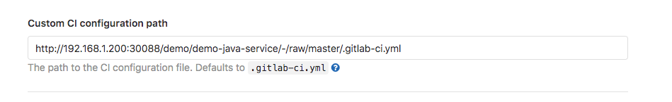
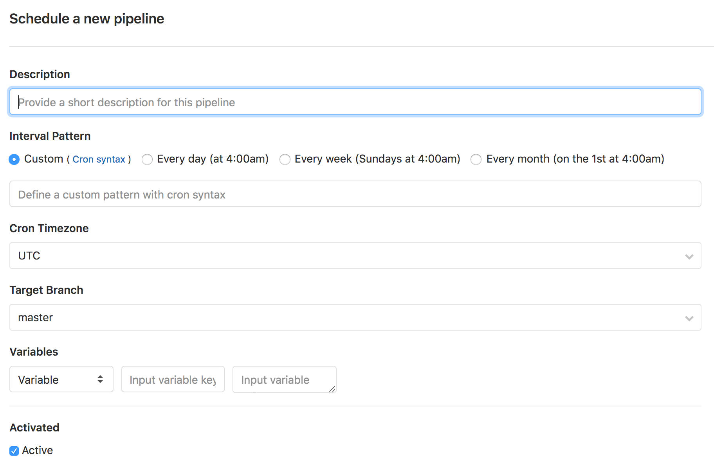
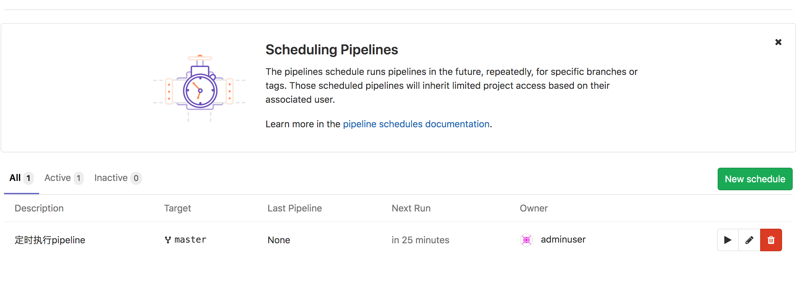

## 流水线配置

### 自定义CI配置文件路径

默认情况下，我们在项目的根目录中查找`.gitlab-ci.yml`文件. 如果需要，您可以指定备用路径和文件名，包括项目外部的位置。

- `.gitlab-ci.yml` (default)

- `.my-custom-file.yml`

- `my/path/.gitlab-ci.yml`

- `my/path/.my-custom-file.yml`

- `http://example.com/generate/ci/config.yml`

- `.gitlab-ci.yml@mygroup/another-project`

- `my/path/.my-custom-file.yml@mygroup/another-project`

  

将配置文件托管在单独的项目中，可以更严格地控制配置文件,创建一个公共项目来承载配置文件,仅向被允许编辑文件的用户授予对项目的写权限。其他用户和项目将能够访问配置文件而无需对其进行编辑.

---

### 测试覆盖率问题

http://s0docs0gitlab0com.icopy.site/12.9/ee/ci/pipelines/settings.html#test-coverage-parsing

---

### 流水线调度

管道的执行时间取决于 Sidekiq自己的时间表。管道不会完全按计划执行，因为计划由Sidekiq处理，Sidekiq根据其间隔运行。

例如，如果满足以下条件，则每天将仅创建两个管道：

- 您设置了一个计划，以每分钟创建一个管道（ `* * * * *` ）
- Sidekiq工作者每天在00:00和12:00（ `0 */12 * * *` ）运行

更改Sidekiq工作人员的频率：

1. 在实例的`gitlab.rb`文件中编辑`gitlab_rails['pipeline_schedule_worker_cron']`值。
2. [重新配置GitLab，](http://s0docs0gitlab0com.icopy.site/12.9/ee/administration/restart_gitlab.html#omnibus-gitlab-reconfigure)以使更改生效。

参考文档：http://docs.gitlab.com/12.9/ee/ci/pipelines/schedules.html#advanced-configuration

---

### 作业分组

http://s0docs0gitlab0com.icopy.site/12.9/ee/ci/pipelines/index.html#how-grouping-works