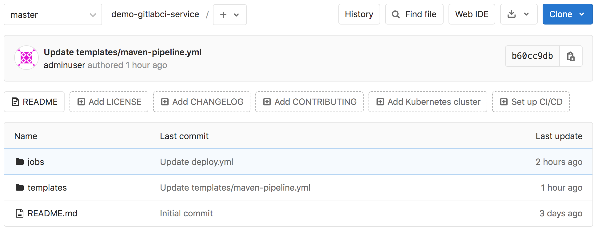

# 工具链集成

### 模板库设计

为了实现模板复用，减少重复代码。本次课程开始我们将使用模板库来完成流水线。开始之前还是要把语法学好便于进一步实施。

创建一个git仓库用于存放模板`demo/demo-gitlabci-service ` ，然后创建一个template目录存放所有pipeline的模板，创建一个jobs目录存放job模板。

这样我们可以将一些maven、ant、gradle、npm工具通过一个job模板和不同的构建命令实现。templates的好处是我们在其中定义了模板流水线，这些流水线可以直接让项目使用。当遇到个性化项目的时候就可以在当前项目创建.gitlab-ci.yml文件来引用模板文件，再进一步实现个性化需要。

### 模板库信息

github : https://github.com/zeyangli/gitlabci-templates

