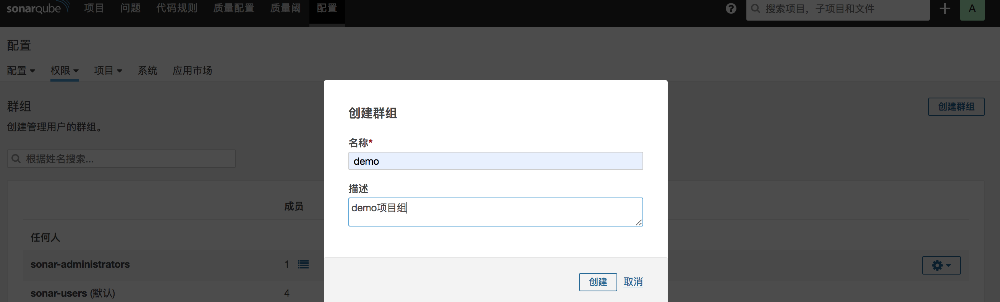

## 集成sonarqube


### 内容

- SonarQube基础简介
- 配置GitLabCI代码扫描
- 配置GitLabCI合并扫描


---

## 准备工作

参考链接：https://docs.sonarqube.org/latest/analysis/gitlab-cicd/

扩展插件：  https://github.com/mc1arke/sonarqube-community-branch-plugin/releases

参考文章：[http://119.3.228.122/jenkins/pipelineintegrated/chapter04/#%E9%85%8D%E7%BD%AE%E5%A4%9A%E5%88%86%E6%94%AF](http://119.3.228.122/jenkins/pipelineintegrated/chapter04/#配置多分支)

Gitlab内置环境变量： http://192.168.1.200:30088/help/ci/variables/README#variables

在SonarQube中创建项目组添加用户，为用户分配权限。使用用户token分析扫描项目。


#### 准备用户


创建群组



创建权限模板


分配权限,一般给这个组中的成员管理员权限


为项目授权权限模板


添加token


### 扫描分析

jobs/codeanalysis.yml

```
.codeanalysis-java:
  stage: code_analysis
  tags:
    - build
  script:
    - echo $CI_MERGE_REQUEST_IID $CI_MERGE_REQUEST_SOURCE_BRANCH_NAME  $CI_MERGE_REQUEST_TARGET_BRANCH_NAME
    - "$SCANNER_HOME/bin/sonar-scanner -Dsonar.projectKey=${CI_PROJECT_NAME} \
                                      -Dsonar.projectName=${CI_PROJECT_NAME} \
                                      -Dsonar.projectVersion=${CI_COMMIT_REF_NAME} \
                                      -Dsonar.ws.timeout=30 \
                                      -Dsonar.projectDescription=${CI_PROJECT_TITLE} \
                                      -Dsonar.links.homepage=${CI_PROJECT_URL} \
                                      -Dsonar.sources=${SCAN_DIR} \
                                      -Dsonar.sourceEncoding=UTF-8 \
                                      -Dsonar.java.binaries=target/classes \
                                      -Dsonar.java.test.binaries=target/test-classes \
                                      -Dsonar.java.surefire.report=target/surefire-reports \
                                      -Dsonar.branch.name=${CI_COMMIT_REF_NAME}"
  artifacts:
    paths:
      - "$ARTIFACT_PATH"

```


template/java-pipeline.yml

```
include:
  - project: 'cidevops/cidevops-gitlabci-service'
    ref: master
    file: 'jobs/build.yml'
  - project: 'cidevops/cidevops-gitlabci-service'
    ref: master
    file: 'jobs/test.yml'
  - project: 'cidevops/cidevops-gitlabci-service'
    ref: master
    file: 'jobs/codeanalysis.yml'

variables:
  BUILD_SHELL: 'mvn clean package  -DskipTests'  ##构建命令
  CACHE_DIR: 'target/'
  TEST_SHELL : 'mvn test'                                   ##测试命令
  JUNIT_REPORT_PATH: 'target/surefire-reports/TEST-*.xml'   ##单元测试报告
  # 代码扫描
  SCANNER_HOME : "/usr/local/buildtools/sonar-scanner-3.2.0.1227-linux"
  SCAN_DIR : "src"
  ARTIFACT_PATH : 'target/*.jar'                            ##制品目录

  
cache:
  paths:
    - ${CACHE_DIR}
    
stages:
  - build
  - test
  - code_analysis


build:
  stage: build
  extends: .build
  rules:
    - when: on_success


test:
  stage: test
  extends: .test
  rules:
    - when: on_success

  
code_analysis:
  stage: code_analysis
  extends: .codeanalysis-java

```


实现效果


---


### Pull request集成

配置SonarQube，添加gitlabtoken 和服务信息。系统设置 -> pull request。

注意下面的配置在配置文件中定义不生效哦，可能是因为版本的问题导致的。暂且忽略。

```
com.github.mc1arke.sonarqube.plugin.branch.pullrequest.gitlab.token=b8Gs1quX5GSeHwyuMWyY
com.github.mc1arke.sonarqube.plugin.branch.pullrequest.gitlab.url=http://192.168.1.200:30088
sonar.pullrequest.provider=GitlabServer
```

如果你想通过API操作可以参考：

```
curl -u “ $ SONAR_API_TOKEN ” -X POST “ http://sonarqube.example.com/api/settings/set?key=sonar.pullrequest.provider&value=GitlabServer ” 
curl -u “ $ SONAR_API_TOKEN ” -X POST “ http： //sonarqube.example.com/api/settings/set?key=com.github.mc1arke.sonarqube.plugin.branch.pullrequest.gitlab.url&value=http://gitlab.example.com “ 
curl -u ” $ SONAR_API_TOKEN “ -X POST ” http://sonarqube.example.com/api/settings/set?key=com.github.mc1arke.sonarqube.plugin.branch.pullrequest.gitlab.token&value= $ GITLAB_TOKEN “
```


添加扫描作业，主要是分析参数。

```
.codeanalysis-mr:
  stage: code_analysis
  only:
    - merge_requests
  tags:
    - build
  script:
    - "$SCANNER_HOME/bin/sonar-scanner -Dsonar.projectKey=${CI_PROJECT_NAME} \
                                      -Dsonar.projectName=${CI_PROJECT_NAME} \
                                      -Dsonar.projectVersion=${CI_COMMIT_REF_NAME} \
                                      -Dsonar.ws.timeout=30 \
                                      -Dsonar.projectDescription=${CI_PROJECT_TITLE} \
                                      -Dsonar.links.homepage=${CI_PROJECT_URL} \
                                      -Dsonar.sources=${SCAN_DIR} \
                                      -Dsonar.sourceEncoding=UTF-8 \
                                      -Dsonar.java.binaries=target/classes \
                                      -Dsonar.java.test.binaries=target/test-classes \
                                      -Dsonar.java.surefire.report=target/surefire-reports \
                                      -Dsonar.pullrequest.key=${CI_MERGE_REQUEST_IID} \
                                      -Dsonar.pullrequest.branch=${CI_MERGE_REQUEST_SOURCE_BRANCH_NAME} \
                                      -Dsonar.pullrequest.base=${CI_MERGE_REQUEST_TARGET_BRANCH_NAME}  \
                                      -Dsonar.gitlab.ref_name=${CI_COMMIT_REF_NAME} \
                                      -Dsonar.gitlab.commit_sha=${CI_COMMIT_SHA}  \
                                      -Dsonar.gitlab.project_id=${CI_PROJECT_PATH} \
                                      -Dsonar.pullrequest.gitlab.repositorySlug=$CI_PROJECT_ID "
                                      
                                      #-Dsonar.branch.name=${CI_COMMIT_REF_NAME} -X "


```


templates/java-pipeline.yml

```
include:
  - project: 'cidevops/cidevops-gitlabci-service'
    ref: master
    file: 'jobs/build.yml'
  - project: 'cidevops/cidevops-gitlabci-service'
    ref: master
    file: 'jobs/test.yml'
  - project: 'cidevops/cidevops-gitlabci-service'
    ref: master
    file: 'jobs/codeanalysis.yml'

variables:
  BUILD_SHELL: 'mvn clean package  -DskipTests'  ##构建命令
  CACHE_DIR: 'target/'
  TEST_SHELL : 'mvn test'                                   ##测试命令
  JUNIT_REPORT_PATH: 'target/surefire-reports/TEST-*.xml'   ##单元测试报告
  # 代码扫描
  SCANNER_HOME : "/usr/local/buildtools/sonar-scanner-3.2.0.1227-linux"
  SCAN_DIR : "src"
  ARTIFACT_PATH : 'target/*.jar'                            ##制品目录

  
cache:
  paths:
    - ${CACHE_DIR}
    
stages:
  - build
  - test
  - code_analysis


build:
  stage: build
  extends: .build
  rules:
    - when: on_success


test:
  stage: test
  extends: .test
  rules:
    - when: on_success

  
code_analysis:
  stage: code_analysis
  extends: .codeanalysis-java
  
codeanalysis_mr:
  stage: code_analysis
  extends: .codeanalysis-mr
```


创建合并请求运行流水线，最终效果。


---

