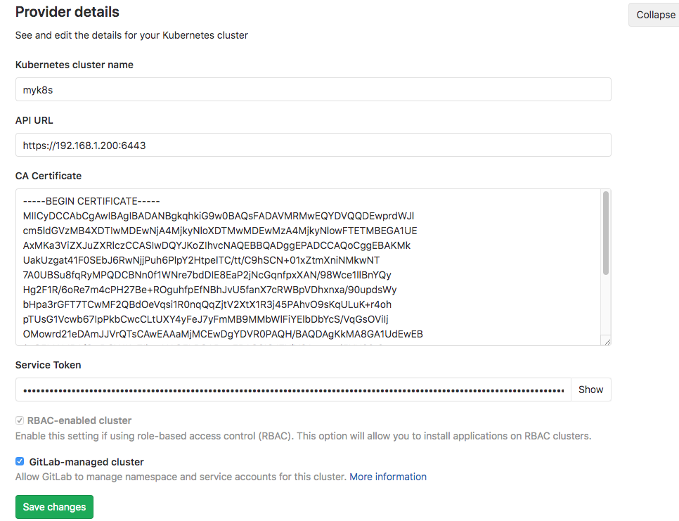
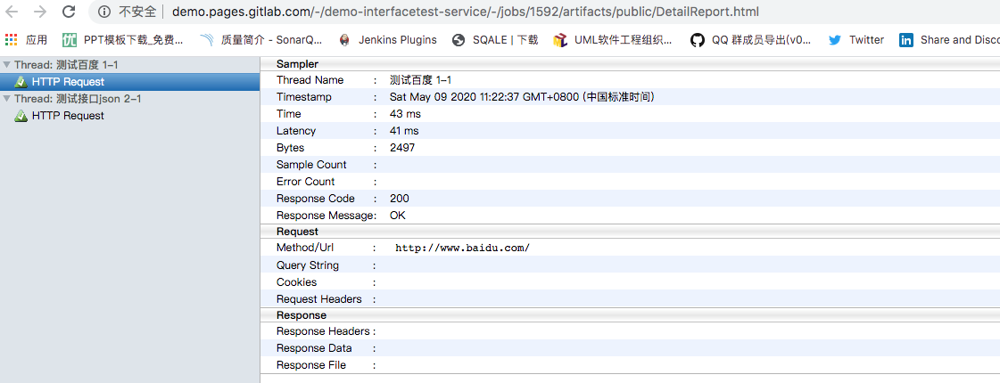
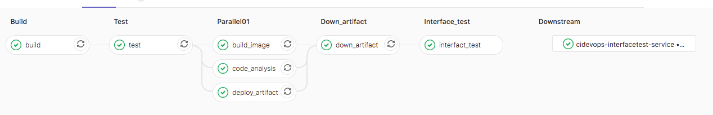

# 自动化测试集成


## 开启gitlab pages

vim /etc/gitlab/gitlab.rb

```
##! Define to enable GitLab Pages
pages_external_url "http://pages.gitlab.com/"
gitlab_pages['enable'] = true
gitlab_pages['inplace_chroot'] = true


gitlab-ctl reconfigure
```

更新gitlab.yml文件

```
containers:
  - name: gitlab
  image: gitlab/gitlab-ce:12.9.0-ce.0
  imagePullPolicy: IfNotPresent
  ports:
    - containerPort: 30088
      name: web
      protocol: TCP
    - containerPort: 22
      name: agent
      protocol: TCP
    - containerPort: 80
      name: page
      protocol: TCP
```

开放80端口

```
kind: Service
apiVersion: v1
metadata:
  labels:
    k8s-app: gitlab
  name: gitlab
  namespace: devops
spec:
  type: NodePort
  ports:
    - name: web
      port: 30088
      targetPort: 30088
      nodePort: 30088
    - name: slave
      port: 22
      targetPort: 22
      nodePort: 30022
    - name: page
      port: 80
      targetPort: 80
      nodePort: 80
  selector:
    k8s-app: gitlab
```





完整的yaml参考github中。


FAQ：未开启chroot

https://gitlab.com/gitlab-org/gitlab-pages/-/issues/129

```
"Failed to bind mount /var/opt/gitlab/gitlab-rails/shared/pages on /tmp/gitlab-pages-1524473513642136363/pages. operation not permitted
```

---


### 运行自动化测试

在这里定义了两个stage，

interface_test作业用于运行自动化测试，此时自动化测试已经配置好ant+jmeter集成所以直接运行ant命令即可。考虑到每个人安装的jmeter环境目录不一致所以可以通过-D选项指定jmeterhome。运行完成接口测试后，测试报告在项目当前目录的`result/htmlfile`中。在此将测试报告整理成制品存放。

pages作业用于将测试报告中的html文件通过pages功能展示。首先获取interface_test作业的制品，然后将测试报告移动到public目录中。最后将public目录作为制品收集，有效期30天。


```
stages:
  - tests
  - deploy
  

interface_test:
  stage: tests
  tags:
    - build
  script:
    - ant -Djmeter.home=/usr/local/buildtools/apache-jmeter-5.2.1
  artifacts:
    paths:
      - result/htmlfile/
  
pages:
  stage: deploy
  dependencies:
    - interface_test
  script:
    - mv result/htmlfile/ public/
  artifacts:
    paths:
      - public
    expire_in: 30 days
  only:
    - master

```


效果：



---


### 上下游项目触发自动化测试


jobs/test.yml

```
.interfacetest:
  stage: interface_test
  trigger: 
    project: cidevops/cidevops-interfacetest-service
    branch: master
    strategy: depend

```

templates.yml

```
interfact_test:
  stage: interface_test
  extends: .interfacetest

```





---

