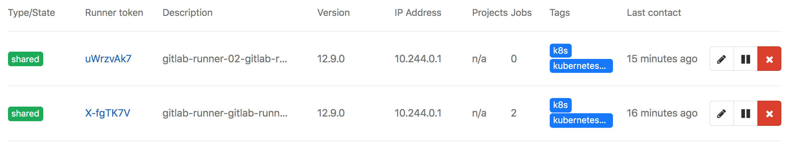
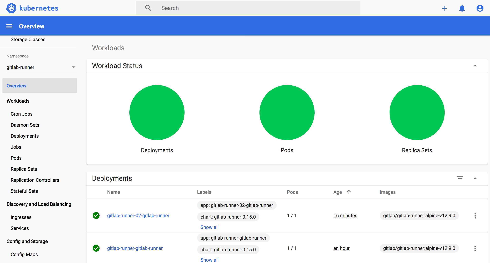
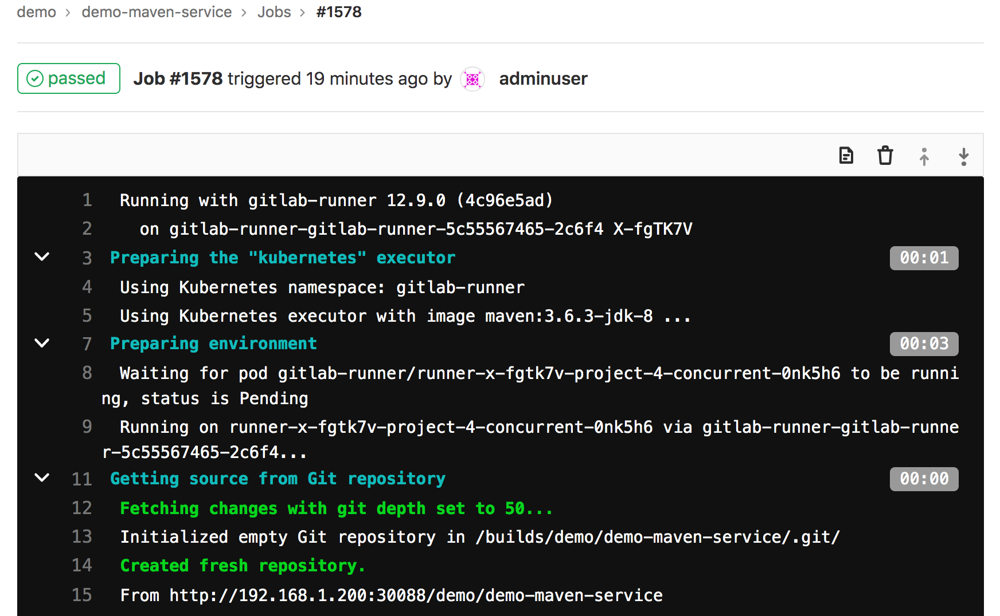
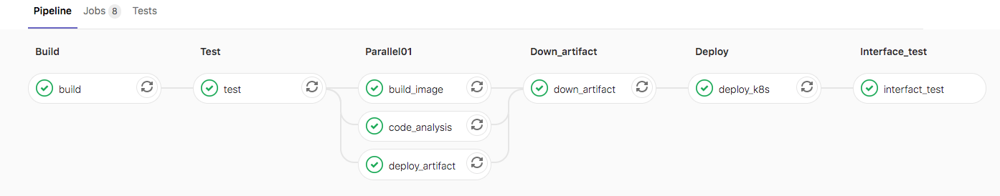
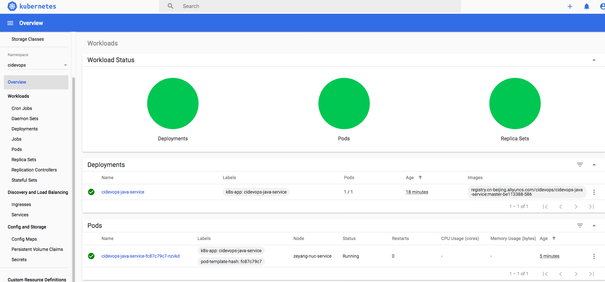

## Kubernetes集成


#### 安装helm3

```
https://github.com/helm/helm/releases
tar -zxvf helm-v3.0.0-linux-amd64.tar.gz
mv linux-amd64/helm /usr/local/bin/helm
```


#### 配置chart 存储库

```
## 添加chart存储库
helm repo add gitlab https://charts.gitlab.io

## 验证源
helm repo list

##查询可以安装的gitlab-runner chart
helm search repo -l gitlab/gitlab-runner
```


#### 更新配置信息

```
## 获取相关版本的chart包
helm fetch gitlab/gitlab-runner --version=0.15.0
[root@zeyang-nuc-service ~]# ls
Desktop                        es
Documents                      gitlab-runner-0.15.0.tgz
```


values.yml

```
## GitLab Runner Image
##
## By default it's using gitlab/gitlab-runner:alpine-v{VERSION}
## where {VERSION} is taken from Chart.yaml from appVersion field
##
## ref: https://hub.docker.com/r/gitlab/gitlab-runner/tags/
##
image: gitlab/gitlab-runner:alpine-v12.9.0

## 镜像下载策略
imagePullPolicy: IfNotPresent

## Gitlab服务器地址
gitlabUrl: http://192.168.1.200:30088/

## runner注册token
runnerRegistrationToken: "JRzzw2j1Ji6aBjwvkxAv"

## 终止之前注销所有跑步者
unregisterRunners: true


## 当停止管道时等待其作业终止时间
terminationGracePeriodSeconds: 3600

## Set the certsSecretName in order to pass custom certficates for GitLab Runner to use
## Provide resource name for a Kubernetes Secret Object in the same namespace,
## this is used to populate the /home/gitlab-runner/.gitlab-runner/certs/ directory
## ref: https://docs.gitlab.com/runner/configuration/tls-self-signed.html#supported-options-for-self-signed-certificates
##
# certsSecretName:


## 配置最大并发作业数
concurrent: 10

## 新作业检查间隔
checkInterval: 30

## GitlabRunner日志级别 debug, info, warn, error, fatal, panic
logLevel: info

## Configure GitLab Runner's logging format. Available values are: runner, text, json
## ref: https://docs.gitlab.com/runner/configuration/advanced-configuration.html#the-global-section
##
# logFormat:

## For RBAC support:
rbac:
  create: true
  ## Define specific rbac permissions.
  resources: ["pods", "pods/exec", "secrets"]
  verbs: ["get", "list", "watch", "create", "patch", "delete"]

  ## Run the gitlab-bastion container with the ability to deploy/manage containers of jobs
  ## cluster-wide or only within namespace
  clusterWideAccess: false

  ## Use the following Kubernetes Service Account name if RBAC is disabled in this Helm chart (see rbac.create)
  ##
  # serviceAccountName: default

  ## Specify annotations for Service Accounts, useful for annotations such as eks.amazonaws.com/role-arn
  ##
  ## ref: https://docs.aws.amazon.com/eks/latest/userguide/specify-service-account-role.html
  ##
  # serviceAccountAnnotations: {}

## Configure integrated Prometheus metrics exporter
## ref: https://docs.gitlab.com/runner/monitoring/#configuration-of-the-metrics-http-server
metrics:
  enabled: true

## Configuration for the Pods that that the runner launches for each new job
##
runners:
  ## Default container image to use for builds when none is specified
  ##
  image: ubuntu:16.04

  ## Specify one or more imagePullSecrets
  ##
  ## ref: https://kubernetes.io/docs/tasks/configure-pod-container/pull-image-private-registry/
  ##
  # imagePullSecrets: []

  ## Specify the image pull policy: never, if-not-present, always. The cluster default will be used if not set.
  ##
  imagePullPolicy: "if-not-present"

  ## Defines number of concurrent requests for new job from GitLab
  ## ref: https://docs.gitlab.com/runner/configuration/advanced-configuration.html#the-runners-section
  ## 限制来自GitLab的对新作业的并发请求数
  requestConcurrency: 1

  ## Specify whether the runner should be locked to a specific project: true, false. Defaults to true.
  ##
  locked: false

  ## Specify the tags associated with the runner. Comma-separated list of tags.
  ##
  ## ref: https://docs.gitlab.com/ce/ci/runners/#using-tags
  ##
  tags: "kubernetes-runner,k8s"

  ## Specify if jobs without tags should be run.
  ## If not specified, Runner will default to true if no tags were specified. In other case it will
  ## default to false.
  ##
  ## ref: https://docs.gitlab.com/ce/ci/runners/#allowing-runners-with-tags-to-pick-jobs-without-tags
  ##
  runUntagged: true

  ## Specify whether the runner should only run protected branches.
  ## Defaults to False.
  ##
  ## ref: https://docs.gitlab.com/ee/ci/runners/#protected-runners
  ##
  protected: false

  ## Run all containers with the privileged flag enabled
  ## This will allow the docker:dind image to run if you need to run Docker
  ## commands. Please read the docs before turning this on:
  ## ref: https://docs.gitlab.com/runner/executors/kubernetes.html#using-docker-dind
  ##
  privileged: true

  ## The name of the secret containing runner-token and runner-registration-token
  # secret: gitlab-runner

  ## Namespace to run Kubernetes jobs in (defaults to the same namespace of this release)
  ##
  # namespace:

  ## The amount of time, in seconds, that needs to pass before the runner will
  ## timeout attempting to connect to the container it has just created.
  ## ref: https://docs.gitlab.com/runner/executors/kubernetes.html
  pollTimeout: 180

  ## Set maximum build log size in kilobytes, by default set to 4096 (4MB)
  ## ref: https://docs.gitlab.com/runner/configuration/advanced-configuration.html#the-runners-section
  outputLimit: 4096

  ## Distributed runners caching
  ## ref: https://gitlab.com/gitlab-org/gitlab-runner/blob/master/docs/configuration/autoscale.md#distributed-runners-caching
  ##
  ## If you want to use s3 based distributing caching:
  ## First of all you need to uncomment General settings and S3 settings sections.
  ##
  ## Create a secret 's3access' containing 'accesskey' & 'secretkey'
  ## ref: https://aws.amazon.com/blogs/security/wheres-my-secret-access-key/
  ##
  ## $ kubectl create secret generic s3access \
  ##   --from-literal=accesskey="YourAccessKey" \
  ##   --from-literal=secretkey="YourSecretKey"
  ## ref: https://kubernetes.io/docs/concepts/configuration/secret/
  ##
  ## If you want to use gcs based distributing caching:
  ## First of all you need to uncomment General settings and GCS settings sections.
  ##
  ## Access using credentials file:
  ## Create a secret 'google-application-credentials' containing your application credentials file.
  ## ref: https://docs.gitlab.com/runner/configuration/advanced-configuration.html#the-runnerscachegcs-section
  ## You could configure
  ## $ kubectl create secret generic google-application-credentials \
  ##   --from-file=gcs-application-credentials-file=./path-to-your-google-application-credentials-file.json
  ## ref: https://kubernetes.io/docs/concepts/configuration/secret/
  ##
  ## Access using access-id and private-key:
  ## Create a secret 'gcsaccess' containing 'gcs-access-id' & 'gcs-private-key'.
  ## ref: https://docs.gitlab.com/runner/configuration/advanced-configuration.html#the-runners-cache-gcs-section
  ## You could configure
  ## $ kubectl create secret generic gcsaccess \
  ##   --from-literal=gcs-access-id="YourAccessID" \
  ##   --from-literal=gcs-private-key="YourPrivateKey"
  ## ref: https://kubernetes.io/docs/concepts/configuration/secret/
  cache: {}
    ## General settings
    # cacheType: s3
    # cachePath: "gitlab_runner"
    # cacheShared: true

    ## S3 settings
    # s3ServerAddress: s3.amazonaws.com
    # s3BucketName:
    # s3BucketLocation:
    # s3CacheInsecure: false
    # secretName: s3access

    ## GCS settings
    # gcsBucketName:
    ## Use this line for access using access-id and private-key
    # secretName: gcsaccess
    ## Use this line for access using google-application-credentials file
    # secretName: google-application-credentials

  ## Build Container specific configuration
  ##
  builds: {}
    # cpuLimit: 200m
    # memoryLimit: 256Mi
    # cpuRequests: 100m
    # memoryRequests: 128Mi

  ## Service Container specific configuration
  ##
  services: {}
    # cpuLimit: 200m
    # memoryLimit: 256Mi
    # cpuRequests: 100m
    # memoryRequests: 128Mi

  ## Helper Container specific configuration
  ##
  helpers: {}
    # cpuLimit: 200m
    # memoryLimit: 256Mi
    # cpuRequests: 100m
    # memoryRequests: 128Mi
    # image: gitlab/gitlab-runner-helper:x86_64-latest

  ## Service Account to be used for runners
  ##
  # serviceAccountName:

  ## If Gitlab is not reachable through $CI_SERVER_URL
  ##
  # cloneUrl:

  ## Specify node labels for CI job pods assignment
  ## ref: https://kubernetes.io/docs/concepts/configuration/assign-pod-node/
  ##
  # nodeSelector: {}

  ## Specify pod labels for CI job pods
  ##
  # podLabels: {}

  ## Specify annotations for job pods, useful for annotations such as iam.amazonaws.com/role
  # podAnnotations: {}

  ## Configure environment variables that will be injected to the pods that are created while
  ## the build is running. These variables are passed as parameters, i.e. `--env "NAME=VALUE"`,
  ## to `gitlab-runner register` command.
  ##
  ## Note that `envVars` (see below) are only present in the runner pod, not the pods that are
  ## created for each build.
  ##
  ## ref: https://docs.gitlab.com/runner/commands/#gitlab-runner-register
  ##
  # env:
  #   NAME: VALUE


## Configure securitycontext
## ref: http://kubernetes.io/docs/user-guide/security-context/
##
securityContext:
  fsGroup: 65533
  runAsUser: 100


## Configure resource requests and limits
## ref: http://kubernetes.io/docs/user-guide/compute-resources/
##
resources: {}
  # limits:
  #   memory: 256Mi
  #   cpu: 200m
  # requests:
  #   memory: 128Mi
  #   cpu: 100m

## Affinity for pod assignment
## Ref: https://kubernetes.io/docs/concepts/configuration/assign-pod-node/#affinity-and-anti-affinity
##
affinity: {}

## Node labels for pod assignment
## Ref: https://kubernetes.io/docs/user-guide/node-selection/
##
nodeSelector: {}
  # Example: The gitlab runner manager should not run on spot instances so you can assign
  # them to the regular worker nodes only.
  # node-role.kubernetes.io/worker: "true"

## List of node taints to tolerate (requires Kubernetes >= 1.6)
## Ref: https://kubernetes.io/docs/concepts/configuration/taint-and-toleration/
##
tolerations: []
  # Example: Regular worker nodes may have a taint, thus you need to tolerate the taint
  # when you assign the gitlab runner manager with nodeSelector or affinity to the nodes.
  # - key: "node-role.kubernetes.io/worker"
  #   operator: "Exists"

## Configure environment variables that will be present when the registration command runs
## This provides further control over the registration process and the config.toml file
## ref: `gitlab-runner register --help`
## ref: https://docs.gitlab.com/runner/configuration/advanced-configuration.html
##
# envVars:
#   - name: RUNNER_EXECUTOR
#     value: kubernetes

## list of hosts and IPs that will be injected into the pod's hosts file
hostAliases: []
  # Example:
  # - ip: "127.0.0.1"
  #   hostnames:
  #   - "foo.local"
  #   - "bar.local"
  # - ip: "10.1.2.3"
  #   hostnames:
  #   - "foo.remote"
  #   - "bar.remote"

## Annotations to be added to manager pod
##
podAnnotations: {}
  # Example:
  # iam.amazonaws.com/role: <my_role_arn>

## Labels to be added to manager pod
##
podLabels: {}
  # Example:
  # owner.team: <my_cool_team>

## HPA support for custom metrics:
## This section enables runners to autoscale based on defined custom metrics.
## In order to use this functionality, Need to enable a custom metrics API server by
## implementing "custom.metrics.k8s.io" using supported third party adapter
## Example: https://github.com/directxman12/k8s-prometheus-adapter
##
#hpa: {}
  # minReplicas: 1
  # maxReplicas: 10
  # metrics:
  # - type: Pods
  #   pods:
  #     metricName: gitlab_runner_jobs
  #     targetAverageValue: 400m

```


#### 部署chart

```
## 创建runner
kubectl create ns gitlab-runner
helm install gitlab-runner --namespace gitlab-runner ./gitlab-runner

## 更新
helm upgrade gitlab-runner --namespace gitlab-runner ./gitlab-runner
```


#### 效果

gitlab



kubernetes




---


### 运行流水线测试

```
image: maven:3.6.3-jdk-8

before_script:
  - ls
  
services:
  - name: mysql:latest
    alias: mysql-1  
  
build:
  image: maven:3.6.3-jdk-8
  stage: build
  tags:
    - k8s
  script:
    - ls
    - sleep 2
    - echo "mvn clean "
    - sleep 10

deploy:
  stage: deploy
  tags:
    - k8s
  script:
    - echo "deploy"
  environment:
    name: production
    url: http://www.baidu.com

```


效果




---


### FAQ

Q1 未创建rbac

```
ERROR: Job failed (system failure): pods is forbidden: User "system:serviceaccount:gitlab-runner:default" cannot create resource "pods" in API group "" in the namespace "gitlab-runner"
```


### 应用发布集成


### 准备工作

创建名称空间

```
kubectl create ns cidevops
```


准备镜像凭据

```
kubectl create secret docker-registry cidevops \
    --docker-server=registry.cn-beijing.aliyuncs.com \
    --docker-username=xxxx \
    --docker-password=xxxx \
    --docker-email=test@test.com -n cidevops
```


### 配置模板

jobs/deploy.yml

```

.deploy-k8s:
  stage: deploy
  tags:
    - build
  script:
    - sed -i "s#__namespace__#${NAMESPACE}#g" deployment.yaml 
    - sed -i "s#__appname__#${APP_NAME}#g" deployment.yaml 
    - sed -i "s#__containerport__#${CONTAINER_PORT}#g" deployment.yaml 
    - sed -i "s#__nodeport__#${NODE_PORT}#g" deployment.yaml 
    - sed -i "s#__imagename__#${IMAGE_NAME}#g" deployment.yaml 
    - kubectl apply -f deployment.yaml
  after_script:
   - sleep 10
   - kubectl get pod  -n $NAMESPACE

```


template.yml

```
deploy_k8s:
  stage: deploy
  extends: .deploy-k8s
  rules:
    - if: " $RUN_DEPLOY == 'no' "
      when: never
    - if: " $MANUAL_BRANCH  == 'master' "
      when: manual
    - when: always
  environment:
    name: $ENV_NAME
    url: $ENV_URL

```


gitlab-ci.yml

```
  #部署k8s
  NAMESPACE: "$CI_PROJECT_NAMESPACE"
  APP_NAME: "$CI_PROJECT_NAME"
  CONTAINER_PORT: 8081
  NODE_PORT: 30181

```


最终效果






----

