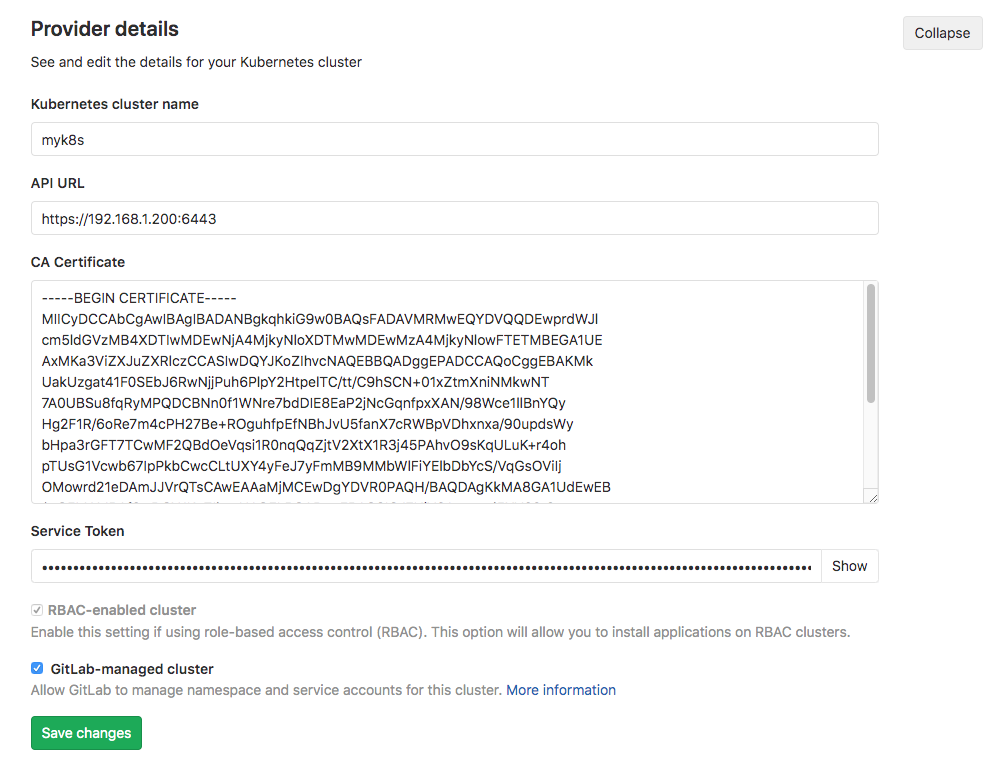
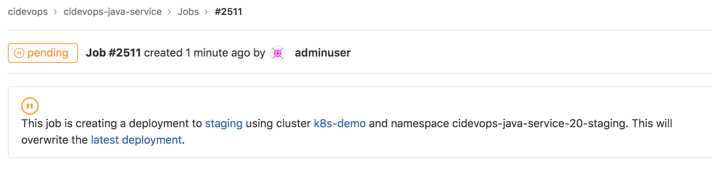
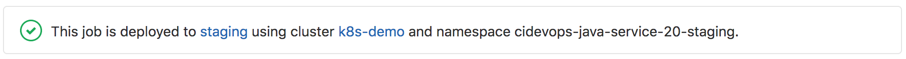
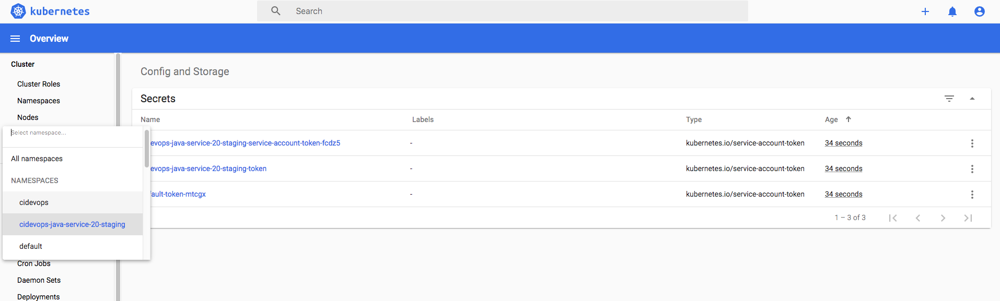
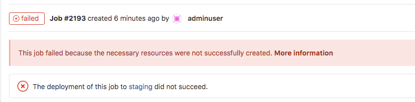

## 配置Gitlab与K8S集群集成


### 1.系统集成配置

获取证书

```
kubectl config view --raw -o=jsonpath='{.clusters[0].cluster.certificate-authority-data}' | base64 --decode
```

创建admin用户

```
---
apiVersion: v1
kind: ServiceAccount
metadata:
  name: gitlab-admin
  namespace: kube-system
---
apiVersion: rbac.authorization.k8s.io/v1beta1
kind: ClusterRoleBinding
metadata:
  name: gitlab-admin
roleRef:
  apiGroup: rbac.authorization.k8s.io
  kind: ClusterRole
  name: cluster-admin
subjects:
- kind: ServiceAccount
  name: gitlab-admin
  namespace: kube-system
```

获取用户token

```
kubectl -n kube-system get secret | grep gitlab-admin | awk '{print $1}'
kubectl -n kube-system get secret gitlab-admin-token-2dh62 -o jsonpath='{.data.token}' | base64 --decode
```

进入系统管理 -> Kubernetes -> 添加已存在集群 ，配置证书与token。 默认开源版本只能添加一个集群。



----


### 2.K8S发布

流水线中添加environment会自动在k8s中创建ns，Kubernetes集成默认为格式为`$CI_PROJECT_NAME-PROJECTID-staging`。对于**非** GitLab管理的集群，可以使用`.gitlab-ci.yml` `environment:kubernetes:namespace`来定制。

```
deploy_k8s:
  image: lucj/kubectl:1.17.2
  tags:
    - k8s
    - kubernetes-runner
  stage: deploy
  script:
    - kubectl config set-cluster my-cluster --server=${KUBE_URL} --certificate-authority="${KUBE_CA_PEM_FILE}"
    - kubectl config set-credentials admin --token=${KUBE_TOKEN}
    - sed -i "s#__namespace__#${NAMESPACE}#g" deployment.yaml 
    - sed -i "s#__appname__#${APP_NAME}#g" deployment.yaml 
    - sed -i "s#__containerport__#${CONTAINER_PORT}#g" deployment.yaml 
    - sed -i "s#__nodeport__#${NODE_PORT}#g" deployment.yaml 
    - sed -i "s#__imagename__#${IMAGE_NAME}#g" deployment.yaml 
    - sed -i "s#__CI_ENVIRONMENT_SLUG__#${CI_ENVIRONMENT_SLUG}#g" deployment.yaml 
    - sed -i "s#__CI_PROJECT_PATH_SLUG__#${CI_PROJECT_PATH_SLUG}#g" deployment.yaml
    - cat deployment.yaml
    - kubectl apply -f deployment.yaml  
  environment:
    name: $ENV_NAME
    url: $ENV_URL

```

集成效果






---


### 3.使用web终端：

第一步：增加deployment注解

```
metadata:
  labels:
    k8s-app: __appname__
  name: __appname__
  namespace: __namespace__
  annotations:
    app.gitlab.com/env: __CI_ENVIRONMENT_SLUG__
    app.gitlab.com/app: __CI_PROJECT_PATH_SLUG__
```

第二步：部署前替换注解变量

```
sed -i "s#__CI_ENVIRONMENT_SLUG__#${CI_ENVIRONMENT_SLUG}#g" deployment.yaml 
sed -i "s#__CI_PROJECT_PATH_SLUG__#${CI_PROJECT_PATH_SLUG}#g" deployment.yaml 
```


```
  script:
    - echo "${KUBE_CA_PEM}" > kube_ca.pem
    - kubectl config set-cluster $K8S_CLUSTER_NAME --server=”$KUBE_URL” --certificate-authority="$(pwd)/kube_ca.pem"
    - kubectl config set-credentials $K8S_CLUSTER_NAME --token=”$KUBE_TOKEN”
    - sed -i "s/__CI_ENVIRONMENT_SLUG__/${CI_ENVIRONMENT_SLUG}/" deployment.yaml
    - kubectl apply -f deployment.yaml -l app=${CI_ENVIRONMENT_SLUG}
```


参考文档： https://forum.gitlab.com/t/gitlab-ci-runner-on-kubernetes-unable-to-access-interactive-web-terminal-connection-failure/26987/5  解决无法开启终端问题。

---




### FAQ

原因是因为权限不够




创建镜像下载凭据

```
kubectl create secret docker-registry cidevops-java-service-20-staging \
    --docker-server=registry.cn-beijing.aliyuncs.com \
    --docker-username=610556220zy \
    --docker-password=zeyang0914.. \
    --docker-email=test@test.com -n cidevops-java-service-20-staging
```

---


参考文档：

https://docs.gitlab.com/runner/configuration/advanced-configuration.html#the-session_server-section

https://s0docs0gitlab0com.icopy.site/ee/ci/interactive_web_terminal/index.html

https://s0docs0gitlab0com.icopy.site/ee/administration/integration/terminal.html#enabling-and-disabling-terminal-support


https://gitlab.com/gitlab-org/charts/gitlab-runner/-/issues/79

