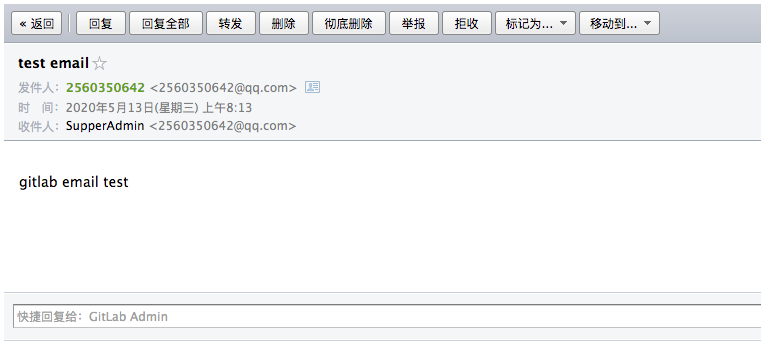
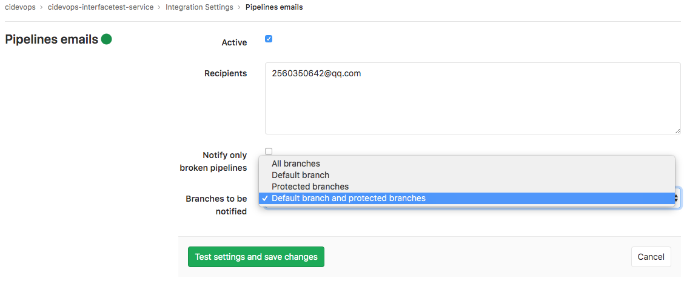
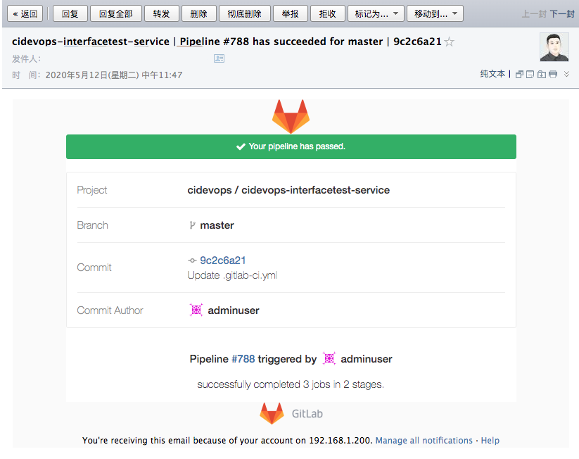
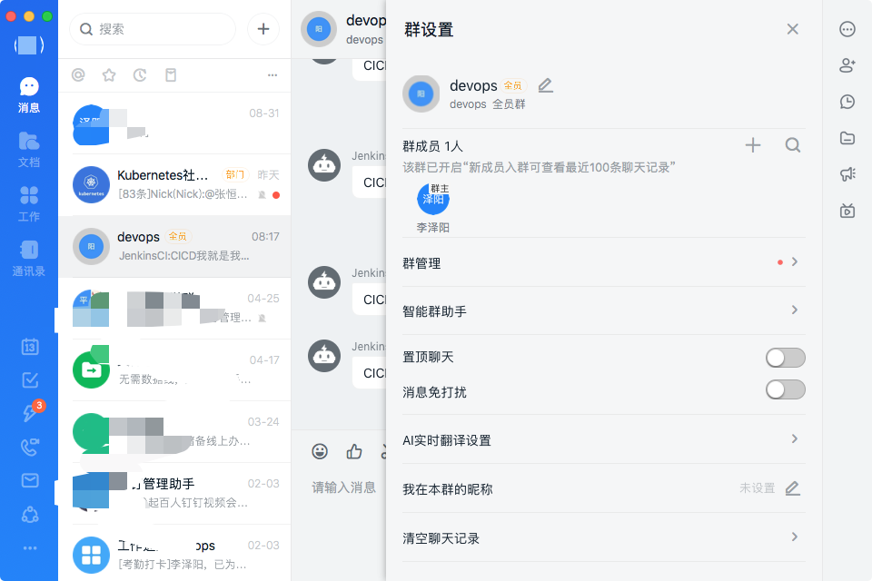
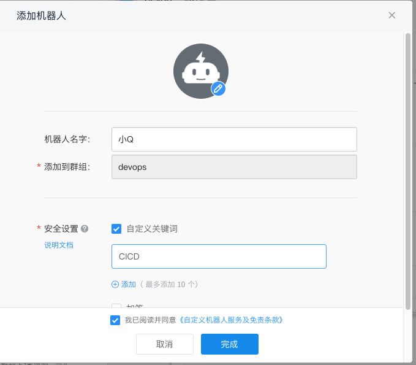
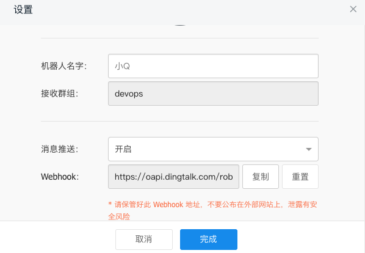
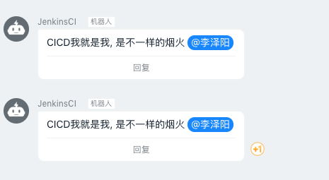

## 流水线构建消息通知


### Pipeline email

编辑/etc/gitlab/gitlab.rb文件开启gitlab email。这里以QQ邮箱为例

```
### GitLab email server settings
###! Docs: https://docs.gitlab.com/omnibus/settings/smtp.html
###! **Use smtp instead of sendmail/postfix.**

gitlab_rails['smtp_enable'] = true
gitlab_rails['smtp_address'] = "smtp.qq.com"
gitlab_rails['smtp_port'] = 465
gitlab_rails['smtp_user_name'] = "2560350642@qq.com"
gitlab_rails['smtp_password'] = "avbkthlkpngnebed"
gitlab_rails['smtp_domain'] = "smtp.qq.com"
gitlab_rails['smtp_authentication'] = "login"
gitlab_rails['smtp_enable_starttls_auto'] = true
gitlab_rails['smtp_tls'] = true

### Email Settings
gitlab_rails['gitlab_email_enabled'] = true
gitlab_rails['gitlab_email_from'] = '2560350642@qq.com'
gitlab_rails['gitlab_email_display_name'] = 'GitLab Admin'
```

重新配置

```
gitlab-ctl stop
gitlab-ctl reconfigure
gitlab-ctl start
gitlab-ctl status
```

登录gitlab-rails控制台，发送测试邮件。

```
su - git
gitlab-rails console

irb(main):002:0> Notify.test_email('2560350642@qq.com', 'test email', 'gitlab email test').deliver_now


Notify#test_email: processed outbound mail in 0.5ms
Delivered mail 5eba1b04de4e5_12903fe2ca0c79b0519ec@gitlab-995f97976-2nmb4.mail (1055.9ms)
Date: Tue, 12 May 2020 03:41:56 +0000
From: GitLab Admin <2560350642@qq.com>
Reply-To: GitLab Admin <noreply@192.168.1.200>
To: 2560350642@qq.com
Message-ID: <5eba1b04de4e5_12903fe2ca0c79b0519ec@gitlab-995f97976-2nmb4.mail>
Subject: Message Subject
Mime-Version: 1.0
Content-Type: text/html;
 charset=UTF-8
Content-Transfer-Encoding: 7bit
Auto-Submitted: auto-generated
X-Auto-Response-Suppress: All

<!DOCTYPE html PUBLIC "-//W3C//DTD HTML 4.0 Transitional//EN" "http://www.w3.org/TR/REC-html40/loose.dtd">
<html><body><p>Message Body And Linuxea.com</p></body></html>

=> #<Mail::Message:70243016426420, Multipart: false, Headers: <Date: Tue, 12 May 2020 03:41:56 +0000>, <From: GitLab Admin <2560350642@qq.com>>, <Reply-To: GitLab Admin <noreply@192.168.1.200>>, <To: 2560350642@qq.com>, <Message-ID: <5eba1b04de4e5_12903fe2ca0c79b0519ec@gitlab-995f97976-2nmb4.mail>>, <Subject: Message Subject>, <Mime-Version: 1.0>, <Content-Type: text/html; charset=UTF-8>, <Content-Transfer-Encoding: 7bit>, <Auto-Submitted: auto-generated>, <X-Auto-Response-Suppress: All>>
```




----


进入项目 -> settings -> 集成


配置邮件通知人、通知条件




运行流水线测试



----


### 钉钉通知

创建群，群机器人，获取hookurl









```
dingding:
  stage: .post
  script:
    - " curl 'https://oapi.dingtalk.com/robot/send?access_token=46ea6f8a0ae44f65fadb1d56d4df5f768801d200af58146580ea7619b108b179' \
        -H 'Content-Type: application/json' \
        -d '{\"msgtype\": \"text\",\"text\": {\"content\": \"CICD我就是我, 是不一样的烟火 @1xxxx2\"},\"at\": {\"atMobiles\": [\"15xxxxx72\"], \"isAtAll\": false}}'"

```

参考文档：https://ding-doc.dingtalk.com/doc#/serverapi2/qf2nxq




---

