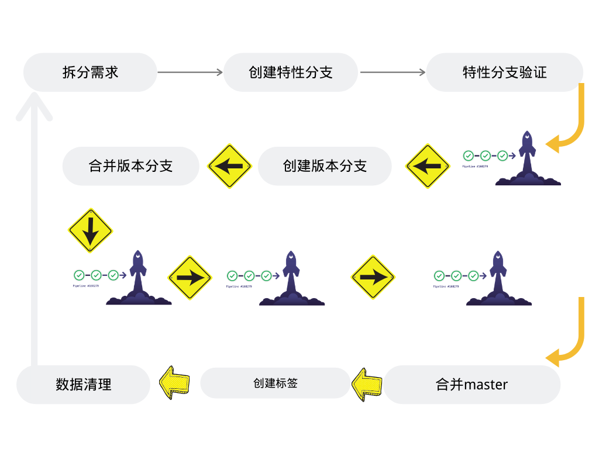

# 流水线设计规划

## 工作流

创建issue --> 创建特性分支 --> 特性分支提交流水线 --> 合并分支流水线 --> 发布分支流水线

1. 创建issues关联特性分支 （特征以数字开头的分支为特性分支）
2. 特性分支提交代码，触发提交流水线（构建验证部署到特性环境）
3. 特性环境验证完成，合并到RELEASE分支。（触发合并流水线进行代码扫描，流水线成功才能合并）
4. RELEASE分支手动发布 （UAT，STAG，PROD）
5. 生产发布完成后RELEASE分支合并到Master分支，并基于master分支创建Release tag。

----

## GitLab Flow

http://dockone.io/article/2350  11个原则

https://www.jianshu.com/p/bb94ebfe883b gitlab上milestone和issues的简单使用

