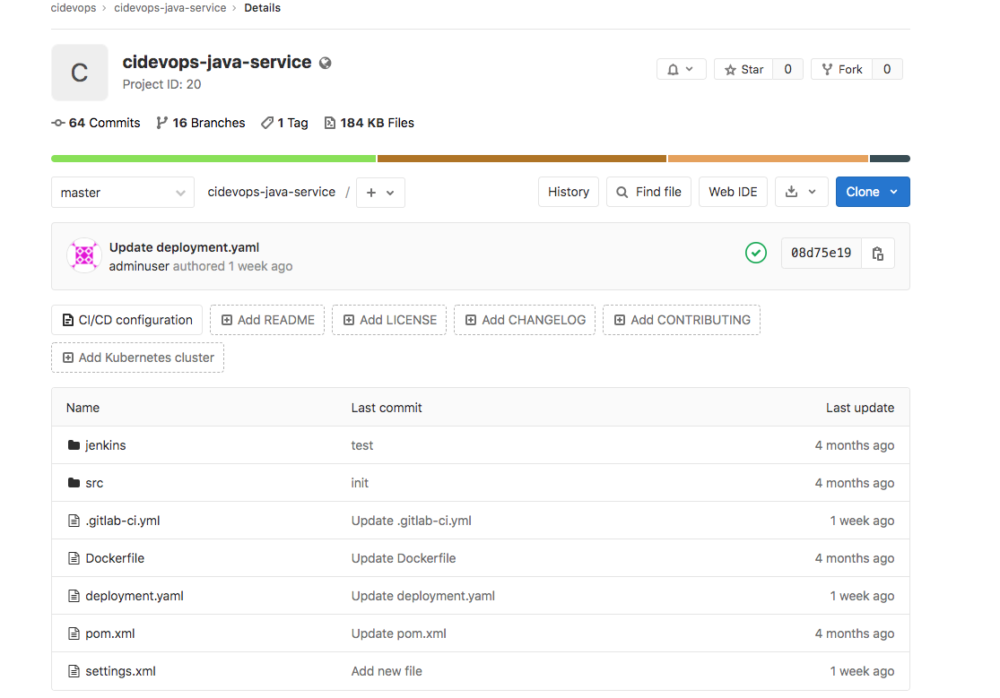
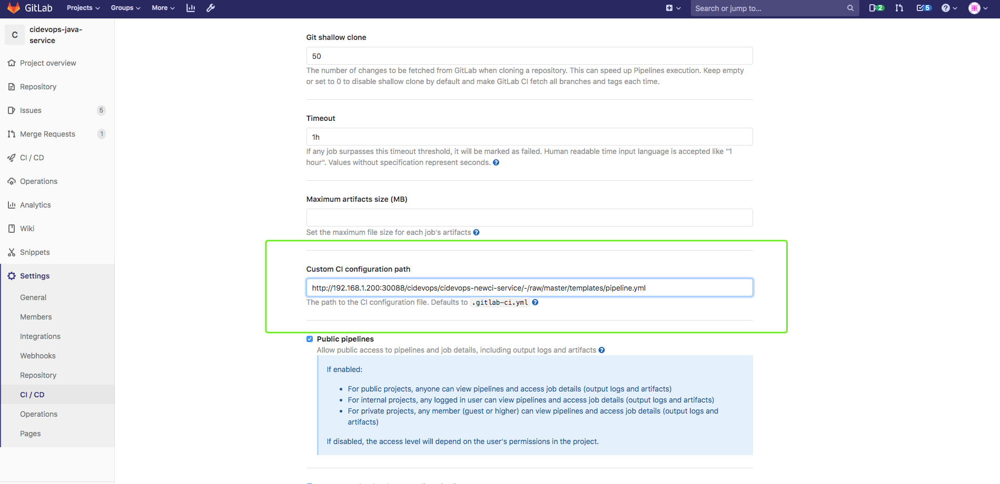

### 1. 准备java项目

还可以直接使用之前的java项目

github ： https://github.com/zeyangli/gitlabci-cidevops-java-service

### 2. 准备模板库

### 3. 准备可用的runner

根据之前内容安装部署runner 

chart ： https://github.com/zeyangli/gitlabci-runner-chart-k8s

### 4.设置项目CI文件

