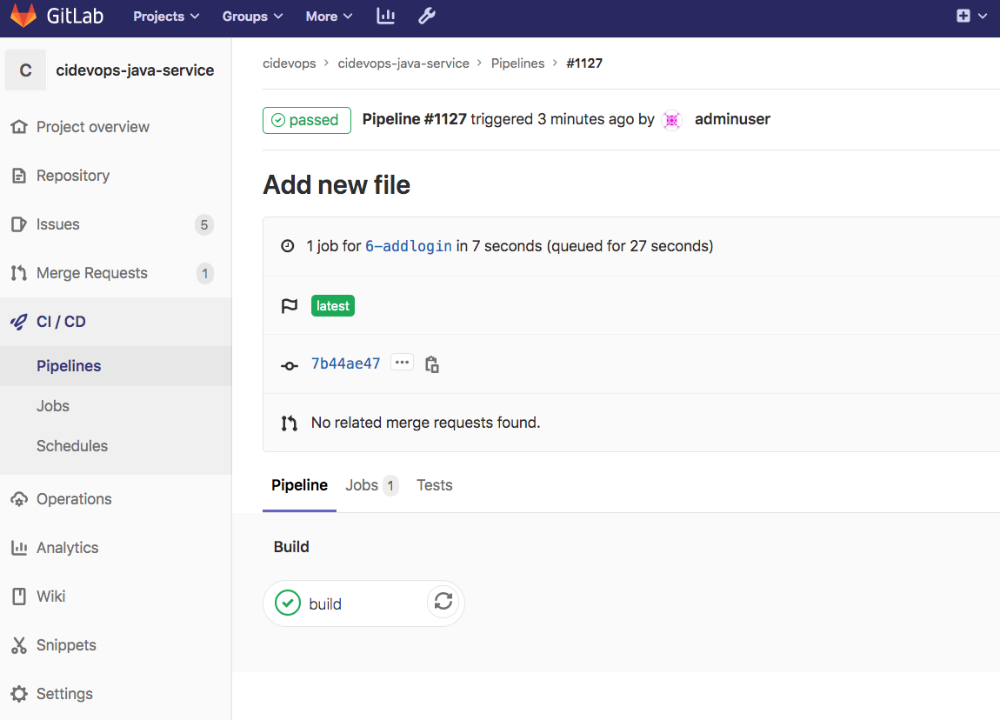
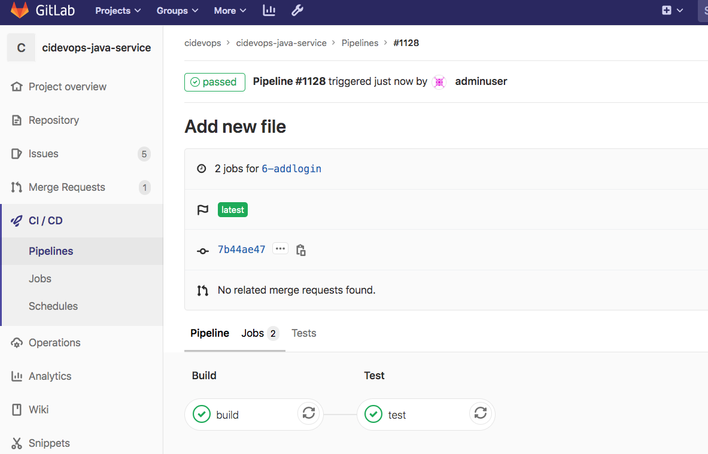
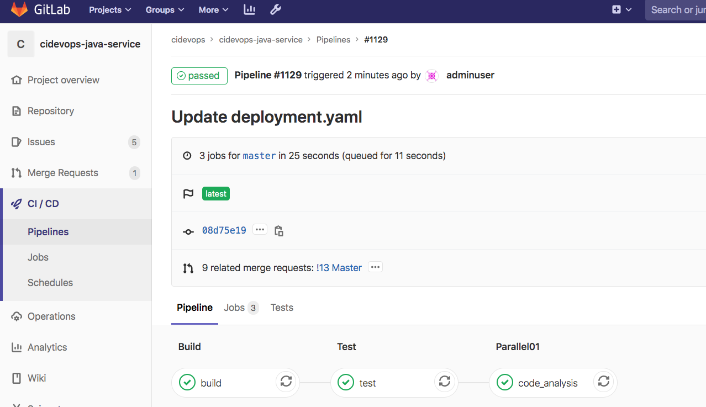
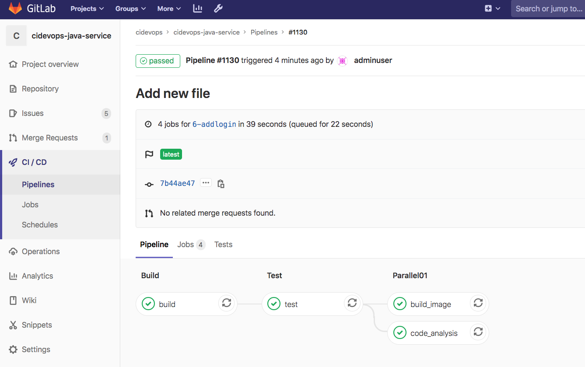
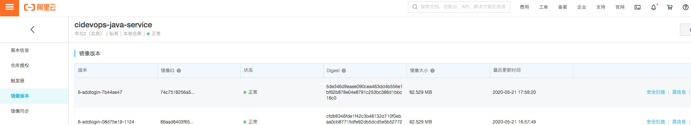
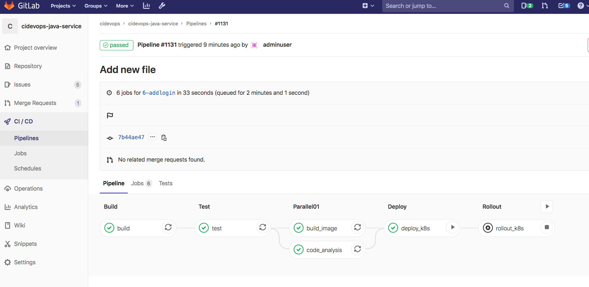
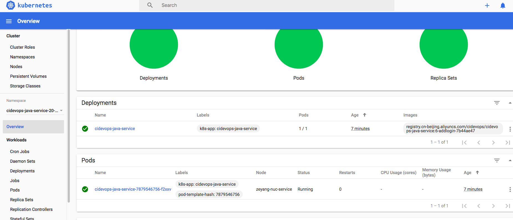

## 提交流水线设计


开发人员在特性分支提交代码，触发提交流水线进行代码验证并发布到特性环境验证（可手动控制发布）。

阶段： 编译，测试，扫描，构建镜像，上传镜像，发布特性环境


特性环境： 命名规范为项目名称-ID-分支名称，每个特性分支发布到对应的特性环境。

镜像名称：

```
registry.cn-beijing.aliyuncs.com/cidevops/cidevops-java-service:3-input-error-a486c590-834
```

ingress域名：  

```
"http://${CI_COMMIT_REF_NAME}.${CI_PROJECT_NAMESPACE}.${CI_PROJECT_NAME}.devops.com"
```


----


## 阶段任务

### Build阶段

定义build作业模板，参数化构建命令。

```
## build相关作业
##

.build:
  stage: build
  script: 
    - ${BUILD_SHELL}

```

在template中引入build作业模板，由于使用容器构建所以声明`MAVEN_IMAGE`变量定义镜像名称。由于之前对构建环境构建目录持久化，所以定义`GIT_CLONE_PATH`参数进入指定的构建目录操作。`GIT_CHECKOUT`设置全局每个作业无需重复下载代码。`BUILD_SHELL`定义构建所需要的命令。定义变量能够足够灵活，适合不同项目不同打包命令的场景下。

```
include:
  - project: 'cidevops/cidevops-newci-service'
    ref: master
    file: 'jobs/build.yml'


variables:
  ## 全局配置
  GIT_CLONE_PATH: $CI_BUILDS_DIR/builds/$CI_PROJECT_NAMESPACE/$CI_PROJECT_NAME/$CI_PIPELINE_ID    
  GIT_CHECKOUT: "false"

  ## 依赖容器镜像
  BUILD_IMAGE: "maven:3.6.3-jdk-8"
  
  ## 构建测试参数
  MAVEN_OPTS: "-Dmaven.repo.local=/home/gitlab-runner/ci-build-cache/maven "
  BUILD_SHELL: 'mvn clean package  -DskipTests  --settings=./settings.xml '  ##构建命令


## 运行阶段  
stages:
  - build

cache:
  paths:
    - target/
    
################# Jobs Configure #####################
## 构建作业
build:
  variables:
    GIT_CHECKOUT: "true"
  image: ${BUILD_IMAGE}
  extends: .build
```

定义build作业，设置作业变量`GIT_CHECKOUT: "true"`表示需要下载代码，默认build是我们流水线中的第一个作业所以必须设置为下载代码，否则构建失败。作业中的变量优先级高于全局。`image`定义我们要使用的镜像，如果采用非容器模式运行可以删除image标签。剩下的配置全部集成模板作业`.build`。

----




----


### Test阶段

这里定义的是在运行编译后进行的单元测试。maven项目一般是`mvn test`,npm项目一般是`npm run test`等。不同的项目运行单元测试的指令不通，其他部分都差不多。这里以maven项目为例。开始设计maven项目单元测试。

编辑`jobs/test.yml`文件定义test作业模板。(后续自动化测试等测试相关作业放到此文件)

```
#单元测试
.test:
  stage: test
  script:
    - $TEST_SHELL
  artifacts:
    reports:
      junit: ${JUNIT_REPORT_PATH}
```


编辑模板文件，添加导入test作业模板。

```
include:
  - project: 'cidevops/cidevops-newci-service'
    ref: master
    file: 'jobs/build.yml'
  - project: 'cidevops/cidevops-newci-service'
    ref: master
    file: 'jobs/test.yml'

```


在模板文件中添加变量定义。

```
variables:
  TEST_SHELL : 'mvn test  --settings=./settings.xml '                        ##测试命令
  JUNIT_REPORT_PATH: 'target/surefire-reports/TEST-*.xml'   ##单元测试报告
  
  
## 测试作业
test:
  image: ${BUILD_IMAGE}
  extends: .test
  before_script:
    - ls 
    - ls target/
```




----


### 代码扫描阶段

jobs/code_analysis.yml

```
##代码扫描
##
##
##

.code_analysis:
  variables:
    GLOBAL_PROJECT_ARGS: "-Dsonar.projectKey=${CI_PROJECT_NAME} 
                          -Dsonar.projectName=${CI_PROJECT_NAME} 
                          -Dsonar.projectVersion=${CI_COMMIT_REF_NAME} 
                          -Dsonar.projectDescription=${CI_PROJECT_TITLE}"
    GLOBAL_SERVER_ARGS:  "-Dsonar.ws.timeout=30 
                          -Dsonar.links.homepage=${CI_PROJECT_URL} 
                          -Dsonar.host.url=${SONAR_SERVER_URL} 
                          -Dsonar.login=${SONAR_SERVER_LOGIN}
                          -Dsonar.sourceEncoding=UTF-8 "
    GLOBAL_MR_ARGS: " -Dsonar.pullrequest.key=${CI_MERGE_REQUEST_IID} 
                      -Dsonar.pullrequest.branch=${CI_MERGE_REQUEST_SOURCE_BRANCH_NAME} 
                      -Dsonar.pullrequest.base=${CI_MERGE_REQUEST_TARGET_BRANCH_NAME} 
                      -Dsonar.gitlab.ref_name=${CI_COMMIT_REF_NAME} 
                      -Dsonar.gitlab.commit_sha=${CI_COMMIT_SHA} 
                      -Dsonar.gitlab.project_id=${CI_PROJECT_PATH} 
                      -Dsonar.pullrequest.gitlab.repositorySlug=${CI_PROJECT_ID} "
    MULTI_BRANCH_ARGS: "-Dsonar.branch.name=${CI_COMMIT_REF_NAME}"
  stage: code_analysis
  script:
    - echo ${GLOBAL_PROJECT_ARGS} ${GLOBAL_SERVER_ARGS} ${SONAR_SCAN_ARGS} ${GLOBAL_MR_ARGS}
    #sonar-scanner $GLOBAL_PROJECT_ARGS $GLOBAL_SERVER_ARGS $SCAN_JAVA_ARGS
    - |
        if [ $CI_PIPELINE_SOURCE == 'merge_request_event' ] 
        
        then
           echo "sonar-scanner ${GLOBAL_PROJECT_ARGS} ${GLOBAL_SERVER_ARGS} ${SONAR_SCAN_ARGS} ${GLOBAL_MR_ARGS}"
           sonar-scanner ${GLOBAL_PROJECT_ARGS} ${GLOBAL_SERVER_ARGS} ${SONAR_SCAN_ARGS} ${GLOBAL_MR_ARGS}
        else 
           echo "sonar-scanner ${GLOBAL_PROJECT_ARGS} ${GLOBAL_SERVER_ARGS} ${SONAR_SCAN_ARGS}"
           sonar-scanner ${GLOBAL_PROJECT_ARGS} ${GLOBAL_SERVER_ARGS} ${SONAR_SCAN_ARGS}  ${MULTI_BRANCH_ARGS}
        fi 
        
.get_analysis_result:
  stage: get_analysis_result
  script:
    - |
        SONAR_REPORT_URL=$(grep "ceTaskUrl" .scannerwork/report-task.txt  | awk -F = '{OFS="=";print $2,$3}')
        echo ${SONAR_REPORT_URL}
        
        
        for i in {1..10}
        do
          curl -k -u "ee2bcb37deeb6dfe3a07fe08fb529559b00c1b7b":"" ${SONAR_REPORT_URL}  -o sonar_result.txt -s
          grep '"status":"SUCCESS"' sonar_result.txt  && SONAR_SCAN_RESULT='SUCCESS'
        
          if [ ${SONAR_SCAN_RESULT} == 'SUCCESS' ]
            then
              echo "${SONAR_SCAN_RESULT}"
              SONAR_SCAN_RESULT=SUCCESS
              break;
          else
            SONAR_SCAN_RESULT='ERROR'
            echo "第$i次获取结果信息，不是成功状态，睡眠10秒！"
            cat sonar_result.txt
            sleep 10
          fi
        done

```


templates/pipeline.yml

```
include:
  - project: 'cidevops/cidevops-newci-service'
    ref: master
    file: 'jobs/build.yml'
  - project: 'cidevops/cidevops-newci-service'
    ref: master
    file: 'jobs/test.yml'
  - project: 'cidevops/cidevops-newci-service'
    ref: master
    file: 'jobs/codeanalysis.yml'


variables:
  ## 全局配置
  GIT_CLONE_PATH: $CI_BUILDS_DIR/builds/$CI_PROJECT_NAMESPACE/$CI_PROJECT_NAME/$CI_PIPELINE_ID    
  GIT_CHECKOUT: "false"

  ## 依赖容器镜像
  BUILD_IMAGE: "maven:3.6.3-jdk-8"
  SONAR_IMAGE: "sonarsource/sonar-scanner-cli:latest"
  
  ## 构建测试参数
  MAVEN_OPTS: "-Dmaven.repo.local=/home/gitlab-runner/ci-build-cache/maven "
  BUILD_SHELL: 'mvn clean package  -DskipTests  --settings=./settings.xml '  ##构建命令
  TEST_SHELL : 'mvn test  --settings=./settings.xml '                        ##测试命令
  JUNIT_REPORT_PATH: 'target/surefire-reports/TEST-*.xml'   ##单元测试报告

  ## 代码扫描
  SONAR_PROJECT_LANG: "JAVA"
  SONAR_SOURCE_DIR : "src" 
  SONAR_SERVER_URL: "http://192.168.1.200:30090" 
  SONAR_SERVER_LOGIN: "ee2bcb37deeb6dfe3a07fe08fb529559b00c1b7b" 
  SONAR_SCAN_ARGS: "-Dsonar.sources=${SONAR_SOURCE_DIR} 
                   -Dsonar.java.binaries=target/classes 
                   -Dsonar.java.test.binaries=target/test-classes 
                   -Dsonar.java.surefire.report=target/surefire-reports "

  


## 运行阶段  
stages:
  - build
  - test
  - parallel01

cache:
  paths:
    - target/
    
################# Jobs Configure #####################
## 构建作业
build:
  variables:
    GIT_CHECKOUT: "true"
  image: ${BUILD_IMAGE}
  extends: .build

## 测试作业
test:
  image: ${BUILD_IMAGE}
  extends: .test
  before_script:
    - ls 
    - ls target/

## 代码扫描
code_analysis:
  stage: parallel01
  image: ${SONAR_IMAGE}
  extends: .code_analysis

```





### 构建镜像阶段


jobs/build.yml

```
.build-docker:
  stage: buildimage
  script:
    - docker login -u $CI_REGISTRY_USER -p $CI_REGISTRY_PASSWD  $CI_REGISTRY
    - docker build -t ${IMAGE_NAME} -f ${DOCKER_FILE_PATH} .
    - docker push ${IMAGE_NAME} 
    - docker rmi ${IMAGE_NAME} 

```


telmplate/pipeline.yml

```
include:
  - project: 'cidevops/cidevops-newci-service'
    ref: master
    file: 'jobs/build.yml'
  - project: 'cidevops/cidevops-newci-service'
    ref: master
    file: 'jobs/test.yml'
  - project: 'cidevops/cidevops-newci-service'
    ref: master
    file: 'jobs/codeanalysis.yml'


variables:
  ## 全局配置
  GIT_CLONE_PATH: $CI_BUILDS_DIR/builds/$CI_PROJECT_NAMESPACE/$CI_PROJECT_NAME/$CI_PIPELINE_ID    
  GIT_CHECKOUT: "false"

  ## 依赖容器镜像
  BUILD_IMAGE: "maven:3.6.3-jdk-8"
  SONAR_IMAGE: "sonarsource/sonar-scanner-cli:latest"
  
  ## 构建测试参数
  MAVEN_OPTS: "-Dmaven.repo.local=/home/gitlab-runner/ci-build-cache/maven "
  BUILD_SHELL: 'mvn clean package  -DskipTests  --settings=./settings.xml '  ##构建命令
  TEST_SHELL : 'mvn test  --settings=./settings.xml '                        ##测试命令
  JUNIT_REPORT_PATH: 'target/surefire-reports/TEST-*.xml'   ##单元测试报告

  ## 代码扫描
  SONAR_PROJECT_LANG: "JAVA"
  SONAR_SOURCE_DIR : "src" 
  SONAR_SERVER_URL: "http://192.168.1.200:30090" 
  SONAR_SERVER_LOGIN: "ee2bcb37deeb6dfe3a07fe08fb529559b00c1b7b" 
  SONAR_SCAN_ARGS: "-Dsonar.sources=${SONAR_SOURCE_DIR} 
                   -Dsonar.java.binaries=target/classes 
                   -Dsonar.java.test.binaries=target/test-classes 
                   -Dsonar.java.surefire.report=target/surefire-reports "

  #构建镜像
  CI_REGISTRY: 'registry.cn-beijing.aliyuncs.com'
  CI_REGISTRY_USER: 'xxxxx'
  #CI_REGISTRY_PASSWD: 'xxxxxxxx.'
  IMAGE_NAME: "$CI_REGISTRY/$CI_PROJECT_PATH:$CI_COMMIT_REF_NAME-$CI_COMMIT_SHORT_SHA"
  DOCKER_FILE_PATH: "./Dockerfile"


## 运行阶段  
stages:
  - build
  - test
  - parallel01

cache:
  paths:
    - target/
    
################# Jobs Configure #####################
## 构建作业
build:
  variables:
    GIT_CHECKOUT: "true"
  image: ${BUILD_IMAGE}
  extends: .build

## 测试作业
test:
  image: ${BUILD_IMAGE}
  extends: .test
  before_script:
    - ls 
    - ls target/

## 代码扫描
code_analysis:
  stage: parallel01
  image: ${SONAR_IMAGE}
  extends: .code_analysis

## 构建镜像
build_image:
  image: docker:latest
  services:
    - name: docker:dind
  stage: parallel01
  extends: .build-docker


```








---


### K8S部署阶段

jobs/deploy.yml

```
## 应用发布


## 使用kubectl镜像发布
.deploy_k8s:
  stage: deploy
  script:
    - echo $KUBE_TOKEN
    - kubectl config set-cluster my-cluster --server=${KUBE_URL} --certificate-authority="${KUBE_CA_PEM_FILE}"
    - kubectl config set-credentials admin --token=${KUBE_TOKEN}
    - ls -a 
    - sed -i "s#__namespace__#${NAMESPACE}#g" deployment.yaml 
    - sed -i "s#__appname__#${APP_NAME}#g" deployment.yaml 
    - sed -i "s#__containerport__#${CONTAINER_PORT}#g" deployment.yaml 
    - sed -i "s#__nodeport__#${NODE_PORT}#g" deployment.yaml 
    - sed -i "s#__imagename__#${IMAGE_NAME}#g" deployment.yaml 
    - sed -i "s#__CI_ENVIRONMENT_SLUG__#${CI_ENVIRONMENT_SLUG}#g" deployment.yaml 
    - sed -i "s#__CI_PROJECT_PATH_SLUG__#${CI_PROJECT_PATH_SLUG}#g" deployment.yaml
    - sed -i "s#__ingressdomain__#${ENV_URL}#g" deployment.yaml
    - cat deployment.yaml
    - "kubectl create secret docker-registry ${APP_NAME} \
            --docker-server=${CI_REGISTRY} \
            --docker-username=$CI_REGISTRY_USER \
            --docker-password=${CI_REGISTRY_PASSWD} \
            --docker-email=test@test.com -n ${NAMESPACE} || echo 'secrets already exists'"
    - kubectl apply -f deployment.yaml  
  environment:
    name: "${CI_COMMIT_REF_NAME}"
    url: "http://${CI_COMMIT_REF_NAME}.${CI_PROJECT_NAMESPACE}.${CI_PROJECT_NAME}.devops.com"
    on_stop: rollout_k8s
  when: manual
  
## 回滚
.rollout_k8s:
  stage: rollout
  script:
    - rm -rf $HOME/.kube
    - kubectl config set-cluster my-cluster --server=${KUBE_URL} --certificate-authority="${KUBE_CA_PEM_FILE}"
    - kubectl config set-credentials admin --token=${KUBE_TOKEN}
    - kubectl rollout history deployment ${APP_NAME} -n ${NAMESPACE}
    - kubectl rollout undo deployment ${APP_NAME} -n ${NAMESPACE}
  when: manual
  environment:
    name: "${CI_COMMIT_REF_NAME}"
    action: stop

```


templates/pipeline.yml

```
include:
  - project: 'cidevops/cidevops-newci-service'
    ref: master
    file: 'jobs/build.yml'
  - project: 'cidevops/cidevops-newci-service'
    ref: master
    file: 'jobs/test.yml'
  - project: 'cidevops/cidevops-newci-service'
    ref: master
    file: 'jobs/codeanalysis.yml'
  - project: 'cidevops/cidevops-newci-service'
    ref: master
    file: 'jobs/deploy.yml'


variables:
  ## 全局配置
  GIT_CLONE_PATH: $CI_BUILDS_DIR/builds/$CI_PROJECT_NAMESPACE/$CI_PROJECT_NAME/$CI_PIPELINE_ID    
  GIT_CHECKOUT: "false"

  ## 依赖容器镜像
  BUILD_IMAGE: "maven:3.6.3-jdk-8"
  SONAR_IMAGE: "sonarsource/sonar-scanner-cli:latest"
  
  ## 构建测试参数
  MAVEN_OPTS: "-Dmaven.repo.local=/home/gitlab-runner/ci-build-cache/maven "
  BUILD_SHELL: 'mvn clean package  -DskipTests  --settings=./settings.xml '  ##构建命令
  TEST_SHELL : 'mvn test  --settings=./settings.xml '                        ##测试命令
  JUNIT_REPORT_PATH: 'target/surefire-reports/TEST-*.xml'   ##单元测试报告

  ## 代码扫描
  SONAR_PROJECT_LANG: "JAVA"
  SONAR_SOURCE_DIR : "src" 
  SONAR_SERVER_URL: "http://192.168.1.200:30090" 
  SONAR_SERVER_LOGIN: "ee2bcb37deeb6dfe3a07fe08fb529559b00c1b7b" 
  SONAR_SCAN_ARGS: "-Dsonar.sources=${SONAR_SOURCE_DIR} 
                   -Dsonar.java.binaries=target/classes 
                   -Dsonar.java.test.binaries=target/test-classes 
                   -Dsonar.java.surefire.report=target/surefire-reports "

  #构建镜像
  CI_REGISTRY: 'registry.cn-beijing.aliyuncs.com'
  CI_REGISTRY_USER: '610556220zy'
  #CI_REGISTRY_PASSWD: 'xxxxxxxx.'
  IMAGE_NAME: "$CI_REGISTRY/$CI_PROJECT_PATH:$CI_COMMIT_REF_NAME-$CI_COMMIT_SHORT_SHA"
  DOCKER_FILE_PATH: "./Dockerfile"

  #部署应用k8s
  RUN_DEPLOY: "yes"
  APP_NAME: "$CI_PROJECT_NAME"
  CONTAINER_PORT: 8081
  #NODE_PORT: 30185
  NAMESPACE: "$CI_PROJECT_NAME-$CI_PROJECT_ID-$CI_ENVIRONMENT_SLUG"


## 运行阶段  
stages:
  - build
  - test
  - parallel01
  - deploy
  - rollout


cache:
  paths:
    - target/
    
################# Jobs Configure #####################
## 构建作业
build:
  variables:
    GIT_CHECKOUT: "true"
  image: ${BUILD_IMAGE}
  extends: .build

## 测试作业
test:
  image: ${BUILD_IMAGE}
  extends: .test
  before_script:
    - ls 
    - ls target/

## 代码扫描
code_analysis:
  stage: parallel01
  image: ${SONAR_IMAGE}
  extends: .code_analysis

## 构建镜像
build_image:
  image: docker:latest
  services:
    - name: docker:dind
  stage: parallel01
  extends: .build-docker

## 发布应用
deploy_k8s:
  stage: deploy
  image: lucj/kubectl:1.17.2
  extends: .deploy_k8s
    
## 应用回滚
rollout_k8s:
  stage: rollout
  image: lucj/kubectl:1.17.2
  extends: .rollout_k8s


```





