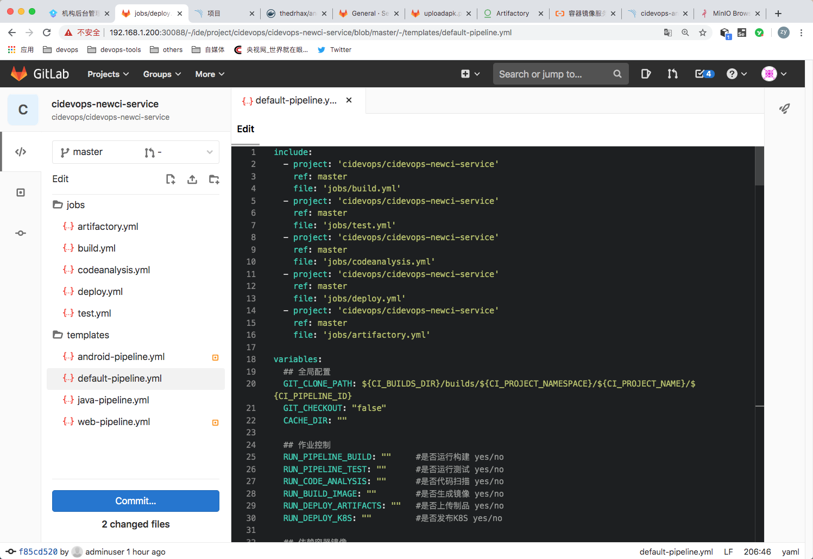

## 目录结构

基本上还是按照之前的目录结构完成的，jobs目录用于存放作业模板。templates目录用于存放流水线模板。 这次使用`default-pipeline.yml`作为所有作业的基础模板。




---


### 作业模板

作业分为Build、test、codeanalysis、artifactory、deploy部分，在每个作业中配置了rules功能开关，由变量控制最终作业的运行。


######  jobs/build.yml  构建作业模板

包含两个作业模板，分别是普通的构建模板（maven/npm/gradle）和docker 镜像构建模板。

```
## build相关作业
##

.build:
  stage: build
  script: 
    - |
      ${BUILD_SHELL}
  variables:
    GIT_CHECKOUT: "true"
  rules:
    - if: " $RUN_PIPELINE_BUILD == 'no' "
      when: never
    - when: always


## 构建镜像
.build-docker:
  stage: buildimage
  script:
    - docker login -u $CI_REGISTRY_USER -p $CI_REGISTRY_PASSWD  $CI_REGISTRY
    - docker build -t ${IMAGE_NAME} -f ${DOCKER_FILE_PATH} .
    - docker push ${IMAGE_NAME} 
    - docker rmi ${IMAGE_NAME} 
  rules:
    - if: " $RUN_BUILD_IMAGE == 'no' "
      when: never
    - when: always

```


###### jobs/test.yml  测试作业模板

主要用于运行项目单元测试，例如maven、gradle、npm单元测试。

```
#单元测试
.test:
  stage: test
  script:
    - $TEST_SHELL
  artifacts:
    reports:
      junit: ${JUNIT_REPORT_PATH}
  rules:
    - if: " $RUN_PIPELINE_TEST == 'no' "
      when: never
    - when: always

```


###### jobs/codeanalysis.yml 代码扫描模板

包含两个作业模板，分别为扫描作业和获取扫描结果。这里面将扫描参数进行了分类，通用的项目参数、特殊的合并请求参数、自定义的项目参数。

```
##代码扫描
##
##
##

.code_analysis:
  variables:
    GLOBAL_PROJECT_ARGS: "-Dsonar.projectKey=${CI_PROJECT_NAME} 
                          -Dsonar.projectName=${CI_PROJECT_NAME} 
                          -Dsonar.projectVersion=${CI_COMMIT_REF_NAME} 
                          -Dsonar.projectDescription=${CI_PROJECT_TITLE}"
    GLOBAL_SERVER_ARGS:  "-Dsonar.ws.timeout=30 
                          -Dsonar.links.homepage=${CI_PROJECT_URL} 
                          -Dsonar.host.url=${SONAR_SERVER_URL} 
                          -Dsonar.login=${SONAR_SERVER_LOGIN}
                          -Dsonar.sourceEncoding=UTF-8 "
    GLOBAL_MR_ARGS: " -Dsonar.pullrequest.key=${CI_MERGE_REQUEST_IID} 
                      -Dsonar.pullrequest.branch=${CI_MERGE_REQUEST_SOURCE_BRANCH_NAME} 
                      -Dsonar.pullrequest.base=${CI_MERGE_REQUEST_TARGET_BRANCH_NAME} 
                      -Dsonar.gitlab.ref_name=${CI_COMMIT_REF_NAME} 
                      -Dsonar.gitlab.commit_sha=${CI_COMMIT_SHA} 
                      -Dsonar.gitlab.project_id=${CI_PROJECT_PATH} 
                      -Dsonar.pullrequest.gitlab.repositorySlug=${CI_PROJECT_ID} "
    MULTI_BRANCH_ARGS: "-Dsonar.branch.name=${CI_COMMIT_REF_NAME}"
  stage: code_analysis
  script:
    - echo ${GLOBAL_PROJECT_ARGS} ${GLOBAL_SERVER_ARGS} ${SONAR_SCAN_ARGS} ${GLOBAL_MR_ARGS}
    #sonar-scanner $GLOBAL_PROJECT_ARGS $GLOBAL_SERVER_ARGS $SCAN_JAVA_ARGS
    - |
        if [ $CI_PIPELINE_SOURCE == 'merge_request_event' ] 
        
        then
           echo "sonar-scanner ${GLOBAL_PROJECT_ARGS} ${GLOBAL_SERVER_ARGS} ${SONAR_SCAN_ARGS} " 
           sonar-scanner ${GLOBAL_PROJECT_ARGS} ${GLOBAL_SERVER_ARGS} ${SONAR_SCAN_ARGS} 
        else 
           echo "sonar-scanner ${GLOBAL_PROJECT_ARGS} ${GLOBAL_SERVER_ARGS} ${SONAR_SCAN_ARGS} ${MULTI_BRANCH_ARGS}"
           sonar-scanner ${GLOBAL_PROJECT_ARGS} ${GLOBAL_SERVER_ARGS} ${SONAR_SCAN_ARGS}  ${MULTI_BRANCH_ARGS}
        fi 
  rules:
    - if: " $RUN_CODE_ANALYSIS == 'no' "
      when: never
    - when: always


#### 获取代码扫描结果
.get_analysis_result:
  stage: get_analysis_result
  script:
    - |
        SONAR_REPORT_URL=$(grep "ceTaskUrl" .scannerwork/report-task.txt  | awk -F = '{OFS="=";print $2,$3}')
        echo ${SONAR_REPORT_URL}
        
        
        for i in {1..10}
        do
          curl -k -u "${SONAR_SERVER_LOGIN}":"" ${SONAR_REPORT_URL}  -o sonar_result.txt -s
          grep '"status":"SUCCESS"' sonar_result.txt  && SONAR_SCAN_RESULT='SUCCESS'
        
          if [ ${SONAR_SCAN_RESULT} == 'SUCCESS' ]
            then
              echo "${SONAR_SCAN_RESULT}"
              SONAR_SCAN_RESULT=SUCCESS

              curl -k -u "${SONAR_SERVER_LOGIN}":"" "${SONAR_SERVER_URL}/api/qualitygates/project_status?projectKey=$CI_PROJECT_NAME&branch=$CI_COMMIT_REF_NAME" -o result.txt  -s
              echo "result info ---->>>>>"
              cat result.txt
              result=`cat result.txt | awk -F ':' '{print $3}' | awk -F '"' '{print$2}'`
              
              echo $result

              if [ $result == 'ERROR' ]                 
                then 
                  echo "${result}"
                  exit 122
                  break;
              else
                  echo "success!"
                  break;
              fi
            
          else
            SONAR_SCAN_RESULT='ERROR'
            echo "第$i次获取结果信息，不是成功状态，睡眠10秒！"
            cat sonar_result.txt
            sleep 10
          fi
        done
        
  rules:
    - if: " $RUN_CODE_ANALYSIS == 'no' "
      when: never
    - when: always
```


###### jobs/artifactory.yml 制品管理作业

包含两个作业，制品上传与下载。使用artifactory制品库接口。

```
## 制品库相关
##

.deploy-artifact:
  stage: deploy-artifact
  script:
    - echo "curl -u${ARTIFACT_USER}:${ARTIFACT_PASSWD} -T ${ARTIFACT_PATH} $ARTIFACTORY_URL/$ARTIFACTORY_NAME/$TARGET_FILE_PATH/$TARGET_ARTIFACT_NAME"
    - curl -u${ARTIFACT_USER}:${ARTIFACT_PASSWD} -T ${ARTIFACT_PATH} "$ARTIFACTORY_URL/$ARTIFACTORY_NAME/$TARGET_FILE_PATH/$TARGET_ARTIFACT_NAME"
  rules:
    - if: " $RUN_DEPLOY_ARTIFACTS == 'no' "
      when: never
    - when: always


.down-artifact:
  stage: down-artifact
  script:
    - curl -u${ARTIFACT_USER}:${ARTIFACT_PASSWD} -O "$ARTIFACTORY_URL/$ARTIFACTORY_NAME/$TARGET_FILE_PATH/$TARGET_ARTIFACT_NAME"
    - ls

```


###### jobs/deploy.yml  发布作业模板

发布基于k8s的发布和回滚配置。

```
## 应用发布


## 使用kubectl镜像发布
.deploy_k8s:
  stage: deploy
  script:
    - echo $KUBE_TOKEN
    - kubectl config set-cluster my-cluster --server=${KUBE_URL} --certificate-authority="${KUBE_CA_PEM_FILE}"
    - kubectl config set-credentials admin --token=${KUBE_TOKEN}
    - ls -a 
    - sed -i "s#__namespace__#${NAMESPACE}#g" ${DEPLOY_FILE}
    - sed -i "s#__appname__#${APP_NAME}#g" ${DEPLOY_FILE}
    - sed -i "s#__containerport__#${CONTAINER_PORT}#g" ${DEPLOY_FILE} 
    - sed -i "s#__nodeport__#${NODE_PORT}#g" ${DEPLOY_FILE} 
    - sed -i "s#__imagename__#${IMAGE_NAME}#g" ${DEPLOY_FILE} 
    - sed -i "s#__CI_ENVIRONMENT_SLUG__#${CI_ENVIRONMENT_SLUG}#g" ${DEPLOY_FILE}
    - sed -i "s#__CI_PROJECT_PATH_SLUG__#${CI_PROJECT_PATH_SLUG}#g" ${DEPLOY_FILE}
    - sed -i "s#__ingressdomain__#${ENV_URL}#g" ${DEPLOY_FILE}
    - cat ${DEPLOY_FILE}
    - "kubectl create secret docker-registry ${APP_NAME} \
            --docker-server=${CI_REGISTRY} \
            --docker-username=$CI_REGISTRY_USER \
            --docker-password=${CI_REGISTRY_PASSWD} \
            --docker-email=test@test.com -n ${NAMESPACE} || echo 'secrets already exists'"
    - kubectl apply -f ${DEPLOY_FILE}
  rules:
    - if: " $RUN_DEPLOY_K8S == 'no'"
      when: never
    - when: manual
  environment:
    name: "${ENV_NAME}"
    url: "http://${ENV_NAME}.${CI_PROJECT_NAMESPACE}.${CI_PROJECT_NAME}.devops.com"

  


## 回滚
.rollout_k8s:
  stage: deploy
  script:
    - rm -rf $HOME/.kube
    - kubectl config set-cluster my-cluster --server=${KUBE_URL} --certificate-authority="${KUBE_CA_PEM_FILE}"
    - kubectl config set-credentials admin --token=${KUBE_TOKEN}
    - kubectl rollout history deployment ${APP_NAME} -n ${NAMESPACE}
    - kubectl rollout undo deployment ${APP_NAME} -n ${NAMESPACE}
  rules:
    - if: " $RUN_DEPLOY_K8S == 'no' "
      when: never
    - when: manual
  environment:
    name: "${ENV_NAME}"
    action: stop

```


---


### default流水线模板

templates/default-pipeline.yml 模板分成个部分

- include导入作业模板
- variables 定义全局变量
- workflow 定义流水线控制
- jobs 构建与发布作业


###### include导入作业模板

```
include:
  - project: 'cidevops/cidevops-newci-service'
    ref: master
    file: 'jobs/build.yml'
  - project: 'cidevops/cidevops-newci-service'
    ref: master
    file: 'jobs/test.yml'
  - project: 'cidevops/cidevops-newci-service'
    ref: master
    file: 'jobs/codeanalysis.yml'
  - project: 'cidevops/cidevops-newci-service'
    ref: master
    file: 'jobs/deploy.yml'
  - project: 'cidevops/cidevops-newci-service'
    ref: master
    file: 'jobs/artifactory.yml'
```


###### variables 定义全局变量

```
variables:
  ## 全局配置
  GIT_CLONE_PATH: ${CI_BUILDS_DIR}/builds/${CI_PROJECT_NAMESPACE}/${CI_PROJECT_NAME}/${CI_PIPELINE_ID}    
  GIT_CHECKOUT: "false"
  CACHE_DIR: ""

  ## 作业控制
  RUN_PIPELINE_BUILD: ""     #是否运行构建 yes/no 
  RUN_PIPELINE_TEST: ""      #是否运行测试 yes/no 
  RUN_CODE_ANALYSIS: ""      #是否代码扫描 yes/no 
  RUN_BUILD_IMAGE: ""        #是否生成镜像 yes/no
  RUN_DEPLOY_ARTIFACTS: ""   #是否上传制品 yes/no
  RUN_DEPLOY_K8S: ""         #是否发布K8S yes/no

  ## 依赖容器镜像
  BUILD_IMAGE: ""
  CURL_IMAGE: "curlimages/curl:7.70.0"
  SONAR_IMAGE: "sonarsource/sonar-scanner-cli:latest"
  KUBECTL_IMAGE: "lucj/kubectl:1.17.2"
  
  
  ## 构建测试参数
  MAVEN_OPTS: ""                #maven构建参数 
  GRADLE_OPTS: ""               #gradle构建参数
  BUILD_SHELL: ''               #构建命令

  ## 单元测试参数
  TEST_SHELL : 'mvn test  --settings=./settings.xml '       #测试命令
  JUNIT_REPORT_PATH: 'target/surefire-reports/TEST-*.xml'   #单元测试报告

  ## 代码扫描
  SONAR_SOURCE_DIR : "src"                                          #项目源码目录
  SONAR_SERVER_URL: "http://192.168.1.200:30090"                    #SonarQube服务器信息
  SONAR_SERVER_LOGIN: "ee2bcb37deeb6dfe3a07fe08fb529559b00c1b7b"    #Sonar Token最好在项目中定义。
  SONAR_SCAN_ARGS: "-Dsonar.sources=${SONAR_SOURCE_DIR}"            #项目扫描参数

  ## 构建镜像
  CI_REGISTRY: 'registry.cn-beijing.aliyuncs.com'               #镜像仓库地址              
  CI_REGISTRY_USER: 'xxxxxx'                               #仓库用户信息
  #CI_REGISTRY_PASSWD: 'xxxxxxxx.'                              #仓库用户密码
  IMAGE_NAME: "${CI_REGISTRY}/${CI_PROJECT_PATH}:${CI_COMMIT_REF_NAME}-${CI_COMMIT_SHORT_SHA}"     #镜像名称
  DOCKER_FILE_PATH: "./Dockerfile"                              #Dockerfile位置

  ## 上传制品库(artifactory)
  ARTIFACTORY_URL: "http://192.168.1.200:30082/artifactory"     #制品库地址
  ARTIFACTORY_NAME: "${CI_PROJECT_NAMESPACE}"                   #制品库名称
  ARTIFACT_PACKAGE: "jar"                                       #制品类型
  ARTIFACT_PATH: "target/*.${ARTIFACT_PACKAGE}"                 #制品位置
  TARGET_FILE_PATH: "${CI_PROJECT_NAMESPACE}/${CI_PROJECT_NAME}/${CI_COMMIT_REF_NAME}-${CI_COMMIT_SHORT_SHA}"   #目标制品位置(目录结构)
  TARGET_ARTIFACT_NAME: "${CI_PROJECT_NAME}-${CI_COMMIT_REF_NAME}-${CI_COMMIT_SHORT_SHA}.${ARTIFACT_PACKAGE}"   #目标制品名称

  ## 部署应用k8s
  APP_NAME: "$CI_PROJECT_NAME"                #应用名称 <--> deploymentName
  CONTAINER_PORT: "8081"                      #服务端口 <--> servicesPort
  NAMESPACE: "$CI_PROJECT_NAME-$CI_PROJECT_ID-$CI_ENVIRONMENT_SLUG"             #名称空间
  ENV_URL: "${ENV_NAME}.${CI_PROJECT_NAMESPACE}.${CI_PROJECT_NAME}.devops.com"  #IngressHosts

```


###### 流水线设置

```
## 流水线控制
workflow:
  rules:
    - if: "$CI_MERGE_REQUEST_ID"          #过滤合并请求
      when: never
    - if: "$CI_PIPELINE_SOURCE == 'web'"    #允许在web页面发布
    - if: "$CI_COMMIT_REF_NAME =~ /^RELEASE-*/ || $CI_COMMIT_REF_NAME =~ /master/ "  #过滤版本分支和主干分支提交代码触发
      when: never
    - if: "$CI_COMMIT_BEFORE_SHA == '0000000000000000000000000000000000000000'"     #过滤分支创建请求
      when: never
    ### 默认策略
    - when: always


## 运行阶段  
stages:
  - build
  - test
  - parallel01
  - get_analysis_result
  - deploy-artifact
  - deploy-feature
  - rollout-feature
  - deploy-uat
  - rollout-uat
  - deploy-stag
  - rollout-stag
  - deploy-prod
  - rollout-prod

cache:
  paths:
    - ${CACHE_DIR}
    
before_script:
  - export
```


###### 构建作业配置

```
################# Jobs Configure #####################
## 构建作业
build:
  image: ${BUILD_IMAGE}
  extends: .build

## 测试作业
test:
  image: ${BUILD_IMAGE}
  extends: .test
  before_script:
    - ls 
    - ls ${CACHE_DIR}

## 代码扫描
code_analysis:
  stage: parallel01
  image: ${SONAR_IMAGE}
  extends: .code_analysis

## 获取构建结果
get_analysis_result:
  image: ${CURL_IMAGE}
  extends: .get_analysis_result
  needs:
    - code_analysis


## 构建镜像
build_image:
  image: docker:latest
  services:
    - name: docker:dind
  stage: parallel01
  extends: .build-docker


## 上传制品
deploy_artifact:
  image: ${CURL_IMAGE}
  stage: deploy-artifact
  extends: .deploy-artifact

## 下载制品  
#down_artifact:  
#  image: ${CURL_IMAGE}
#  stage: down_artifact
#  extends: .down-artifact
```


###### 发布部署作业配置

```
#################Deploy Feature Jobs Configure #####################
## feature发布应用
deploy_feature:
  variables:
    DEPLOY_FILE: 'deployment.yaml'
    ENV_NAME: 'feature'
  stage: deploy-feature
  image: ${KUBECTL_IMAGE}
  extends: .deploy_k8s
  environment:
    on_stop: "rollout_feature"
  rules:
    - if: $RUN_DEPLOY_K8S == 'no'
      when: never
    - if: $CI_COMMIT_REF_NAME =~ /^RELEASE-*/ || $CI_COMMIT_REF_NAME =~ /master/ || $CI_COMMIT_TAG
      when: never
    - when: manual
    
## 应用回滚
rollout_feature:
  variables:
    DEPLOY_FILE: 'deployment.yaml'
    ENV_NAME: 'feature'
  stage: rollout-feature
  image: ${KUBECTL_IMAGE}
  extends: .rollout_k8s
  needs:
    - deploy_feature
  rules:
    - if: $RUN_DEPLOY_K8S == 'no'
      when: never
    - if: $CI_COMMIT_REF_NAME =~ /^RELEASE-*/ || $CI_COMMIT_REF_NAME =~ /master/ || $CI_COMMIT_TAG
      when: never
    - when: on_failure


#################Deploy UAT Jobs Configure #####################
## UAT
deploy_uat:
  variables:
    DEPLOY_FILE: 'config/deployment-uat.yaml'
    ENV_NAME: 'uat'
  stage: deploy-uat
  image: ${KUBECTL_IMAGE}
  extends: .deploy_k8s
  environment:
    on_stop: "rollout_uat"
  rules:
    - if: $RUN_DEPLOY_K8S == 'no'
      when: never
    - if: $CI_COMMIT_REF_NAME =~ /^RELEASE-*/ || $CI_COMMIT_REF_NAME =~ /master/ || $CI_COMMIT_TAG
      when: manual
    - when: never

## UAT应用回滚
rollout_uat:
  variables:
    DEPLOY_FILE: 'config/deployment-uat.yaml'
    ENV_NAME: 'uat'
  stage: rollout-uat
  image: ${KUBECTL_IMAGE}
  extends: .rollout_k8s
  needs:
    - deploy_uat
  rules:
    - if: $RUN_DEPLOY_K8S == 'no'
      when: never
    - if: $CI_COMMIT_REF_NAME =~ /^RELEASE-*/ || $CI_COMMIT_REF_NAME =~ /master/ || $CI_COMMIT_TAG
      when: on_failure
    - when: never

#################Deploy STAG Jobs Configure #####################
## STAG
deploy_stag:
  variables:
    DEPLOY_FILE: 'config/deployment-stag.yaml'
    ENV_NAME: 'stag'
  stage: deploy-stag
  image: ${KUBECTL_IMAGE}
  extends: .deploy_k8s
  environment:
    on_stop: "rollout_stag"
  needs:
    - deploy_uat
  rules:
    - if: $RUN_DEPLOY_K8S == 'no'
      when: never
    - if: $CI_COMMIT_REF_NAME =~ /^RELEASE-*/ || $CI_COMMIT_REF_NAME =~ /master/ || $CI_COMMIT_TAG
      when: manual
    - when: never

## STAG应用回滚
rollout_stag:
  variables:
    DEPLOY_FILE: 'config/deployment-stag.yaml'
    ENV_NAME: 'stag'
  stage: rollout-stag
  image: ${KUBECTL_IMAGE}
  extends: .rollout_k8s
  needs:
    - deploy_stag
  rules:
    - if: $RUN_DEPLOY_K8S == 'no'
      when: never
    - if: $CI_COMMIT_REF_NAME =~ /^RELEASE-*/ || $CI_COMMIT_REF_NAME =~ /master/ || $CI_COMMIT_TAG
      when: on_failure
    - when: never

#################Deploy PROD Jobs Configure #####################
## PROD
deploy_prod:
  variables:
    DEPLOY_FILE: 'config/deployment-prod.yaml'
    ENV_NAME: 'prod'
  stage: deploy-prod
  image: ${KUBECTL_IMAGE}
  extends: .deploy_k8s
  environment:
    on_stop: "rollout_prod"
  needs:
    - deploy_stag
  rules:
    - if: $RUN_DEPLOY_K8S == 'no'
      when: never
    - if: $CI_COMMIT_REF_NAME =~ /^RELEASE-*/ || $CI_COMMIT_REF_NAME =~ /master/ || $CI_COMMIT_TAG
      when: manual
    - when: never

## PROD应用回滚
rollout_prod:
  variables:
    DEPLOY_FILE: 'config/deployment-prod.yaml'
    ENV_NAME: 'prod'
  stage: rollout-prod
  image: ${KUBECTL_IMAGE}
  extends: .rollout_k8s
  needs:
    - deploy_prod
  rules:
    - if: $RUN_DEPLOY_K8S == 'no'
      when: never
    - if: $CI_COMMIT_REF_NAME =~ /^RELEASE-*/ || $CI_COMMIT_REF_NAME =~ /master/ || $CI_COMMIT_TAG
      when: on_failure
    - when: never
```


