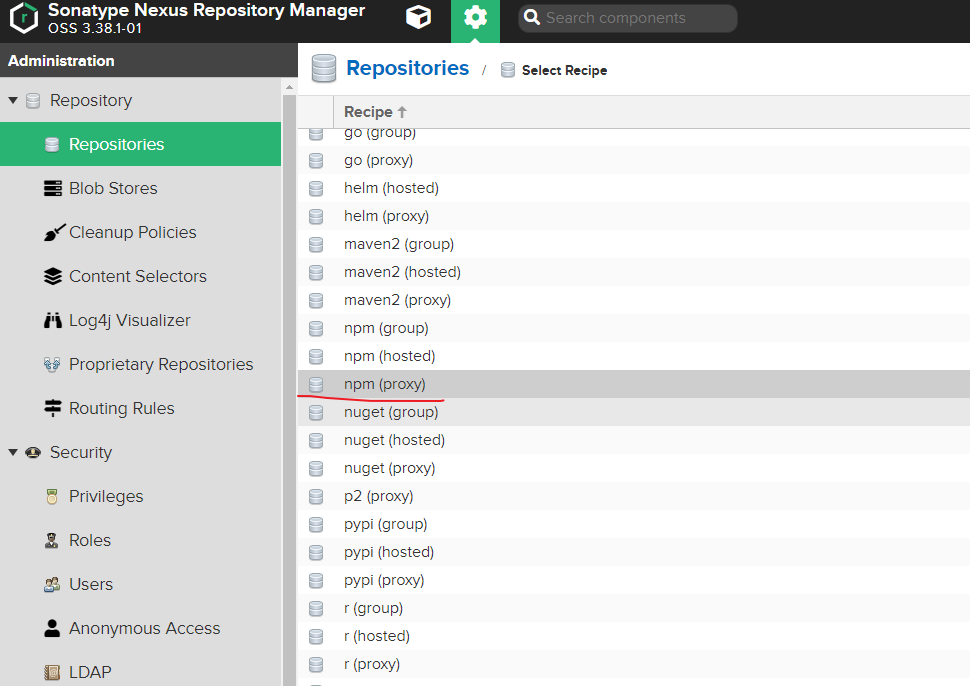
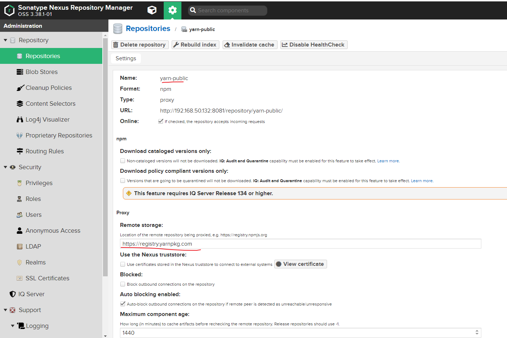
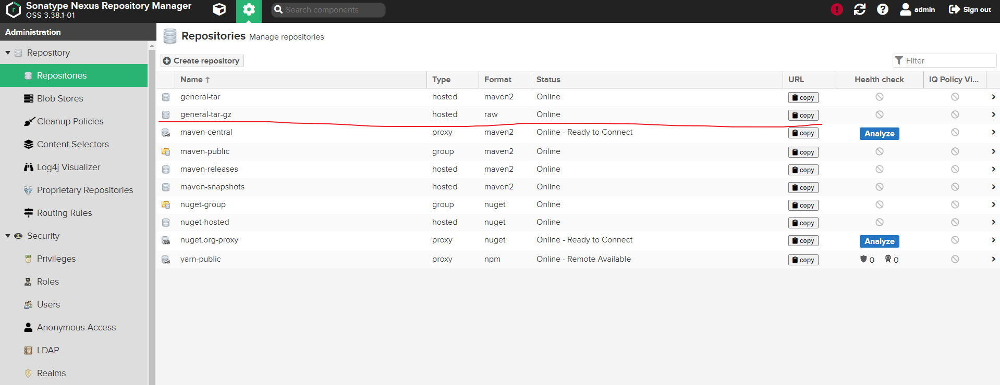

## 某官网前端项目流水线设计

### 背景

由于内部未统一项目的分支设计，导致分支管理比较乱。所以，这里我们通过提交的信息进行判断。

成品库以及yarn仓库代理统一使用nexus3。

### 部署nexus3


```bash
mkdir /data/nexus3 #创建数据目录
cd /app/ && mkdir nexus3 #应用docker-compose存放路径
#挂载数据目录以及宿主机时区，hosts文件按需挂载
cat /app/nexus3/docker-compose.yml 
version: "3"

services:
  package-repository:
    image: sonatype/nexus3:3.38.1
    container_name: package-repository
    restart: always 
    volumes:
      - "/data/nexus3:/nexus-data"
      - "/etc/localtime:/etc/localtime:ro"
      - "/etc/hosts:/etc/hosts:ro"
    ports:
      - "8081:8081"
#按照官方文档为数据目录授权，官方文档中写明docker中的运行用户ID为200      
chown -R 200 /data/nexus3/
docker-compose up -d # 启动nexus3
cat /data/nexus3/admin.password  #查看初始化密码，然后修改密码
```

这里我们使用admin登陆nexus3，然后创建对应的仓库。





PS: 如果使用的是npm的话，`Remote storage` 则要写npm仓库的源地址。

#### npm (proxy) Repository

repositories – create repository – npm(proxy)

- Name: npm-central
- Remote storage: https://registry.npmjs.org

##### Developer Setting (Set Config)

```bash
npm config set registry http://localhost:8081/repository/npm-central/
npm config list
------
#test
npm install npmrc -g
```

#### yarn (proxy) Repository

repositories – create repository – npm(proxy)

- yarn-central
- Remote storage: [https://registry.yarnpkg.com](https://registry.yarnpkg.com/)

##### Developer Setting (Set Config)

```bash
yarn config set registry http://localhost:8081/repository/yarn-central/
yarn config list
------
#test
yarn global add npmrc
```

PS: 参考地址：`https://anote.dev/nexus-on-npm-yarnproxy-repository/`

##### 创建dist-tar通用包仓库

我们需要将前端编译之后的dist目录，打包并上传至通用仓库，这里我们依然使用nexus3存储。 我们创建的仓库类型选择：Type-hosted; Fromat-raw.




### 创建流水线

流水线完整内容：

```yaml
variables:
  DEPLOY_VARIABLE: "default-deploy"
  GIT_CHECKOUT: "false"  #默认所有的job都需要下载仓库
  ARTIFACTORY_URL: "http://192.168.50.132:8081/repository/general-tar-gz"  #制品打包之后上传位置
  NPM_REGISTRY_URL: "http://192.168.50.132:8081/repository/yarn-public/"   #npm仓库代理，加速构建
  SSH_KNOWN_HOSTS: "192.168.50.121"  #部署到测试环境的主机
  SSH_KNOWN_PORT: 22
  SSH_KNOWN_USER: "root"

workflow:
  rules:
    - if: $CI_COMMIT_MESSAGE =~ /-deploy$/   #当提交信息以-deploy结尾的时候会进行测试环境部署
      when: always
    - if: $CI_COMMIT_MESSAGE =~ /-deployment-prd$/  #当提交信息以-deployment-prd结尾时，则需要部署到生产环境
      variables:
        DEPLOY_VARIABLE: "deploy-prd" # 部署到生产环境，控制变量，觉得执行job
      when: always
    - when: never
    

#定义三个阶段   
stages:
  - build                  
  - upload_artifacts
  - deploy

cache:
  paths:
    - node_modules/    #定义构建缓存，加速构建过程

build-job:
  variables: 
    GIT_CHECKOUT: "true"   #只有budild阶段下载仓库
  stage: build
  tags:
    - docker143
  image: iqimei/node16:alpine-tools-v1   #自定义镜像，官方描述可查看dockerfile
  script:
    - pwd
    - ls  
    - yarn config set registry ${NPM_REGISTRY_URL}
    - yarn install --pure-lockfile
    - yarn run build
    - cd dist 
    - ls
    - rm -rf *.tar.gz
    - tar -zcvf dist-${CI_COMMIT_SHORT_SHA}.tar.gz *
  #- curl -v -u $NEXUS3_AUTH --upload-file dist-${CI_COMMIT_SHORT_SHA}.tar.gz ${ARTIFACTORY_URL}/${CI_PROJECT_NAMESPACE}/${CI_PROJECT_NAME}/dist-${CI_COMMIT_SHORT_SHA}.tar.gz
  # cache:
  #   paths: 
  #     - dist/dist-${CI_COMMIT_SHORT_SHA}.tar.gz

upload_dist_artifacts:
  stage: upload_artifacts
  tags:
    - docker143
  image: iqimei/node16:alpine-tools-v1
  script:
    - echo "upload_dist_artifacts"
    - echo "curl -v -u $NEXUS3_AUTH --upload-file dist-${CI_COMMIT_SHORT_SHA}.tar.gz ${ARTIFACTORY_URL}/${CI_PROJECT_NAMESPACE}/${CI_PROJECT_NAME}/dist-${CI_COMMIT_SHORT_SHA}.tar.gz"
    - cd dist
    - ls
    - curl -v -u $NEXUS3_AUTH --upload-file dist-${CI_COMMIT_SHORT_SHA}.tar.gz ${ARTIFACTORY_URL}/${CI_PROJECT_NAMESPACE}/${CI_PROJECT_NAME}/dist-${CI_COMMIT_SHORT_SHA}.tar.gz
  rules:
    - if: "$DEPLOY_VARIABLE == 'deploy-prd'"
      when: always
    - when: never
    
deploy-job:
  stage: deploy
  tags:
    - docker143
  image: iqimei/alpine:v3.15-ssh
  script:
    - echo "deploy ${SSH_KNOWN_HOSTS}"
    - ls dist/dist-${CI_COMMIT_SHORT_SHA}.tar.gz
    - echo "starting deploy use ssh copy ......"
    - eval $(ssh-agent -s)
    - echo "$TEST_SSH_KEY" | tr -d '\r' | ssh-add -
    - mkdir -p ~/.ssh
    - chmod 700 ~/.ssh
    - ssh-keyscan $SSH_KNOWN_HOSTS >> ~/.ssh/known_hosts
    - chmod 644 ~/.ssh/known_hosts
    - ssh root@$SSH_KNOWN_HOSTS "\[ -d "/var/www/${CI_PROJECT_NAME}" \] || mkdir -p /var/www/${CI_PROJECT_NAME}"
    - scp dist/dist-${CI_COMMIT_SHORT_SHA}.tar.gz root@$SSH_KNOWN_HOSTS:/var/www/${CI_PROJECT_NAME}
    - ssh root@$SSH_KNOWN_HOSTS "cd /var/www/${CI_PROJECT_NAME} && tar -zxf  dist-${CI_COMMIT_SHORT_SHA}.tar.gz -C /var/www/${CI_PROJECT_NAME} && rm -f dist-${CI_COMMIT_SHORT_SHA}.tar.gz && ls -l"
  rules:
    - if: "$DEPLOY_VARIABLE == 'deploy-prd'"
      when: never
    - when: always


#生产环境的部署job，我只定义了echo，具体通过ssh部署到nginx配置的web目录下，参考测试环境的deploy job
deploy-prd-job:
  stage: deploy
  tags:
    - docker143
  image: reg.aixbx.com/pubcomp/node16-alpine-tools:v1
  script:
    - echo "deploy prod"
    - ls dist/*
  rules:
    - if: "$DEPLOY_VARIABLE == 'deploy-prd'"
      when: manual
    - when: never
#由于生产环境发布的特殊性，这里我们配置了手动执行。

```

