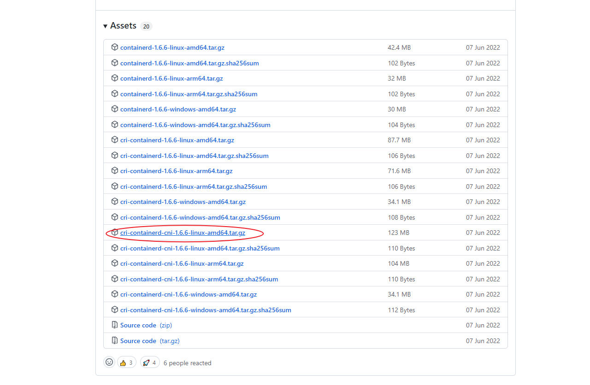

## 容器运行时Containerd的安装和使用


### 使用Containerd的理由

- Docker Engine 没有实现 [CRI](https://kubernetes.io/zh-cn/docs/concepts/architecture/cri/)， 而这是容器运行时在 Kubernetes 中工作所需要的。 为此，必须安装一个额外的服务 [cri-dockerd](https://github.com/Mirantis/cri-dockerd)。 cri-dockerd 是一个基于传统的内置 Docker 引擎支持的项目， 它在 1.24 版本从 kubelet 中[移除](https://kubernetes.io/zh-cn/dockershim)。
- Containerd比Docker更加轻量级，更适合在生产环境中使用.
- 简洁的基于 gRPC 的 API 和 client library
- 完整的 OCI 支持(runtime 和 image spec); 同时具备稳定性和高性能的定义良好的容器核心功能; 
- 一个解耦的系统(让 image、filesystem、runtime 解耦合)，实现插件式的扩展和重用


### 下载

系统版本:

```bash
[root@k8s-rnode1 src]# uname -a
Linux k8s-rnode1 4.18.0-372.16.1.el8_6.0.1.x86_64 #1 SMP Thu Jul 14 21:39:58 UTC 2022 x86_64 x86_64 x86_64 GNU/Linux
[root@k8s-rnode1 src]# cat /etc/redhat-release 
Rocky Linux release 8.6 (Green Obsidian)
```


根据系统版本和CPU类型选择`cri-containerd-cni`文件进行下载. 此文件已经包含了`CLI`(与containerd交互的命令行界面)以及`cni`的网络插件.

[github地址](https://github.com/containerd/containerd/releases)

这里我们使用最新的1.6.6版本.



拷贝指定文件到指定的目录

```bash
[root@k8s-rnode1 ~]$ cd /usr/local/src/
[root@k8s-rnode1 ~]$ wget https://github.com/containerd/containerd/releases/download/v1.6.6/cri-containerd-cni-1.6.6-linux-amd64.tar.gz
[root@k8s-rnode1 src]$ tar xzvf cri-containerd-cni-1.6.6-linux-amd64.tar.gz
[root@k8s-rnode1 src]$ ls -l
total 125608
-rw-r--r-- 1 root root 128619561 Aug  1 16:44 cri-containerd-cni-1.6.6-linux-amd64.tar.gz
drwxr-xr-x 4 root root        51 Jun  7 01:35 etc
drwxr-xr-x 4 root root        35 Jun  7 01:34 opt
drwxr-xr-x 3 root root        19 Jun  7 01:34 usr

```

### 安装

拷贝二进制文件到指定目录

```bash
[root@k8s-rnode1 src]$ cp etc/crictl.yaml /etc/
[root@k8s-rnode1 src]$ cp -ra etc/cni /etc/
[root@k8s-rnode1 src]$ cp -ra opt/cni /opt/
[root@k8s-rnode1 src]$ cp etc/systemd/system/containerd.service /usr/lib/systemd/system/
[root@k8s-rnode1 src]$ cp -a usr/local/bin/* /usr/local/bin/
[root@k8s-rnode1 src]$ cp -a usr/local/sbin/* /usr/local/sbin/
```


生成`containerd`配置文件

```bash
# 1. 创建文件夹
[root@k8s-rnode1 src]$ mkdir -p /etc/containerd
# 2. 生成配置文件
[root@k8s-rnode1 src]$ containerd config default > /etc/containerd/config.toml
```

修改配置文件如下:

```toml
disabled_plugins = []
imports = []
oom_score = 0
plugin_dir = ""
required_plugins = []
root = "/var/lib/containerd"
state = "/run/containerd"
temp = ""
version = 2

[cgroup]
  path = ""

[debug]
  address = ""
  format = ""
  gid = 0
  level = ""
  uid = 0

[grpc]
  address = "/run/containerd/containerd.sock"
  gid = 0
  max_recv_message_size = 16777216
  max_send_message_size = 16777216
  tcp_address = ""
  tcp_tls_ca = ""
  tcp_tls_cert = ""
  tcp_tls_key = ""
  uid = 0

[metrics]
  address = ""
  grpc_histogram = false

[plugins]

  [plugins."io.containerd.gc.v1.scheduler"]
    deletion_threshold = 0
    mutation_threshold = 100
    pause_threshold = 0.02
    schedule_delay = "0s"
    startup_delay = "100ms"

  [plugins."io.containerd.grpc.v1.cri"]
    device_ownership_from_security_context = false
    disable_apparmor = false
    disable_cgroup = false
    disable_hugetlb_controller = true
    disable_proc_mount = false
    disable_tcp_service = true
    enable_selinux = false
    enable_tls_streaming = false
    enable_unprivileged_icmp = false
    enable_unprivileged_ports = false
    ignore_image_defined_volumes = false
    max_concurrent_downloads = 3
    max_container_log_line_size = 16384
    netns_mounts_under_state_dir = false
    restrict_oom_score_adj = false
    #1. 修改K8S基础镜像地址
    sandbox_image = "registry.cn-hangzhou.aliyuncs.com/google_containers/pause:3.6"
    selinux_category_range = 1024
    stats_collect_period = 10
    stream_idle_timeout = "4h0m0s"
    stream_server_address = "127.0.0.1"
    stream_server_port = "0"
    systemd_cgroup = false
    tolerate_missing_hugetlb_controller = true
    unset_seccomp_profile = ""

    [plugins."io.containerd.grpc.v1.cri".cni]
      bin_dir = "/opt/cni/bin"
      conf_dir = "/etc/cni/net.d"
      conf_template = ""
      ip_pref = ""
      max_conf_num = 1

    [plugins."io.containerd.grpc.v1.cri".containerd]
      default_runtime_name = "runc"
      disable_snapshot_annotations = true
      discard_unpacked_layers = false
      ignore_rdt_not_enabled_errors = false
      no_pivot = false
      snapshotter = "overlayfs"

      [plugins."io.containerd.grpc.v1.cri".containerd.default_runtime]
        base_runtime_spec = ""
        cni_conf_dir = ""
        cni_max_conf_num = 0
        container_annotations = []
        pod_annotations = []
        privileged_without_host_devices = false
        runtime_engine = ""
        runtime_path = ""
        runtime_root = ""
        runtime_type = ""

        [plugins."io.containerd.grpc.v1.cri".containerd.default_runtime.options]

      [plugins."io.containerd.grpc.v1.cri".containerd.runtimes]

        [plugins."io.containerd.grpc.v1.cri".containerd.runtimes.runc]
          base_runtime_spec = ""
          cni_conf_dir = ""
          cni_max_conf_num = 0
          container_annotations = []
          pod_annotations = []
          privileged_without_host_devices = false
          runtime_engine = ""
          runtime_path = ""
          runtime_root = ""
          runtime_type = "io.containerd.runc.v2"

          [plugins."io.containerd.grpc.v1.cri".containerd.runtimes.runc.options]
            BinaryName = ""
            CriuImagePath = ""
            CriuPath = ""
            CriuWorkPath = ""
            IoGid = 0
            IoUid = 0
            NoNewKeyring = false
            NoPivotRoot = false
            Root = ""
            ShimCgroup = ""
            #2. 结合 runc 使用 systemd cgroup 驱动 参考k8s设置地址: https://kubernetes.io/zh-cn/docs/setup/production-environment/container-runtimes/#containerd
            SystemdCgroup = true

      [plugins."io.containerd.grpc.v1.cri".containerd.untrusted_workload_runtime]
        base_runtime_spec = ""
        cni_conf_dir = ""
        cni_max_conf_num = 0
        container_annotations = []
        pod_annotations = []
        privileged_without_host_devices = false
        runtime_engine = ""
        runtime_path = ""
        runtime_root = ""
        runtime_type = ""

        [plugins."io.containerd.grpc.v1.cri".containerd.untrusted_workload_runtime.options]

    [plugins."io.containerd.grpc.v1.cri".image_decryption]
      key_model = "node"

    [plugins."io.containerd.grpc.v1.cri".registry]
      config_path = ""

      [plugins."io.containerd.grpc.v1.cri".registry.auths]

      [plugins."io.containerd.grpc.v1.cri".registry.configs]

      [plugins."io.containerd.grpc.v1.cri".registry.headers]

      [plugins."io.containerd.grpc.v1.cri".registry.mirrors]
        #3. 设置镜像仓库加速
        [plugins."io.containerd.grpc.v1.cri".registry.mirrors."docker.io"]
          endpoint = ["https://fz5yth0r.mirror.aliyuncs.com","https://dockerhub.mirrors.nwafu.edu.cn","https://docker.mirrors.ustc.edu.cn","https://registry.docker-cn.com"]
        [plugins."io.containerd.grpc.v1.cri".registry.mirrors."gcr.io"]
          endpoint = ["https://gcr.mirrors.ustc.edu.cn"]
        [plugins."io.containerd.grpc.v1.cri".registry.mirrors."k8s.gcr.io"]
          endpoint = ["https://registry.cn-hangzhou.aliyuncs.com/google_containers"]
        [plugins."io.containerd.grpc.v1.cri".registry.mirrors."quay.io"]
          endpoint = ["https://quay.mirrors.ustc.edu.cn"]

    [plugins."io.containerd.grpc.v1.cri".x509_key_pair_streaming]
      tls_cert_file = ""
      tls_key_file = ""

  [plugins."io.containerd.internal.v1.opt"]
    path = "/opt/containerd"

  [plugins."io.containerd.internal.v1.restart"]
    interval = "10s"

  [plugins."io.containerd.internal.v1.tracing"]
    sampling_ratio = 1.0
    service_name = "containerd"

  [plugins."io.containerd.metadata.v1.bolt"]
    content_sharing_policy = "shared"

  [plugins."io.containerd.monitor.v1.cgroups"]
    no_prometheus = false

  [plugins."io.containerd.runtime.v1.linux"]
    no_shim = false
    runtime = "runc"
    runtime_root = ""
    shim = "containerd-shim"
    shim_debug = false

  [plugins."io.containerd.runtime.v2.task"]
    platforms = ["linux/amd64"]
    sched_core = false

  [plugins."io.containerd.service.v1.diff-service"]
    default = ["walking"]

  [plugins."io.containerd.service.v1.tasks-service"]
    rdt_config_file = ""

  [plugins."io.containerd.snapshotter.v1.aufs"]
    root_path = ""

  [plugins."io.containerd.snapshotter.v1.btrfs"]
    root_path = ""

  [plugins."io.containerd.snapshotter.v1.devmapper"]
    async_remove = false
    base_image_size = ""
    discard_blocks = false
    fs_options = ""
    fs_type = ""
    pool_name = ""
    root_path = ""

  [plugins."io.containerd.snapshotter.v1.native"]
    root_path = ""

  [plugins."io.containerd.snapshotter.v1.overlayfs"]
    root_path = ""
    upperdir_label = false

  [plugins."io.containerd.snapshotter.v1.zfs"]
    root_path = ""

  [plugins."io.containerd.tracing.processor.v1.otlp"]
    endpoint = ""
    insecure = false
    protocol = ""

[proxy_plugins]

[stream_processors]

  [stream_processors."io.containerd.ocicrypt.decoder.v1.tar"]
    accepts = ["application/vnd.oci.image.layer.v1.tar+encrypted"]
    args = ["--decryption-keys-path", "/etc/containerd/ocicrypt/keys"]
    env = ["OCICRYPT_KEYPROVIDER_CONFIG=/etc/containerd/ocicrypt/ocicrypt_keyprovider.conf"]
    path = "ctd-decoder"
    returns = "application/vnd.oci.image.layer.v1.tar"

  [stream_processors."io.containerd.ocicrypt.decoder.v1.tar.gzip"]
    accepts = ["application/vnd.oci.image.layer.v1.tar+gzip+encrypted"]
    args = ["--decryption-keys-path", "/etc/containerd/ocicrypt/keys"]
    env = ["OCICRYPT_KEYPROVIDER_CONFIG=/etc/containerd/ocicrypt/ocicrypt_keyprovider.conf"]
    path = "ctd-decoder"
    returns = "application/vnd.oci.image.layer.v1.tar+gzip"

[timeouts]
  "io.containerd.timeout.bolt.open" = "0s"
  "io.containerd.timeout.shim.cleanup" = "5s"
  "io.containerd.timeout.shim.load" = "5s"
  "io.containerd.timeout.shim.shutdown" = "3s"
  "io.containerd.timeout.task.state" = "2s"

[ttrpc]
  address = ""
  gid = 0
  uid = 0
```


### 启动containerd

```bash
# 启动，并设置为开机启动
[root@k8s-rnode1 ~]$ systemctl daemon-reload &&systemctl enable containerd && systemctl start containerd
# 查看是否启动成功
[root@k8s-rnode1 ~]$ systemctl status containerd
[root@k8s-rnode1 ~]$ systemctl status containerd | grep "active"
   Active: active (running) since Mon 2022-08-01 18:16:38 CST; 26min ago
```

### 安装nerdctl

虽然官方默认的`ctr`工具与`containerd`捆绑在一起,但是该`ctr`工具仅用于调试containerd.  这里我们建议使用`nerdctl`.

nerdctl: Docker-compatible CLI for containerd

nerdctl是兼容docker的CLI.

[nerdctl下载地址](https://github.com/containerd/nerdctl/releases)

根据系统版本和CPU类型选择对应版本进行下载.

这里我们使用的是v0.22.2目前的最新版本.

下载:

```bash
[root@k8s-rnode1 ~]$ cd /usr/local/src/
[root@k8s-rnode1 src]$ wget https://github.com/containerd/nerdctl/releases/download/v0.22.2/nerdctl-0.22.2-linux-amd64.tar.gz
```

解压:

```bash
[root@k8s-rnode1 src]$ tar Cxzvvf /usr/local/bin nerdctl-0.22.2-linux-amd64.tar.gz
-rwxr-xr-x root/root  27807744 2022-08-02 01:54 nerdctl
-rwxr-xr-x root/root     21562 2022-08-02 01:53 containerd-rootless-setuptool.sh
-rwxr-xr-x root/root      7032 2022-08-02 01:53 containerd-rootless.sh
```

### 运行容器

进行命令测试

```bash
[root@k8s-rnode1 src]$ nerdctl info
Client:
 Namespace:     default
 Debug Mode:    false

Server:
 Server Version: v1.6.6
 Storage Driver: overlayfs
 Logging Driver: json-file
 Cgroup Driver: cgroupfs
 Cgroup Version: 1
 Plugins:
  Log: fluentd journald json-file
  Storage: native overlayfs
 Security Options:
  seccomp
   Profile: default
 Kernel Version: 4.18.0-372.16.1.el8_6.0.1.x86_64
 Operating System: Rocky Linux 8.6 (Green Obsidian)
 OSType: linux
 Architecture: x86_64
 CPUs: 2
 Total Memory: 3.618GiB
 Name: k8s-rnode1
 ID: 1a7f6518-d04d-4acb-b61f-5c80f2c618b5
```

运行容器

```bash
[root@k8s-rnode1 ~]$ nerdctl run -d --name nginx -p 80:80 nginx:alpine
[root@k8s-rnode1 ~]$ nerdctl ps
CONTAINER ID    IMAGE                             COMMAND                   CREATED           STATUS    PORTS                 NAMES
e686f18c070e    docker.io/library/nginx:alpine    "/docker-entrypoint.…"    47 minutes ago    Up        0.0.0.0:80->80/tcp    nginx
[root@k8s-rnode1 ~]$ nerdctl pull iqimei/busybox-httpd-server:v1
docker.io/iqimei/busybox-httpd-server:v1:                                         resolved       |++++++++++++++++++++++++++++++++++++++| 
manifest-sha256:2bf4ba508c9ea5ebe8748116ce82c02066f39ca5631ac9aa2c40ca67f957eb2c: done           |++++++++++++++++++++++++++++++++++++++| 
config-sha256:af7189cca5dd58650482051d29b2c5ada5df24467b1644595cae5dcae72faa39:   done           |++++++++++++++++++++++++++++++++++++++| 
layer-sha256:5cc84ad355aaa64f46ea9c7bbcc319a9d808ab15088a27209c9e70ef86e5a2aa:    done           |++++++++++++++++++++++++++++++++++++++| 
layer-sha256:f0a20889bc2c2442fad15ba064df29741778d02f933e267ec16b5070b160aac3:    done           |++++++++++++++++++++++++++++++++++++++| 
elapsed: 18.4s                                                                    total:  757.8  (41.2 KiB/s) 
[root@k8s-rnode1 ~]$ nerdctl images
REPOSITORY                     TAG       IMAGE ID        CREATED               PLATFORM       SIZE        BLOB SIZE
iqimei/busybox-httpd-server    v1        2bf4ba508c9e    About a minute ago    linux/amd64    1.2 MiB     757.8 KiB
alpine                         latest    7580ece7963b    51 minutes ago        linux/amd64    5.5 MiB     2.7 MiB
nginx                          alpine    9c2030e1ff2c    52 minutes ago        linux/amd64    25.3 MiB    9.7 MiB

```


nerdctl命令补全

```bash
[root@k8s-rnode1 ~]$ dnf install -y bash-completion
[root@k8s-rnode1 ~]$ source /usr/share/bash-completion/bash_completion
[root@k8s-rnode1 ~]$ source <(nerdctl completion bash)
[root@k8s-rnode1 ~]$ echo "source <(nerdctl completion bash)" >> ~/.bashrc
[root@k8s-rnode1 ~]$ source ~/.bashrc
```


访问nginx:

```bash
[root@k8s-rnode1 ~]$ curl http://127.0.0.1
<!DOCTYPE html>
<html>
<head>
<title>Welcome to nginx!</title>
<style>
html { color-scheme: light dark; }
body { width: 35em; margin: 0 auto;
font-family: Tahoma, Verdana, Arial, sans-serif; }
</style>
</head>
<body>
<h1>Welcome to nginx!</h1>
<p>If you see this page, the nginx web server is successfully installed and
working. Further configuration is required.</p>

<p>For online documentation and support please refer to
<a href="http://nginx.org/">nginx.org</a>.<br/>
Commercial support is available at
<a href="http://nginx.com/">nginx.com</a>.</p>

<p><em>Thank you for using nginx.</em></p>
</body>
</html>
```

通过`ip add show`命令可以查看到容器桥接的网卡IP段

```bash
[root@k8s-rnode1 ~]$ ip add sh
1: lo: <LOOPBACK,UP,LOWER_UP> mtu 65536 qdisc noqueue state UNKNOWN group default qlen 1000
    link/loopback 00:00:00:00:00:00 brd 00:00:00:00:00:00
    inet 127.0.0.1/8 scope host lo
       valid_lft forever preferred_lft forever
2: ens33: <BROADCAST,MULTICAST,UP,LOWER_UP> mtu 1500 qdisc fq_codel state UP group default qlen 1000
    link/ether 00:0c:29:12:cd:7e brd ff:ff:ff:ff:ff:ff
    inet 192.168.74.110/24 brd 192.168.74.255 scope global noprefixroute ens33
       valid_lft forever preferred_lft forever
3: nerdctl0: <BROADCAST,MULTICAST,UP,LOWER_UP> mtu 1500 qdisc noqueue state UP group default qlen 1000
    link/ether ca:fd:1e:84:e9:37 brd ff:ff:ff:ff:ff:ff
    inet 10.4.0.1/24 brd 10.4.0.255 scope global nerdctl0
       valid_lft forever preferred_lft forever
4: vethcf66ac7e@if2: <BROADCAST,MULTICAST,UP,LOWER_UP> mtu 1500 qdisc noqueue master nerdctl0 state UP group default 
    link/ether 7e:01:10:a6:47:bc brd ff:ff:ff:ff:ff:ff link-netnsid 0
```


另外`nerdctl`也提供了类似`dcoker compose`的命令,用来编排容器

```bash
root@k8s-rnode1 ~]$ nerdctl compose --help
Compose

Usage:
  nerdctl compose [flags]
  nerdctl compose [command]
Management commands:
Commands:
  build       Build or rebuild services
  config      Validate and view the Compose file
  down        Remove containers and associated resources
  kill        Force stop service containers
  logs        Show logs of a running container
  ps          List containers of services
  pull        Pull service images
  push        Push service images
  up          Create and start containers
Flags:
      --env-file string            Specify an alternate environment file
  -f, --f stringArray              Alias of --file
      --file stringArray           Specify an alternate compose file
  -h, --help                       help for compose
      --project-directory string   Specify an alternate working directory
  -p, --project-name string        Specify an alternate project name
Global Flags:
      --address string           containerd address, optionally with "unix://" prefix [$CONTAINERD_ADDRESS] (default "/run/containerd/containerd.sock")
      --cgroup-manager string    Cgroup manager to use ("cgroupfs"|"systemd") (default "cgroupfs")
      --cni-netconfpath string   cni config directory [$NETCONFPATH] (default "/etc/cni/net.d")
      --cni-path string          cni plugins binary directory [$CNI_PATH] (default "/opt/cni/bin")
      --data-root string         Root directory of persistent nerdctl state (managed by nerdctl, not by containerd) (default "/var/lib/nerdctl")
      --debug                    debug mode
      --debug-full               debug mode (with full output)
      --host string              Alias of --address (default "/run/containerd/containerd.sock")
      --hosts-dir strings        A directory that contains <HOST:PORT>/hosts.toml (containerd style) or <HOST:PORT>/{ca.cert, cert.pem, key.pem} (docker style) (default [/etc/containerd/certs.d,/etc/docker/certs.d])
      --insecure-registry        skips verifying HTTPS certs, and allows falling back to plain HTTP
      --namespace string         containerd namespace, such as "moby" for Docker, "k8s.io" for Kubernetes [$CONTAINERD_NAMESPACE] (default "default")
      --snapshotter string       containerd snapshotter [$CONTAINERD_SNAPSHOTTER] (default "overlayfs")
      --storage-driver string    Alias of --snapshotter (default "overlayfs")
Use "nerdctl compose [command] --help" for more information about a command.
```

