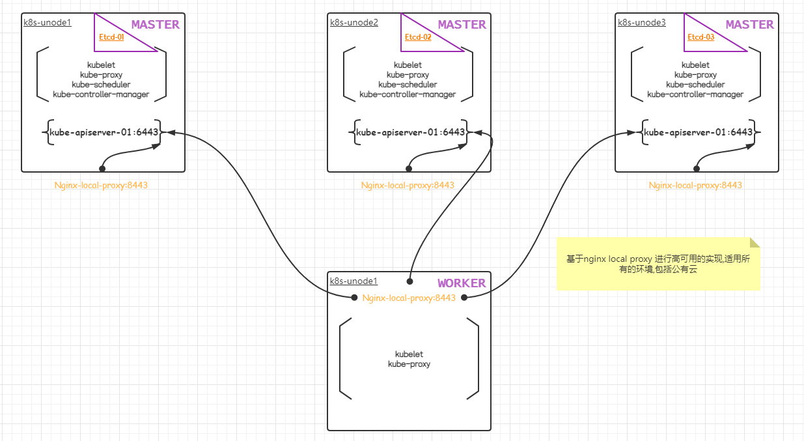
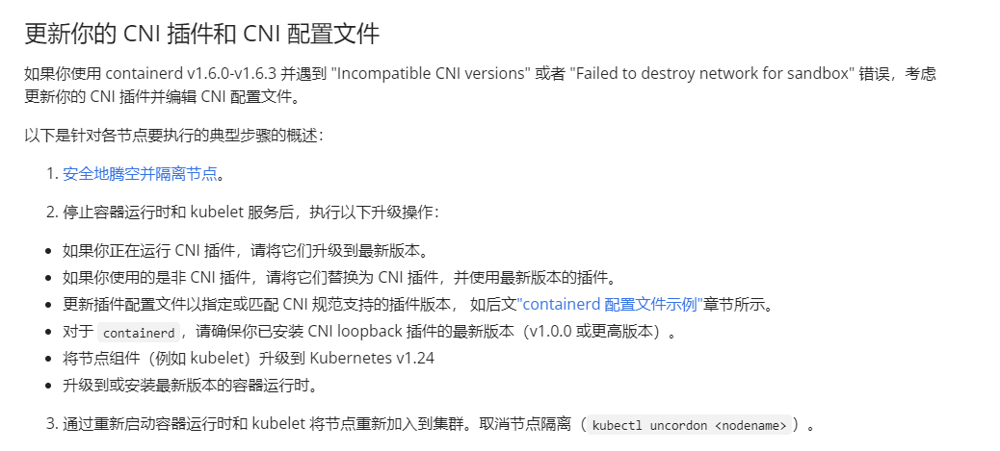
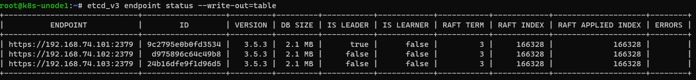

## 基于Ubuntu22.04和Kubeadm部署生产可用的K8s HA集群


### 主机配置

| IP地址         | Hostname   | 最小配置 | Kernel Version                     |
| -------------- | ---------- | -------- | ---------------------------------- |
| 192.168.74.101 | k8s-unode1 | 2CPU 4G  | Linux k8s-unode1 5.15.0-43-generic |
| 192.168.74.102 | k8s-unode2 | 2CPU 4G  | Linux k8s-unode2 5.15.0-43-generic |
| 192.168.74.103 | k8s-unode3 | 2CPU 4G  | Linux k8s-unode3 5.15.0-43-generic |
| 192.168.74.104 | k8s-unode4 | 2CPU 4G  | Linux k8s-unode4 5.15.0-43-generic |

对于Ubuntu安装之前的准备工作,可参考之前的文章,[Ubuntu 22.04最小化安装之后的优化](https://www.toutiao.com/article/7126799367582777856/)

基础架构图




### 检查`/etc/resolv.conf`

coreDNS会proxy非集群的search（也就是pod访问外网，这个就是集群外的解析）到宿主机的/etc/resolv.conf里的nameserver，这个文件内容会和宿主机一样，Ubuntu系统会把DNS解析到`127.0.0.x`本地的一个DNS server,代理本地所有的DNS请求到公网，这样会导致POD无法解析到外网域名。

这里我们需要禁用Ubuntu 20.04LTS 的reslove.conf中的127.0.0.53的代理。

**PS: 我们在修改/etc/reslov.conf 中DNS的 nameserver 114.114.114.114，每次重启之后，就会重置为：127.0.0.53**

**Override Ubuntu 20.04 DNS using systemd-resolved**

打开`/etc/systemd/resolved.conf`,修改为：

```ini
[Resolve]
DNS=114.114.114.114
#FallbackDNS=
#Domains=
LLMNR=no
#MulticastDNS=no
#DNSSEC=no
#Cache=yes
DNSStubListener=no
```

LLMNR=设置的是禁止运行LLMNR(Link-Local Multicast Name Resolution)，否则systemd-resolve会监听5535端口。

```bash
 rm /etc/resolv.conf
 ln -s /run/systemd/resolve/resolv.conf /etc/resolv.conf
 systemctl restart systemd-resolved
```

参考链接：https://unix.stackexchange.com/questions/588658/override-ubuntu-20-04-dns-using-systemd-resolved

### 安装containerd-所有节点均需执行

下载安装包,这里我们使用的目前最新的版本1.6.6

这里我们下载了包含了`cri`和`containerd`的安装包.

不下载包含`cni`的安装包,这因为containerd包含的`cni`的版本为`0.8.6`, 而我们所需要的版本为`1.0.0`以上.

本篇末尾,会讲解我使用containerd自带的cni版本插件所遇到的问题.

```bash
$ cd /usr/local/src/
$ wget https://github.com/containerd/containerd/releases/download/v1.6.6/cri-containerd-1.6.6-linux-amd64.tar.gz
$ mkdir cri-containerd
$ tar zxvf cri-containerd-1.6.6-linux-amd64.tar.gz -C cri-containerd/
$ cd cri-containerd/ && ls -l
total 12
drwxr-xr-x 3 root root 4096 Aug  4 17:01 etc
drwxr-xr-x 3 root root 4096 Aug  4 17:01 opt
drwxr-xr-x 3 root root 4096 Jun  7 01:34 usr
```

拷贝对应的文件到指定的目录,这里看了一下opt目录下的内容,好像是跟谷歌的gce有关的,这里我们用不到,就不拷贝了.

```bash
$ mv etc/crictl.yaml /etc/
$ mv etc/systemd/system/containerd.service /etc/systemd/system/
$ mv usr/local/bin/* /usr/local/bin/
$ mv usr/local/sbin/runc /usr/local/sbin/
```

生成`containerd`配置文件

```bash
$ mkdir -p /etc/containerd
$ containerd config default > /etc/containerd/config.toml
```

修改配置文件如下

```toml
disabled_plugins = []
imports = []
oom_score = 0
plugin_dir = ""
required_plugins = []
root = "/var/lib/containerd"
state = "/run/containerd"
temp = ""
version = 2

[cgroup]
  path = ""

[debug]
  address = ""
  format = ""
  gid = 0
  level = ""
  uid = 0

[grpc]
  address = "/run/containerd/containerd.sock"
  gid = 0
  max_recv_message_size = 16777216
  max_send_message_size = 16777216
  tcp_address = ""
  tcp_tls_ca = ""
  tcp_tls_cert = ""
  tcp_tls_key = ""
  uid = 0

[metrics]
  address = ""
  grpc_histogram = false

[plugins]

  [plugins."io.containerd.gc.v1.scheduler"]
    deletion_threshold = 0
    mutation_threshold = 100
    pause_threshold = 0.02
    schedule_delay = "0s"
    startup_delay = "100ms"

  [plugins."io.containerd.grpc.v1.cri"]
    device_ownership_from_security_context = false
    disable_apparmor = false
    disable_cgroup = false
    disable_hugetlb_controller = true
    disable_proc_mount = false
    disable_tcp_service = true
    enable_selinux = false
    enable_tls_streaming = false
    enable_unprivileged_icmp = false
    enable_unprivileged_ports = false
    ignore_image_defined_volumes = false
    max_concurrent_downloads = 3
    max_container_log_line_size = 16384
    netns_mounts_under_state_dir = false
    restrict_oom_score_adj = false
    #1. 修改K8S基础镜像地址
    sandbox_image = "registry.cn-hangzhou.aliyuncs.com/google_containers/pause:3.6"
    selinux_category_range = 1024
    stats_collect_period = 10
    stream_idle_timeout = "4h0m0s"
    stream_server_address = "127.0.0.1"
    stream_server_port = "0"
    systemd_cgroup = false
    tolerate_missing_hugetlb_controller = true
    unset_seccomp_profile = ""

    [plugins."io.containerd.grpc.v1.cri".cni]
      bin_dir = "/opt/cni/bin"
      conf_dir = "/etc/cni/net.d"
      conf_template = ""
      ip_pref = ""
      max_conf_num = 1

    [plugins."io.containerd.grpc.v1.cri".containerd]
      default_runtime_name = "runc"
      disable_snapshot_annotations = true
      discard_unpacked_layers = false
      ignore_rdt_not_enabled_errors = false
      no_pivot = false
      snapshotter = "overlayfs"

      [plugins."io.containerd.grpc.v1.cri".containerd.default_runtime]
        base_runtime_spec = ""
        cni_conf_dir = ""
        cni_max_conf_num = 0
        container_annotations = []
        pod_annotations = []
        privileged_without_host_devices = false
        runtime_engine = ""
        runtime_path = ""
        runtime_root = ""
        runtime_type = ""

        [plugins."io.containerd.grpc.v1.cri".containerd.default_runtime.options]

      [plugins."io.containerd.grpc.v1.cri".containerd.runtimes]

        [plugins."io.containerd.grpc.v1.cri".containerd.runtimes.runc]
          base_runtime_spec = ""
          cni_conf_dir = ""
          cni_max_conf_num = 0
          container_annotations = []
          pod_annotations = []
          privileged_without_host_devices = false
          runtime_engine = ""
          runtime_path = ""
          runtime_root = ""
          runtime_type = "io.containerd.runc.v2"

          [plugins."io.containerd.grpc.v1.cri".containerd.runtimes.runc.options]
            BinaryName = ""
            CriuImagePath = ""
            CriuPath = ""
            CriuWorkPath = ""
            IoGid = 0
            IoUid = 0
            NoNewKeyring = false
            NoPivotRoot = false
            Root = ""
            ShimCgroup = ""
            #2. 结合 runc 使用 systemd cgroup 驱动 参考k8s设置地址: https://kubernetes.io/zh-cn/docs/setup/production-environment/container-runtimes/#containerd
            SystemdCgroup = true

      [plugins."io.containerd.grpc.v1.cri".containerd.untrusted_workload_runtime]
        base_runtime_spec = ""
        cni_conf_dir = ""
        cni_max_conf_num = 0
        container_annotations = []
        pod_annotations = []
        privileged_without_host_devices = false
        runtime_engine = ""
        runtime_path = ""
        runtime_root = ""
        runtime_type = ""

        [plugins."io.containerd.grpc.v1.cri".containerd.untrusted_workload_runtime.options]

    [plugins."io.containerd.grpc.v1.cri".image_decryption]
      key_model = "node"

    [plugins."io.containerd.grpc.v1.cri".registry]
      config_path = ""

      [plugins."io.containerd.grpc.v1.cri".registry.auths]

      [plugins."io.containerd.grpc.v1.cri".registry.configs]

      [plugins."io.containerd.grpc.v1.cri".registry.headers]

      [plugins."io.containerd.grpc.v1.cri".registry.mirrors]
        #3. 设置镜像仓库加速
        [plugins."io.containerd.grpc.v1.cri".registry.mirrors."docker.io"]
          endpoint = ["https://fz5yth0r.mirror.aliyuncs.com","https://dockerhub.mirrors.nwafu.edu.cn","https://docker.mirrors.ustc.edu.cn","https://registry.docker-cn.com"]
        [plugins."io.containerd.grpc.v1.cri".registry.mirrors."gcr.io"]
          endpoint = ["https://gcr.mirrors.ustc.edu.cn"]
        [plugins."io.containerd.grpc.v1.cri".registry.mirrors."k8s.gcr.io"]
          endpoint = ["https://registry.cn-hangzhou.aliyuncs.com/google_containers"]
        [plugins."io.containerd.grpc.v1.cri".registry.mirrors."quay.io"]
          endpoint = ["https://quay.mirrors.ustc.edu.cn"]

    [plugins."io.containerd.grpc.v1.cri".x509_key_pair_streaming]
      tls_cert_file = ""
      tls_key_file = ""

  [plugins."io.containerd.internal.v1.opt"]
    path = "/opt/containerd"

  [plugins."io.containerd.internal.v1.restart"]
    interval = "10s"

  [plugins."io.cont:qainerd.internal.v1.tracing"]
    sampling_ratio = 1.0
    service_name = "containerd"

  [plugins."io.containerd.metadata.v1.bolt"]
    content_sharing_policy = "shared"

  [plugins."io.containerd.monitor.v1.cgroups"]
    no_prometheus = false

  [plugins."io.containerd.runtime.v1.linux"]
    no_shim = false
    runtime = "runc"
    runtime_root = ""
    shim = "containerd-shim"
    shim_debug = false

  [plugins."io.containerd.runtime.v2.task"]
    platforms = ["linux/amd64"]
    sched_core = false

  [plugins."io.containerd.service.v1.diff-service"]
    default = ["walking"]

  [plugins."io.containerd.service.v1.tasks-service"]
    rdt_config_file = ""

  [plugins."io.containerd.snapshotter.v1.aufs"]
    root_path = ""

  [plugins."io.containerd.snapshotter.v1.btrfs"]
    root_path = ""

  [plugins."io.containerd.snapshotter.v1.devmapper"]
    async_remove = false
    base_image_size = ""
    discard_blocks = false
    fs_options = ""
    fs_type = ""
    pool_name = ""
    root_path = ""

  [plugins."io.containerd.snapshotter.v1.native"]
    root_path = ""

  [plugins."io.containerd.snapshotter.v1.overlayfs"]
    root_path = ""
    upperdir_label = false

  [plugins."io.containerd.snapshotter.v1.zfs"]
    root_path = ""

  [plugins."io.containerd.tracing.processor.v1.otlp"]
    endpoint = ""
    insecure = false
    protocol = ""

[proxy_plugins]

[stream_processors]

  [stream_processors."io.containerd.ocicrypt.decoder.v1.tar"]
    accepts = ["application/vnd.oci.image.layer.v1.tar+encrypted"]
    args = ["--decryption-keys-path", "/etc/containerd/ocicrypt/keys"]
    env = ["OCICRYPT_KEYPROVIDER_CONFIG=/etc/containerd/ocicrypt/ocicrypt_keyprovider.conf"]
    path = "ctd-decoder"
    returns = "application/vnd.oci.image.layer.v1.tar"

  [stream_processors."io.containerd.ocicrypt.decoder.v1.tar.gzip"]
    accepts = ["application/vnd.oci.image.layer.v1.tar+gzip+encrypted"]
    args = ["--decryption-keys-path", "/etc/containerd/ocicrypt/keys"]
    env = ["OCICRYPT_KEYPROVIDER_CONFIG=/etc/containerd/ocicrypt/ocicrypt_keyprovider.conf"]
    path = "ctd-decoder"
    returns = "application/vnd.oci.image.layer.v1.tar+gzip"

[timeouts]
  "io.containerd.timeout.bolt.open" = "0s"
  "io.containerd.timeout.shim.cleanup" = "5s"
  "io.containerd.timeout.shim.load" = "5s"
  "io.containerd.timeout.shim.shutdown" = "3s"
  "io.containerd.timeout.task.state" = "2s"

[ttrpc]
  address = ""
  gid = 0
  uid = 0
```


启动containerd

```
# 启动，并设置为开机启动
$ systemctl daemon-reload &&systemctl enable containerd && systemctl start containerd
# 查看是否启动成功
$ systemctl status containerd
```


### 安装nginx local proxy

这里是基于nginx local proxy来实现kubernetes集群的HA, 可以不用SLB也可以在公有云的VPC中部署;需要在所有的机器上运行nginx来进行实现.

修改所有节点的`hosts`文件,追加如下内容:

```bash
$ cat>>/etc/hosts <<EOF
127.0.0.1 apiserver.k8s.local
192.168.74.101 apiserver01.k8s.local
192.168.74.102 apiserver02.k8s.local
192.168.74.103 apiserver03.k8s.local
192.168.74.101 k8s-unode1
192.168.74.102 k8s-unode2
192.168.74.103 k8s-unode3
192.168.74.104 k8s-unode4
EOF
```

这里大家也可以不定义hosts,在nginx local proxy时可以使用IP地址.但是每次修改IP需要重新加载,建议使用域名.

```bash
$ apt install nginx
$ mv /etc/nginx/nginx.conf /etc/nginx/nginx.conf.bak
$ mkdir -p /etc/kubernetes
$ vim /etc/kubernetes/kube-nginx.conf
```

配置文件内容如下:

```nginx
error_log /var/log/nginx/error.log notice;
user www-data;
pid /run/nginx.pid;
include /etc/nginx/modules-enabled/*.conf;
worker_processes 2;
worker_rlimit_nofile 130048;
worker_shutdown_timeout 10s;

events {
  multi_accept on;
  use epoll;
  worker_connections 16384;
}

stream {
  upstream kube_apiserver {
    least_conn;
    server apiserver01.k8s.local:6443 max_fails=3 fail_timeout=10s;
    server apiserver02.k8s.local:6443 max_fails=3 fail_timeout=10s;
    server apiserver03.k8s.local:6443 max_fails=3 fail_timeout=10s;
    }

  server {
    listen        8443;
    proxy_pass    kube_apiserver;
    proxy_timeout 10m;
    proxy_connect_timeout 1s;
  }
}

http {
  aio threads;
  aio_write on;
  tcp_nopush on;
  tcp_nodelay on;

  keepalive_timeout 75s;
  keepalive_requests 100;
  reset_timedout_connection on;
  server_tokens off;
  autoindex off;

  server {
    listen 8081;
    location /healthz {
      access_log off;
      return 200;
    }
    location /stub_status {
      stub_status on;
      access_log off;
    }
  }
}
```

启动nginx local proxy

```bash
$ ln -s /etc/kubernetes/kube-nginx.conf /etc/nginx/nginx.conf
$ nginx -t
$ systemctl daemon-reload
$ systemctl restart nginx
$ ss -lntp
```


### kubeadm部署-所有节点均需执行

node节点可以按需安装kubectl

```bash
$ apt install -y kubeadm kubectl kubelet
```

这里我们需要替换通过仓库安装额cni插件,通过仓库安装的cni插件版本为`0.8.6`;会导致`incompatible CNI versions`问题;  我们需要进行更新.详情可以参考本篇最后面的章节.

安装cni插件

[下载地址](https://github.com/containernetworking/plugins/releases/)

这里我们下载[CNI plugins v1.1.1](https://github.com/containernetworking/plugins/releases/tag/v1.1.1)

```bash
$ wget https://github.com/containernetworking/plugins/releases/download/v1.1.1/cni-plugins-linux-amd64-v1.1.1.tgz
$ mkdir cni-plugins/
$ tar zxvf cni-plugins-linux-amd64-v1.1.1.tgz -C cni-plugins/
$ mkdir -p /opt/cni/bin
$ mv cni-plugins/* /opt/cni/bin/
```


### 配置集群信息-仅在第一个master上执行

打印默认的配置信息

```bash
 $ kubeadm config print init-defaults > initconfig.yml
```

默认的配置文件如下:

```yaml
apiVersion: kubeadm.k8s.io/v1beta3
bootstrapTokens:
- groups:
  - system:bootstrappers:kubeadm:default-node-token
  token: abcdef.0123456789abcdef
  ttl: 24h0m0s
  usages:
  - signing
  - authentication
kind: InitConfiguration
localAPIEndpoint:
  advertiseAddress: 1.2.3.4
  bindPort: 6443
nodeRegistration:
  criSocket: unix:///var/run/containerd/containerd.sock
  imagePullPolicy: IfNotPresent
  name: node
  taints: null
---
apiServer:
  timeoutForControlPlane: 4m0s
apiVersion: kubeadm.k8s.io/v1beta3
certificatesDir: /etc/kubernetes/pki
clusterName: kubernetes
controllerManager: {}
dns: {}
etcd:
  local:
    dataDir: /var/lib/etcd
imageRepository: registry.cn-hangzhou.aliyuncs.com/google_containers
kind: ClusterConfiguration
kubernetesVersion: 1.24.3
networking:
  dnsDomain: cluster.local
  serviceSubnet: 10.96.0.0/12
scheduler: {}
```

我们主要关注和只保留`ClusterConfiguration`的段，然后修改下,最终版本如下:

```yaml
---
#使用 kubeadm API 定制组件
#https://kubernetes.io/zh-cn/docs/reference/config-api/kubeadm-config.v1beta3/
#通用配置
apiVersion: kubeadm.k8s.io/v1beta3
kind: ClusterConfiguration
imageRepository: registry.cn-hangzhou.aliyuncs.com/google_containers
certificatesDir: /etc/kubernetes/pki
clusterName: kubernetes
kubernetesVersion: 1.24.3
controlPlaneEndpoint: apiserver.k8s.local:8443 # 单个master的话写master的ip或者不写
networking:
  dnsDomain: cluster.local
  serviceSubnet: 10.96.0.0/12
  podSubnet: 10.244.0.0/16
#kube-apiserver配置定制
apiServer:
  timeoutForControlPlane: 4m0s
  extraArgs:
    runtime-config: api/all=true
    storage-backend: etcd3
    etcd-servers: https://192.168.74.101:2379,https://192.168.74.102:2379,https://192.168.74.103:2379
  certSANs:
  - 10.96.0.1 # service cidr的第一个ip
  - 127.0.0.1 # 多个master的时候负载均衡出问题了能够快速使用localhost调试
  - localhost
  - apiserver.k8s.local # 负载均衡的域名或者vip
  - 192.168.74.101
  - 192.168.74.102
  - 192.168.74.103
  - apiserver01.k8s.local
  - apiserver02.k8s.local
  - apiserver03.k8s.local
  - master
  - kubernetes
  - kubernetes.default
  - kubernetes.default.svc
  - kubernetes.default.svc.cluster.local
  extraVolumes: #与宿主机时区保持一致
  - hostPath: /etc/localtime
    mountPath: /etc/localtime
    name: localtime
    readOnly: true
#kube-controller-manager配置定制
controllerManager:
  extraArgs:
    bind-address: "0.0.0.0" #如果有多IP建议写死
    experimental-cluster-signing-duration: 876000h
  extraVolumes:
  - hostPath: /etc/localtime
    mountPath: /etc/localtime
    name: localtime
    readOnly: true
scheduler:
  extraArgs:
    bind-address: "0.0.0.0"
  extraVolumes:
  - hostPath: /etc/localtime
    mountPath: /etc/localtime
    name: localtime
    readOnly: true
etcd:
  local:
    dataDir: /var/lib/etcd
    serverCertSANs: # server和peer的localhost,127,::1都默认自带的不需要写
    - master
    - 192.168.74.101
    - 192.168.74.102
    - 192.168.74.103
    - etcd01.k8s.local
    - etcd02.k8s.local
    - etcd03.k8s.local
    peerCertSANs:
    - master
    - 192.168.74.101
    - 192.168.74.102
    - 192.168.74.103
    - etcd01.k8s.local
    - etcd02.k8s.local
    - etcd03.k8s.local
    extraArgs: # 官方暂时没有extraVolumes
      auto-compaction-retention: "1h"
      max-request-bytes: "33554432"
      quota-backend-bytes: "8589934592"
      enable-v2: "false" # disable etcd v2 api
---
apiVersion: kubeproxy.config.k8s.io/v1alpha1
kind: KubeProxyConfiguration # https://godoc.org/k8s.io/kube-proxy/config/v1alpha1#KubeProxyConfiguration
mode: ipvs # or iptables
ipvs:
  excludeCIDRs: null
  minSyncPeriod: 0s
  scheduler: "rr" # 调度算法
  syncPeriod: 15s
iptables:
  masqueradeAll: true
  masqueradeBit: 14
  minSyncPeriod: 0s
  syncPeriod: 30s
---
apiVersion: kubelet.config.k8s.io/v1beta1
kind: KubeletConfiguration # https://godoc.org/k8s.io/kubelet/config/v1beta1#KubeletConfiguration
cgroupDriver: systemd
failSwapOn: true # 如果开启swap则设置为false

```

检查配置文件

```bash
$ kubeadm init --config initconfig.yaml --dry-run
```

warning是由于我们使用了8443端口,nginx local proxy进行本地负载; 他会覆盖默认的6443端口;可以忽略

```
port specified in controlPlaneEndpoint overrides bindPort in the controlplane address
```

预先拉取镜像

```bash
$ kubeadm config images pull --config initconfig.yml
[config/images] Pulled registry.cn-hangzhou.aliyuncs.com/google_containers/kube-apiserver:v1.24.3
[config/images] Pulled registry.cn-hangzhou.aliyuncs.com/google_containers/kube-controller-manager:v1.24.3
[config/images] Pulled registry.cn-hangzhou.aliyuncs.com/google_containers/kube-scheduler:v1.24.3
[config/images] Pulled registry.cn-hangzhou.aliyuncs.com/google_containers/kube-proxy:v1.24.3
[config/images] Pulled registry.cn-hangzhou.aliyuncs.com/google_containers/pause:3.7
[config/images] Pulled registry.cn-hangzhou.aliyuncs.com/google_containers/etcd:3.5.3-0
[config/images] Pulled registry.cn-hangzhou.aliyuncs.com/google_containers/coredns:v1.8.6
```

### kubeadm初始化集群-kubeadm init仅在第一个master上执行

下面的init操作只在第一个master上执行

```bash
$ kubeadm init --config initconfig.yml --upload-certs
```

输出的信息主要内容如下:

```
[bootstrap-token] Creating the "cluster-info" ConfigMap in the "kube-public" namespace
[kubelet-finalize] Updating "/etc/kubernetes/kubelet.conf" to point to a rotatable kubelet client certificate and key
[addons] Applied essential addon: CoreDNS
W0803 16:16:22.731226   40287 endpoint.go:57] [endpoint] WARNING: port specified in controlPlaneEndpoint overrides bindPort in the controlplane address
[addons] Applied essential addon: kube-proxy

Your Kubernetes control-plane has initialized successfully!

To start using your cluster, you need to run the following as a regular user:
-----------------------------配置kubectl----------------------------------
  mkdir -p $HOME/.kube
  sudo cp -i /etc/kubernetes/admin.conf $HOME/.kube/config
  sudo chown $(id -u):$(id -g) $HOME/.kube/config

Alternatively, if you are the root user, you can run:

  export KUBECONFIG=/etc/kubernetes/admin.conf

You should now deploy a pod network to the cluster.
Run "kubectl apply -f [podnetwork].yaml" with one of the options listed at:
  https://kubernetes.io/docs/concepts/cluster-administration/addons/

You can now join any number of the control-plane node running the following command on each as root:
------------------------------加入master节点-----------------------------------------
  kubeadm join apiserver.k8s.local:8443 --token asexb7.8yfzenkoco264qf5 \
        --discovery-token-ca-cert-hash sha256:a207febabb4d9fecc98f76cb4cc4f93563c7369e0d5cf9a970c8ffcf780601dc \
        --control-plane --certificate-key 183cef7625aec22a0153aa603bcdb36e5c2dd6267fa0e0ee2875f1f02c69709e

Please note that the certificate-key gives access to cluster sensitive data, keep it secret!
As a safeguard, uploaded-certs will be deleted in two hours; If necessary, you can use
"kubeadm init phase upload-certs --upload-certs" to reload certs afterward.

Then you can join any number of worker nodes by running the following on each as root:
----------------------------加入node节点--------------------------------------------------
kubeadm join apiserver.k8s.local:8443 --token asexb7.8yfzenkoco264qf5 \
        --discovery-token-ca-cert-hash sha256:a207febabb4d9fecc98f76cb4cc4f93563c7369e0d5cf9a970c8ffcf780601dc
```

可以依据上面的命令配置kubectl并加入其它节点.

配置可选项

初始化集群的(kubeadm init config file)的yaml信息会存放在集群的configmap中,可以通过以下命令获取

```bash
$ kubectl -n kube-system get configmap kubeadm-config -o yaml
```

可以通过以下命令去掉master节点上的污点,生产环境不要这么做

```bash
$ kubectl taint nodes --all node-role.kubernetes.io/master-
```

token忘记或者ttl过期了,怎么查看和重新创建

```bash
$ kubeadm token list
$ kubeadm token create --print-join-command
```

sha256的值可以通过下列命令获取

```bash
$ openssl x509 -pubkey -in \
    /etc/kubernetes/pki/ca.crt | \
    openssl rsa -pubin -outform der 2>/dev/null | \
    openssl dgst -sha256 -hex | sed 's/^.* //'
```

设置kubectl的补全脚本

```bash
$ kubectl completion bash > /etc/bash_completion.d/kubectl
```

### 添加node节点

按照前面的步骤做

获取加入命令在其中任意一台master上做即可.

加入的命令在具体需要加入的节点上执行.

```
1: 系统初始化设置
2: 设置主机名以及时间同步等
3: 安装containerd和启动nginx local proxy
4: 配置软件源,可以只安装kubeadm和kubelet
5: 按照上面的命令加入节点
```

```bash
#这里可以看到token,但是这个token活过期,可以看到后面的TTL值,还有23个小时过期
$ kubeadm token list
TOKEN                     TTL         EXPIRES                USAGES                   DESCRIPTION                                                EXTRA GROUPS
asexb7.8yfzenkoco264qf5   23h         2022-08-04T08:16:22Z   authentication,signing   <none>                                                     system:bootstrappers:kubeadm:default-node-token
iqgk0q.uh25jj8wytrjiyr9   1h          2022-08-03T10:16:21Z   <none>                   Proxy for managing TTL for the kubeadm-certs secret        <none>
#过下列命令获取获取sha256的值
$ openssl x509 -pubkey -in \
    /etc/kubernetes/pki/ca.crt | \
    openssl rsa -pubin -outform der 2>/dev/null | \
    openssl dgst -sha256 -hex | sed 's/^.* //'
a207febabb4d9fecc98f76cb4cc4f93563c7369e0d5cf9a970c8ffcf780601dc
#拼接处加入集群的命令如下
kubeadm join apiserver.k8s.local:8443 --token asexb7.8yfzenkoco264qf5 \
        --discovery-token-ca-cert-hash sha256:a207febabb4d9fecc98f76cb4cc4f93563c7369e0d5cf9a970c8ffcf780601dc
```

如果此时token已经过期,我们可以通过如下命令直接获取加入集群的信息

```bash
$ kubeadm token create --print-join-command
kubeadm join apiserver.k8s.local:8443 --token qek2d8.b4v1w3mxzp00mn84 --discovery-token-ca-cert-hash sha256:a207febabb4d9fecc98f76cb4cc4f93563c7369e0d5cf9a970c8ffcf780601dc
#可以看到下面已经生成了一个新的tocken
$ kubeadm token list
TOKEN                     TTL         EXPIRES                USAGES                   DESCRIPTION                                                EXTRA GROUPS
asexb7.8yfzenkoco264qf5   23h         2022-08-04T08:16:22Z   authentication,signing   <none>                                                     system:bootstrappers:kubeadm:default-node-token
iqgk0q.uh25jj8wytrjiyr9   1h          2022-08-03T10:16:21Z   <none>                   Proxy for managing TTL for the kubeadm-certs secret        <none>
qek2d8.b4v1w3mxzp00mn84   23h         2022-08-04T09:04:57Z   authentication,signing   <none>                                                     system:bootstrappers:kubeadm:default-node-token
```

添加ROLES

ROLES只是一个label,可以打 label 让其显示指定的字符串，想显示啥就 `node-role.kubernetes.io/xxxx`

```
kubectl label node k8s-unode4 node-role.kubernetes.io/worker=""
```

验证ROLES

```bash
$ kubectl get node
NAME         STATUS   ROLES           AGE   VERSION
k8s-unode1   NotReady    control-plane   60m   v1.24.3
k8s-unode2   NotReady   control-plane   56m   v1.24.3
k8s-unode3   NotReady    control-plane   42m   v1.24.3
k8s-unode4   NotReady    <none>          41m   v1.24.3
$ kubectl label node k8s-unode4 node-role.kubernetes.io/worker=""
node/k8s-unode4 labeled
$ kubectl get node
NAME         STATUS   ROLES           AGE   VERSION
k8s-unode1   NotReady    control-plane   60m   v1.24.3
k8s-unode2   NotReady    control-plane   56m   v1.24.3
k8s-unode3   NotReady    control-plane   43m   v1.24.3
k8s-unode4   NotReady    worker          42m   v1.24.3
```


### 配置flannel网络

在任意一台master上执行即可.

```bash
$ wget https://raw.githubusercontent.com/coreos/flannel/master/Documentation/kube-flannel.yml
$ kubectl apply -f kube-flannel.yml
```

查看flanel的pod状态,新版的flannel创建了自己独立的namespace,之前是在kube-system名称空间下

```bash
$ kubectl -n kube-flannel get pod
NAME                    READY   STATUS     RESTARTS   AGE
kube-flannel-ds-7r7g6   0/1     Init:0/2   0          90s
kube-flannel-ds-rsmh5   0/1     Init:0/2   0          90s
kube-flannel-ds-w98q8   0/1     Init:0/2   0          90s
kube-flannel-ds-zvfpl   0/1     Init:0/2   0          90s
```

```bash
$ kubectl -n kube-flannel get pod
NAME                    READY   STATUS    RESTARTS   AGE
kube-flannel-ds-gwxqj   1/1     Running   0          18m
kube-flannel-ds-k9jc5   1/1     Running   0          18m
kube-flannel-ds-pclv4   1/1     Running   0          18m
kube-flannel-ds-tf6kv   1/1     Running   0          18m
```


### 验证集群可用性

```bash
$ kubectl -n kube-system get pod -o wide
```

等待 kube-system 空间下的 pod 都是 Running 后我们来测试下集群可用性

```bash
$ cat<<EOF | kubectl apply -f -
apiVersion: apps/v1
kind: Deployment
metadata:
  name: nginx
spec:
  selector:
    matchLabels:
      app: nginx
  template:
    metadata:
      labels:
        app: nginx
    spec:
      containers:
      - image: nginx:alpine
        name: nginx
        ports:
        - containerPort: 80
---
apiVersion: v1
kind: Service
metadata:
  name: nginx
spec:
  selector:
    app: nginx
  ports:
    - protocol: TCP
      port: 80
      targetPort: 80
---
apiVersion: v1
kind: Pod
metadata:
  name: busybox
  namespace: default
spec:
  containers:
  - name: busybox
    image: busybox:1.28.3  #用后面的版本感觉有些问题,也可以进入pod通过ping命令验证
    command:
      - sleep
      - "3600"
    imagePullPolicy: IfNotPresent
  restartPolicy: Always
EOF
```

确认pod已正常启动

```bash
$ kubectl get pod -o wide -w
$ kubectl get po,svc -o wide
```

验证集群DNS解析

```bash
$ kubectl exec -ti busybox -- nslookup kubernetes
Server:    10.96.0.10
Address 1: 10.96.0.10 kube-dns.kube-system.svc.cluster.local

Name:      kubernetes
Address 1: 10.96.0.1 kubernetes.default.svc.cluster.local
```

```bash
#删除测试pod
$ kubectl delete -f nginx-test.yml
```

官方文档: https://kubernetes.io/zh-cn/docs/setup/production-environment/tools/kubeadm/high-availability/

### CNI版本问题

此时我们的网络插件flannel已经正常运行了. 我们想确认CoreDNS组件是否正确的运行,确发现CoreDNS的pod一直处于`ContainerCreating`状态.

```bash
$ kubectl -n kube-system get pod
NAME                                 READY   STATUS              RESTARTS      AGE
coredns-7f74c56694-btdnp             0/1     ContainerCreating   0             20m
coredns-7f74c56694-rwcr8             0/1     ContainerCreating   0             20m
etcd-k8s-unode1                      1/1     Running             8             126m
etcd-k8s-unode2                      1/1     Running             5             121m
etcd-k8s-unode3                      1/1     Running             0             108m
kube-apiserver-k8s-unode1            1/1     Running             11            126m
kube-apiserver-k8s-unode2            1/1     Running             4             121m
kube-apiserver-k8s-unode3            1/1     Running             0             108m
kube-controller-manager-k8s-unode1   1/1     Running             0             29m
kube-controller-manager-k8s-unode2   1/1     Running             1 (25m ago)   25m
kube-controller-manager-k8s-unode3   1/1     Running             0             27m
kube-proxy-5pkvz                     1/1     Running             0             122m
kube-proxy-fm6xc                     1/1     Running             0             126m
kube-proxy-jqqm2                     1/1     Running             0             107m
kube-proxy-ww9w7                     1/1     Running             0             108m
kube-scheduler-k8s-unode1            1/1     Running             2             126m
kube-scheduler-k8s-unode2            1/1     Running             1             122m
kube-scheduler-k8s-unode3            1/1     Running             0             108m
```

通过命令查看其无法正常启动问题

```bash
$ kubectl -n kube-system describe pod coredns-7f74c56694-btdnp
.......
.......
 Warning  FailedCreatePodSandBox  3m9s (x61 over 16m)  kubelet            (combined from similar events): Failed to create pod sandbox: rpc error: code = Unknown desc = failed to setup network for sandbox "60e0230279bd5b31031f82edbdabebd970412acb216998728b1c52152511ea80": plugin type="bridge" failed (add): incompatible CNI versions; config is "1.0.0", plugin supports ["0.1.0" "0.2.0" "0.3.0" "0.3.1" "0.4.0"]
```

这个问题的主要内容是: `incompatible CNI versions`.

当你去网上去搜索解决方案大都是 说 使用 `containerd` 的版本不对，也就是说, 确实是 `CNI` 的版本是有问题的.

具体的解决方案在官方网站中是这样说的：



[官网的参考链接](https://kubernetes.io/zh-cn/docs/tasks/administer-cluster/migrating-from-dockershim/troubleshooting-cni-plugin-related-errors/#updating-your-cni-plugins-and-cni-config-files)

当前containerd的版本是 v1.6.6

```bash
$ containerd -v
containerd github.com/containerd/containerd v1.6.6
```

在containerd的issues中有一个人遇到了 `v1.6.4` 版本中出现了 `incompatible CNI versions` 这个问题。

https://github.com/containerd/containerd/issues/6876 

仔细看了一下,需要安装一个新版本的1.0.0版本的bridge.

替换CNI

```bash
# 下载包
$ wget https://github.com/containernetworking/plugins/releases/download/v1.1.1/cni-plugins-linux-amd64-v1.1.1.tgz

# 备份一下驱动
$ cp -ra /opt/cni /opt/cni.bak

# 解压到指定目录
$ tar -zxvf cni-plugins-linux-amd64-v1.1.1.tgz -C /opt/cni/bin 

# 重启 kubelet
$ systemctl restart kubelet
```

然后在所有的节点上都执行一遍上面的内容, 然后就可以了。

### etcd集群备份

获取`etcdctl`,复制出容器里的,无法用`docker cp`和`kubectl cp`,只能用这种方法

```bash
$ cp /run/containerd/io.containerd.runtime.v2.task/k8s.io/`crictl ps -a --no-trunc  | awk  '/etcd-k8s-unode1/{print $1}'`/rootfs/usr/local/bin/etcdctl /usr/local/bin/
```

配置etcdctl的参数,避免每次使用命令需要指定证书.kubernetes现在默认使用etcd v3版本的api.

```bash
$ cat >/etc/profile.d/etcd.sh<<'EOF'
ETCD_CERET_DIR=/etc/kubernetes/pki/etcd/
ETCD_CA_FILE=ca.crt
ETCD_KEY_FILE=healthcheck-client.key
ETCD_CERT_FILE=healthcheck-client.crt
ETCD_EP=https://192.168.74.101:2379,https://192.168.74.102:2379,https://192.168.74.103:2379

alias etcd_v2="etcdctl --cert-file ${ETCD_CERET_DIR}/${ETCD_CERT_FILE} \
              --key-file ${ETCD_CERET_DIR}/${ETCD_KEY_FILE}  \
              --ca-file ${ETCD_CERET_DIR}/${ETCD_CA_FILE}  \
              --endpoints $ETCD_EP"

alias etcd_v3="ETCDCTL_API=3 \
    etcdctl   \
   --cert ${ETCD_CERET_DIR}/${ETCD_CERT_FILE} \
   --key ${ETCD_CERET_DIR}/${ETCD_KEY_FILE} \
   --cacert ${ETCD_CERET_DIR}/${ETCD_CA_FILE} \
    --endpoints $ETCD_EP"
EOF
#配置完成之后,需要退出再登录一下,使环境变量生效
```




制定备份脚本,并加入Linux计划任务.

```bash
$ mkdir -p /opt/etcd
$ cat>/opt/etcd/etcd_cron.sh<<'EOF'
#!/bin/bash
set -e

export PATH=/usr/local/sbin:/usr/local/bin:/usr/sbin:/usr/bin:/root/bin

:  ${bak_dir:=/root/} #缺省备份目录,可以修改成存在的目录
:  ${cert_dir:=/etc/kubernetes/pki/etcd/}
:  ${endpoints:=https://192.168.50.101:2379}

bak_prefix='etcd-'
cmd_suffix='date +%Y-%m-%d-%H:%M'
bak_suffix='.db'

#将规范化后的命令行参数分配至位置参数（$1,$2,...)
temp=`getopt -n $0 -o c:d: -u -- "$@"`

[ $? != 0 ] && {
    echo '
Examples:
  # just save once
  bash $0 /tmp/etcd.db
  # save in contab and  keep 5
  bash $0 -c 5
    '
    exit 1
    }
set -- $temp


# -c 备份保留副本数量
# -d 指定备份存放目录
while true;do
    case "$1" in
        -c)
            [ -z "$bak_count" ] && bak_count=$2
            printf -v null %d "$bak_count" &>/dev/null || \
                { echo 'the value of the -c must be number';exit 1; }
            shift 2
            ;;
        -d)
            [ ! -d "$2" ] && mkdir -p $2
            bak_dir=$2
            shift 2
            ;;
         *)
            [[ -z "$1" || "$1" == '--' ]] && { shift;break; }
            echo "Internal error!"
            exit 1
            ;;
    esac
done


function etcd_v2(){

    etcdctl --cert-file $cert_dir/healthcheck-client.crt \
            --key-file  $cert_dir/healthcheck-client.key \
            --ca-file   $cert_dir/ca.crt \
        --endpoints $endpoints $@
}

function etcd_v3(){

    ETCDCTL_API=3 etcdctl   \
       --cert $cert_dir/healthcheck-client.crt \
       --key  $cert_dir/healthcheck-client.key \
       --cacert $cert_dir/ca.crt \
       --endpoints $endpoints $@
}

etcd::cron::save(){
    cd $bak_dir/
    etcd_v3 snapshot save  $bak_prefix$($cmd_suffix)$bak_suffix
    rm_files=`ls -t $bak_prefix*$bak_suffix | tail -n +$[bak_count+1]`
    if [ -n "$rm_files" ];then
        rm -f $rm_files
    fi
}

main(){
    [ -n "$bak_count" ] && etcd::cron::save || etcd_v3 snapshot save $@
}

main $@
EOF
```

crontab -e添加下面内容自动保留四个备份副本

```bash
0 2 * * * bash /opt/etcd/etcd_cron.sh -c 4 -d /opt/etcd/ &>/dev/null
```

