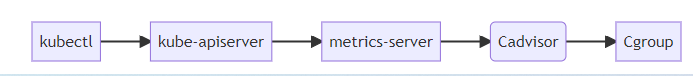
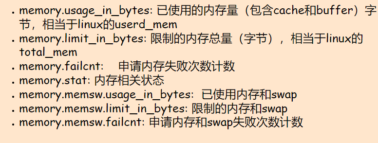

## 深入理解kubernetes监控原理

### 前言

承接上文,我们在基于`Ubuntu 2204`使用`kubeadm`部署了`k8s`集群,且基于`helm`部署了`metrics-server`.

然后我们可以很欢快的使用`kubectl top`命令查看node、pod的实时资源使用情况：如CPU、内存。

本文将介绍其数据链路和实现原理，同时会阐述k8s中的监控体系。如有不对之处，请留言指教。


### kubectl top 

`kubectl top`是我们经常使用的基础命令，但是必须需要部署`metrics-server`组件，才能获取到监控值。

- 在kubernetes 1.8版本之前，则需要部署`heapter`， 现已被废弃
- 在kubernetes1.8以及以上，则需要部署`metrics-server`

我们所使用的版本是1.24.3的最新版本，所以一定要部署`metrics-server`

查看node的资源使用情况

```bash
$ kubectl top node
NAME         CPU(cores)   CPU%   MEMORY(bytes)   MEMORY%
k8s-unode1   158m         7%     1814Mi          47%
k8s-unode2   50m          2%     874Mi           23%
k8s-unode3   51m          2%     943Mi           24%
k8s-unode4   45m          2%     905Mi           23%
$ kubectl top node k8s-unode1
NAME         CPU(cores)   CPU%   MEMORY(bytes)   MEMORY%
k8s-unode1   160m         8%     1811Mi          47%
```

查看pod的资源使用情况，`--containers`可以显示pod内所有的`container`

```bash
$ kubectl top pod -n metrics-server
NAME                              CPU(cores)   MEMORY(bytes)
metrics-server-56c6866684-w6n9b   5m           17Mi
$ kubectl top pod --containers -n metrics-server
POD                               NAME             CPU(cores)   MEMORY(bytes)
metrics-server-56c6866684-w6n9b   metrics-server   5m           17Mi
```

指标的具体含义

- 这里CPU 的`m`  和 memory 的 `mi` 与k8s中 request、limit是一致的，cpu单位的100m=0.1 内存单位 1MI=1204Ki
- pod的内存值是其内存的实际使用量，也是做limit限制时判断oom的依据。pod的使用量等于其所有业务容器的综合，但是不包含pause容器。与Cadvisr中的container_memory_working_set_bytes 指标值相等。

- node的值并不等于该node上所有pod值的总和，也不等于直接在机器上执行top或free所得到的值。


**kubectl top pod 内存计算**

每次启动 pod，都会有一个 pause 容器，既然是容器就一定有资源消耗（一般在 2-3M 的内存），cgroup 文件中，业务容器和 pause 容器都在同一个 pod的文件夹下。

但 cadvisor 在查询 pod 的内存使用量时，是先获取了 pod 下的container列表，再逐个获取container的内存占用，不过这里的 container 列表并没有包含 pause，因此最终 top pod 的结果也不包含 pause 容器

**pod 的内存使用量计算**

kubectl top pod 得到的内存使用量，并不是cadvisor 中的`container_memory_usage_bytes`，而是`container_memory_working_set_bytes`，计算方式为：

- `container_memory_usage_bytes == container_memory_rss + container_memory_cache + kernel memory`
- `container_memory_working_set_bytes = container_memory_usage_bytes – total_inactive_file`（未激活的匿名缓存页）

`container_memory_working_set_bytes`是容器真实使用的内存量，也是limit限制时的 oom 判断依据

kubectl top命令和 top 的差异和上边 一致，无法直接对比，同时，就算你对 pod 做了limit 限制，pod 内的 top 看到的内存和 cpu总量仍然是机器总量，并不是pod 可分配量

- 进程的RSS为进程使用的所有物理内存（file_rss＋anon_rss），即Anonymous pages＋Mapped apges（包含共享内存）
- cgroup RSS为（anonymous and swap cache memory），不包含共享内存。两者都不包含file cache

### 实现原理

##### 数据链路

k8s dashboard、kubectl top等都是通过apiserver获取监控数据，数据链路如下：




- 使用 heapster 时：apiserver 会直接将metric请求通过 proxy 的方式转发给集群内的 hepaster 服务
- 使用 metrics-server 时：apiserver是通过/apis/metrics.k8s.io/的地址访问metric


##### 监控体系

在提出 metric api 的概念时，官方页提出了新的监控体系，监控资源被分为了2种：

- Core metrics(核心指标)：从 Kubelet、cAdvisor 等获取度量数据，再由metrics-server提供给 Dashboard、HPA 控制器等使用。
- Custom Metrics(自定义指标)：由Prometheus Adapter提供API custom.metrics.k8s.io，由此可支持任意Prometheus采集到的指标。


- 核心指标只包含node和pod的cpu、内存等，一般来说，核心指标作HPA已经足够，但如果想根据自定义指标:如请求qps/5xx错误数来实现HPA，就需要使用自定义指标了。

- 目前Kubernetes中自定义指标一般由Prometheus来提供，再利用k8s-prometheus-adpater聚合到apiserver，实现和核心指标（metric-server)同样的效果。


##### kubelet

无论是废弃的heapster还是metric-server，都只是数据的中转和聚合；两者都是调用的kubelet的api接口获取的数据。kubelet代码中实际集成了采集指标的cAdvisor模块，可以通过kubelet暴露的10250端口获取监控数据

- Kubelet Summary metrics: 127.0.0.1:10250/metrics，暴露 node、pod 汇总数据
- Cadvisor metrics: 127.0.0.1:10250/metrics/cadvisor，暴露 container 维度数据

kubelet虽然提供了 metric 接口，但实际监控逻辑由内置的cAdvisor模块负责。

##### cAdvisor

cAdvisor由谷歌开源，使用go语言开发。[项目地址](https://github.com/google/cadvisor)

cadvisor不仅可以搜集一台机器上所有运行的容器信息，包括CPU使用情况、内存使用情况、网络吞吐量及文件系统使用情况，还提供基础查询界面和http接口，方便其他组件进行数据抓取。在K8S中集成在Kubelet里作为默认启动项，k8s官方标配。

cadvisor获取指标时实际调用的是 runc/libcontainer库，而libcontainer是对 cgroup文件 的封装，即 cadvsior也只是个转发者，它的数据来自于cgroup文件。

##### cgroup

cgroup文件中的值是监控数据的最终来源，如

- mem usage的值，来自于`/sys/fs/cgroup/memory/docker/[containerId]/memory.usage_in_bytes`
- 如果没限制内存，`Limit = machine_mem`，否则来自于
  `/sys/fs/cgroup/memory/docker/[id]/memory.limit_in_bytes`
- 内存使用率 = `memory.usage_in_bytes/memory.limit_in_bytes`

一般情况下，cgroup文件夹下的内容包括CPU、内存、磁盘、网络等信息。


```
device：设备控制权限
cpuset：分配指定的CPU和内存节点
cpu：控制CPU占用率
cpuacct：统计CPU使用情况
memory：限制内存的使用上限
freezer：冻结Cgroup中的进程
net_cls：配合（traffic controller）限制网络带宽
net_prio：设置进程的网络流量优先级
huge_tlb：限制HugeTLB的使用
pref_event：允许perf工具基于cgrgoup分组做性能监测
```

memory下的几个常用的指标含义：



```
memory.usage_in_bytes: 已使用的内存量（包含cache和buffer）字节，相当于linux的userd_mem
memory.limit_in_bytes: 限制的内存总量（字节），相当于linux的total_mem
memory.failcnt:    申请内存失败次数计数
memory.stat: 内存相关状态
memory.memsw.usage_in_bytes:  已使用内存和swap
memory.memsw.limit_in_bytes: 限制的内存和swap
memory.memsw.failcnt: 申请内存和swap失败次数计数
```

