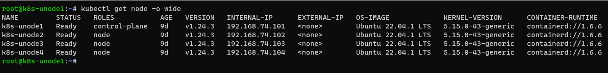
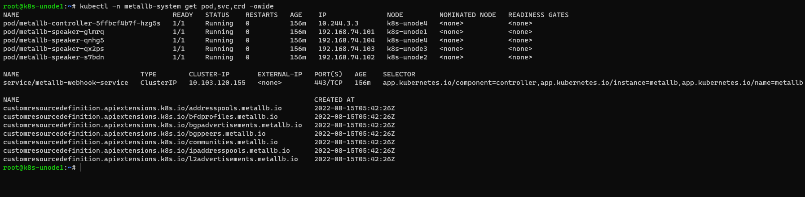
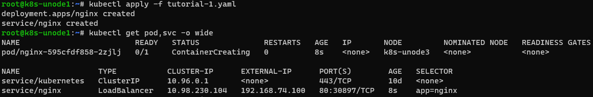
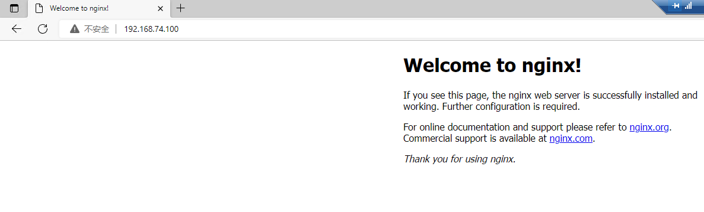

## 在kubernetes集群中部署MetalLB实现负载均衡

### 概述

在公有云部署的kubernetes集群中，有公有云厂商提供LoadBalancer类型的Service。但是在基于本地环境部署的k8s集群是我们常用的测试环境和开发环境；需要通过NodePort和externalIPs方式将外部流量引入集群中，这就带来了很多的不便。

尤其是我们通过helm去部署一些服务时，尝尝会依赖于LoadBalancer的资源类型，导致创建的services中`type: LoadBalancers`会一直处于Pending状态；我们不得不进行仓库的fetch，然后手动进行values的修改。

Metallb 通过标准路由协议能解决该问题。MetalLB 也是 CNCF 的沙箱项目，最早发布在 https://github.com/google/metallb 开发，后来迁移到 https://github.com/metallb/metallb 中。


MetalLB 通过 `MetalLB hooks` 监听`SVC`的变化；然后通过`Speaker`组件采用对应的模式将外部流量引流到`kubernetes`集群`node`节点的可达路径。而具体到Pod中则是通过`kuber-proxy`依据转发模式(iptables或ipvs)将流量转发到Pod中。

MetaLB负责从主机维度实现负载均衡，而pod副本间的负载是通过`kube-proxy`实现。MetalLB负责IP地址分配、依据设定的广播模式进行广播、节点选举、节点失效切换等功能。而引流的过程则通过ARP、NDP和BGP标准路由协议实现。

主要的两大功能：

1. 地址分配：用户需要在配置中提供一个地址池，Metallb 将会在其中选取地址分配给服务。
2. 地址广播（IP外部声明）：根据不同配置，Metallb 会以二层（ARP/NDP）或者 BGP 的方式进行地址的广播。

工作模式：

1. BGP模式（Layer 3），使用BGP协议分配地址池；运行 BGP 的设备之间可以交换路由信息，我们可以将自己的 IP 段通过 BGP 协议告诉其他设备，这样其他设备就能正确的路由数据包到服务器上了。BGP 需要路由器的支持。如果Calico也是使用的BGP模式，有可能会有冲突从而导致metallb无法正常工作。

2. ARP（IPV4）/NDP(IPV6)工作模式（Layer2）；使用 ARP/NDP 协议分配地址池；在服务器的内部子网里找未使用的 IP，然后等其他电脑访问这个 IP 的时候，我们回应一个 ARP 包，其他电脑就知道这个 IP 在哪里可以通信了，尽管这个 IP 其实没有绑定到任何网卡上，也有可能只是 iptables 里的一条记录。分配的 IP 只能和服务器其他 IP 位于同一子网，这就要求我们所有的节点必须在同一个二层网络内。

   

更多详情请参考官方文档：`https://metallb.universe.tf/`

### 架构

二层部署的架构图，参考红帽openshift官方文档。


上图显示了与 MetalLB 相关的以下概念：

- 应用程序可以通过在 `172.130.0.0/16` 子网上具有集群 IP 的服务获取。该 IP 地址可以从集群内部访问。服务也有一个外部 IP 地址，用于分配给服务的 MetalLB，即 `192.168.100.200`。
- 节点 1 和 3 具有应用程序的 pod。
- `speaker` 守护进程集在每个节点上运行一个 pod。MetalLB Operator 启动这些 pod。
- 每个 `speaker` pod 都是主机网络的 pod。容器集的 IP 地址与主机网络上节点的 IP 地址相同。
- 节点 1 上的 `speaker` pod 使用 ARP 声明服务的外部 IP 地址 `192.168.100.200`。声明外部 IP 地址的 `speaker` pod 必须与服务的端点位于同一个节点上，端点必须为 `Ready` 条件。
- 客户端流量路由到主机网络，并连接到 `192.168.100.200` IP 地址。在流量进入节点后，服务代理会根据您为服务设置的外部流量策略，将流量发送到同一节点上的应用 pod 或其他节点。
- 如果节点 1 不可用，则外部 IP 地址将故障转移到另一节点。在具有应用 pod 和服务端点实例的另一个节点上，`speaker` Pod 开始宣布外部 IP 地址 `192.168.100.200`，新节点接收客户端流量。在图中，唯一的候选项是节点 3。


### 部署

**MetalLB Operator 自定义资源**

MetalLB Operator 监控其自己的命名空间以获取两个自定义资源：

- `MetalLB`

  当您在集群中添加 `MetalLB` 自定义资源时，MetalLB Operator 会在集群中部署 MetalLB。Operator 只支持单个自定义资源实例。如果删除了实例，Operator 会从集群中删除 MetalLB。

- `AddressPool`

  MetalLB 需要一个或多个 IP 地址池，您可以在添加类型为 `LoadBalancer` 的服务时分配给服务。当您在集群中添加 `AddressPool` 自定义资源时，MetalLB Operator 会配置 MetalLB，以便它能够从池中分配 IP 地址。地址池包含 IP 地址列表。列表可以是使用范围设置的单个 IP 地址，如 1.1.1.1-1.1.1.1、以 CIDR 表示法指定的范围、指定为起始和结束地址的范围，或者以连字符分隔的、两者的组合。地址池需要名称。文档使用 `doc-example`、`doc-example-reserved` 和 `doc-example-ipv6` 等名称。地址池指定 MetalLB 是否可以自动从池中分配 IP 地址，或者是否为按名称显式指定池的服务保留 IP 地址。

将 `MetalLB` 自定义资源添加到集群后，Operator 将部署 MetalLB、MetalLB 软件组件、`controller` 和 `speaker`。

安装 MetalLB Operator 时，`metallb-operator-controller-manager` 部署会启动一个 pod。pod 是 Operator 的实施。pod 监控 `MetalLB` 自定义资源和 `AddressPool` 自定义资源的更改。

当 Operator 启动 MetalLB 实例时，它会启动一个 `controller` 部署和一个 `speaker` 守护进程集。

- `controller`

  Operator 会启动部署和单个 pod。当您添加类型为 `LoadBalancer` 的服务时，Kubernetes 使用 `controller` 从地址池中分配 IP 地址。如果出现服务失败，请验证 `控制器` pod 日志中是否有以下条目：

  ```terminal
  "event":"ipAllocated","ip":"172.22.0.201","msg":"IP address assigned by controller
  ```

- `speaker`

  Operator 会为集群中的每个节点启动一个带有一个 `speaker` pod 的守护进程集。`如果控制器` 将 IP 地址分配给服务，且服务仍不可用，请阅读 `speaker` pod 日志。如果 `发言人` pod 不可用，请运行 `oc describe pod -n` 命令。

  对于第 2 层模式，在 `controller` 为服务分配 IP 地址后，每个 `speaker` Pod 决定它是否与服务的端点位于同一个节点上。涉及对节点名称和服务名称进行哈希的算法用于选择一个 `speaker` Pod 来宣布负载均衡器 IP 地址。`speaker` 使用地址解析协议 (ARP) 来宣布 IPv4 地址和邻居发现协议 (NDP) 来宣布 IPv6 地址。

  对负载均衡器 IP 地址的请求会路由到具有声明 IP 地址的 `speaker` 的节点。节点接收数据包后，服务代理会将数据包路由到该服务的端点。在最佳情况下，端点可以位于同一节点上，也可以位于另一节点上。每次建立连接时，服务代理都会选择一个端点。

**第 2 层模式的 MetalLB 概念**

在第 2 层模式中，一个节点上的 `speaker` pod 向主机网络宣布服务的外部 IP 地址。从网络的角度来看，节点似乎有多个 IP 地址分配给网络接口。

由于第 2 层模式依赖于 ARP 和 NDP，客户端必须位于没有中断服务的节点所在的同一子网，以便 MetalLB 正常工作。另外，分配给该服务的 IP 地址必须在客户端用来访问该服务的网络所在的同一子网中。

`speaker` pod 响应 IPv4 服务和 IPv6 的 NDP 请求。

在第 2 层模式中，服务 IP 地址的所有流量都通过一个节点进行路由。在流量进入节点后，CNI 网络供应商的服务代理会将流量分发到该服务的所有 pod。

由于服务的所有流量都通过第 2 层模式中的单一节点进入，所以严格意义上，MetalLB 不会为第 2 层实施负载平衡器。相反，MetalLB 为第 2 层实施故障转移机制，以便在 `speaker` pod 不可用时，不同节点上的 `speaker` pod 可以宣布服务 IP 地址。

当节点不可用时，自动故障转移。其他节点上的 `speaker` pod 检测到节点不可用，新的 `speaker` pod 和节点从故障节点上拥有服务 IP 地址的所有权。


**环境要求**

集群版本信息如下：



支持MetalLB的CNI如下：

| Network addon | Compatible                                                   |
| :------------ | :----------------------------------------------------------- |
| Antrea        | Yes (Tested on version [1.4 and 1.5](https://github.com/jayunit100/k8sprototypes/tree/master/kind/metallb-antrea)) |
| Calico        | Mostly (see [known issues](https://metallb.universe.tf/configuration/calico/)) |
| Canal         | Yes                                                          |
| Cilium        | Yes                                                          |
| Flannel       | Yes                                                          |
| Kube-ovn      | Yes                                                          |
| Kube-router   | Mostly (see [known issues](https://metallb.universe.tf/configuration/kube-router/)) |
| Weave Net     | Mostly (see [known issues](https://metallb.universe.tf/configuration/weave/)) |

注意事项：

- 参考 [CLOUD COMPATIBILITY](https://metallb.universe.tf/installation/clouds/) `https://metallb.universe.tf/installation/clouds/` 查看你的环境是否支持 MetalLB

- 使用 BGP 工作模式时，需要一台或多台支持 BGP 的路由器

- 由于第 2 层模式依赖于 ARP 和 NDP，客户端必须位于没有中断服务的节点所在的同一子网，以便 MetalLB 正常工作。另外，分配给该服务的 IP 地址必须在客户端用来访问该服务的网络所在的同一子网中。

- 使用 L2 工作模式时，所有的节点必须在同一个二层网络内；必须允许节点之间通过 7946 端口（TCP & UDP，可以配置其他端口）通信，memberlist服务监听在该端口；二层模式不需要将 IP 绑定到工作节点的网络接口上。它的工作原理是直接响应本地网络上的 ARP 请求，将本机的 MAC 地址提供给客户端

- 从 Kubernetes v1.14.2 开始，若 kube-proxy 使用 IPVS 模式，需要开启 strict ARP （严格的ARP）模式，使用 `kubectl edit configmap -n kube-system kube-proxy` 修改如下：

  ```yaml
  apiVersion: kubeproxy.config.k8s.io/v1alpha1
  kind: KubeProxyConfiguration
  mode: "ipvs"
  ipvs:
    strictARP: true
  ```

**通过helm安装**

MetalLBKubernetes manifests、Kustomize 和 Helm 三种安装方式；这里我们采用helm安装：

```bash
$ helm repo add metallb https://metallb.github.io/metallb
$ helm search repo -l metallb
$ helm fetch metallb/metallb --version=0.13.4
$ tar zxvf metallb-0.13.4.tgz
#这里我们可以根据自己的需求进行values值的修改，例如原镜像地（quay.io）址无法拉取，我们可以先拉取然后上传到自己的镜像仓库，然后修改地址
$ kubectl create namespace metallb-system
$ helm install metallb -n metallb-system ./metallb
```

验证安装，如下图所示



在`metallb-system`的namespace下，会安装两个组件：

- `controller deployment`：负责监听service资源的变化；依据对应的IP地址池进行IP地址分配的控制器；
- `speaker daemonset`：负责监听service资源的变化；通过protocols维护服务间联通，并依据具体的协议发起对应的广播和应答、以及节点leader的选举。

`speaker` pod 响应 IPv4 服务和 IPv6 的 NDP 请求。

**通过manifest安装**

要安装 MetalLB，使用yaml应用清单：

```bash
$ kubectl apply -f https://raw.githubusercontent.com/metallb/metallb/v0.13.4/config/manifests/metallb-native.yaml
```


### 配置

由于我们的集群工作在测试环境中，我们采用的是L2工作模式下

第 2 层模式最容易上手，并且可以在任何环境中工作——不需要花哨的路由器


定义要分给负载均衡服务的IP地址池

新版本metallb使用了[CR（Custom Resources）](https://kubernetes.io/zh-cn/docs/concepts/extend-kubernetes/api-extension/custom-resources/)，这里我们通过`IPAddressPool`的CR，进行地址池的定义。

如果实例中不设置`IPAddressPool`选择器`L2Advertisement`；那么`L2Advertisement`默认为该实例所有的`IPAddressPool`相关联。

创建metallb-config-ipaddresspool.yaml

```yaml
apiVersion: metallb.io/v1beta1
kind: IPAddressPool
metadata:
  name: first-pool
  namespace: metallb-system
spec:
  addresses:
  - 192.168.74.100-192.168.74.110
```

进行L2关联地址池的绑定。这里也可以使用标签选择器。

创建metallb-config-L2Advertisement.yaml

```yaml
apiVersion: metallb.io/v1beta1
kind: L2Advertisement
metadata:
  name: example
  namespace: metallb-system
spec:
  ipAddressPools:
  - first-pool
```

### 测试

创建类型为LoadBalancer的SVC进行测试，创建yaml文件`tutorial-1.yaml`

```yaml
apiVersion: apps/v1
kind: Deployment
metadata:
  name: nginx
  namespace: default
spec:
  selector:
    matchLabels:
      app: nginx
  template:
    metadata:
      labels:
        app: nginx
    spec:
      containers:
      - name: nginx
        image: nginx:1
        ports:
        - name: http
          containerPort: 80

---
apiVersion: v1
kind: Service
metadata:
  name: nginx
  namespace: default
spec:
  ports:
  - name: http
    port: 80
    protocol: TCP
    targetPort: 80
  selector:
    app: nginx
  type: LoadBalancer
```

结果如下图所示：




通过浏览器进行访问：




参考网址：

- https://access.redhat.com/documentation/zh-cn/openshift_container_platform/4.9/html/networking/_load-balancing-with-metallb
- https://metallb.universe.tf/


​                    