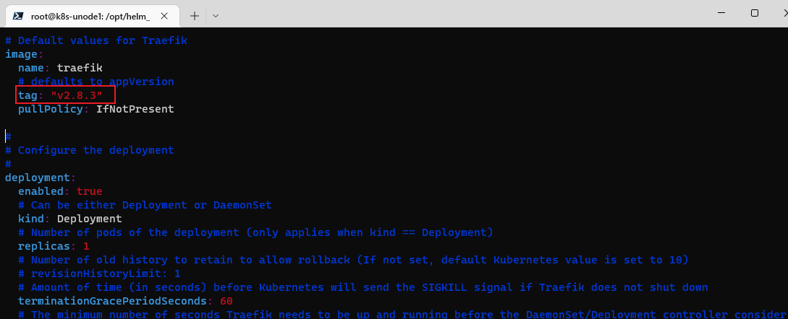
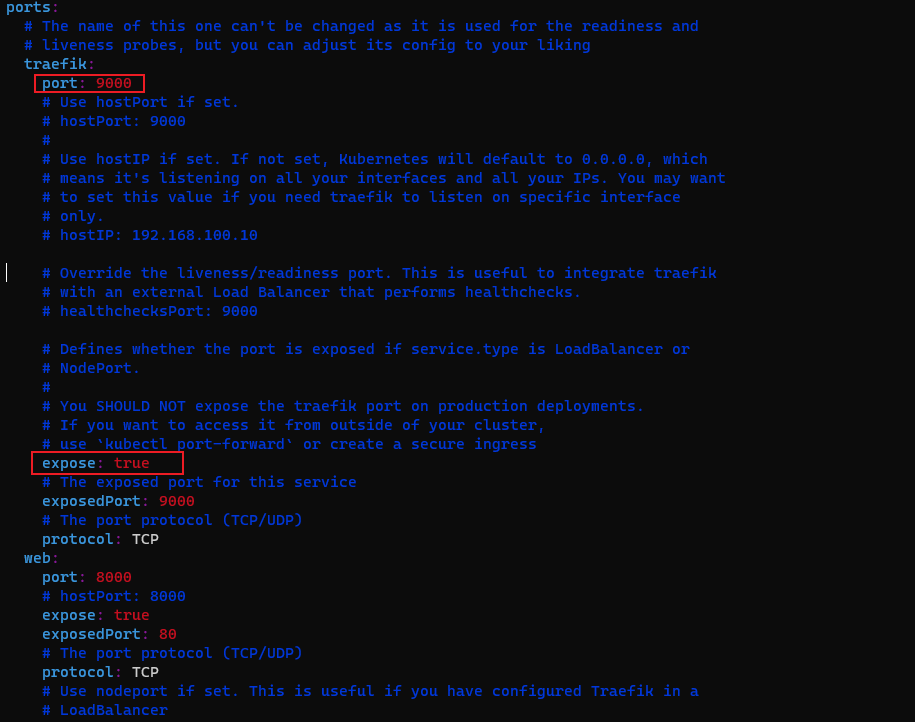
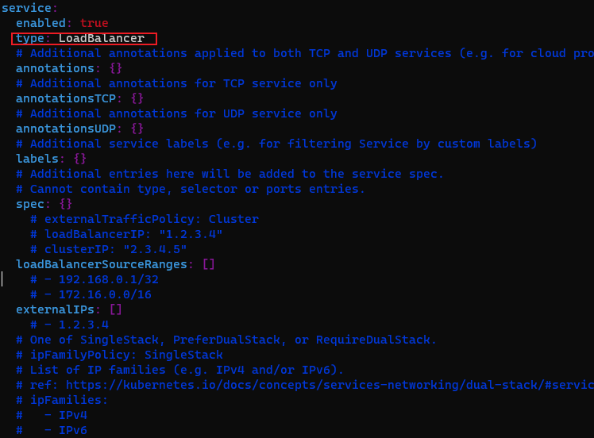
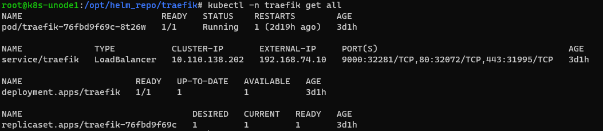
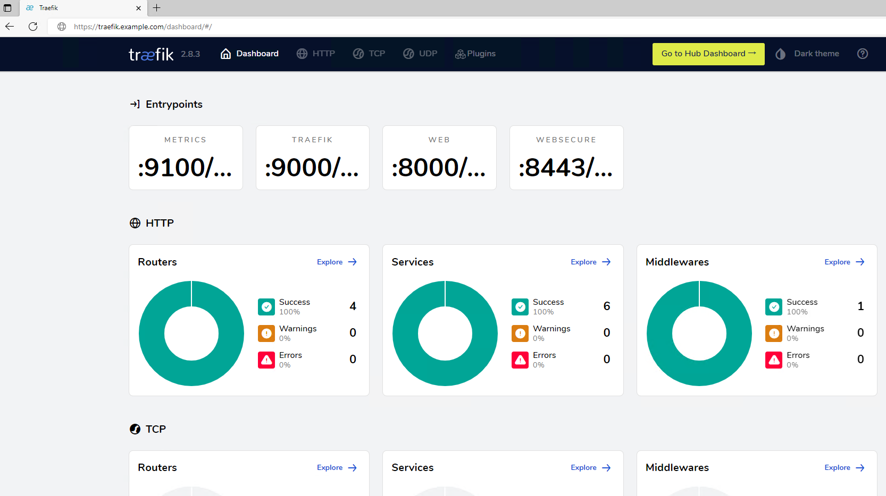

## kubernetes-traefik的安装和部署

Traefik 是一个出色的 Kubernetes 集群入口控制器，允许您拥有一个 L7 入口路由引擎来将入口流量路由到您的 Kubernetes 托管服务。在本教程中，我们将研究 Traefik 的 安装和配置，以了解如何使用 MetalLB 作为负载均衡器；并使用 helm 安装 Traefik。


## Traefik Helm 安装的先决条件

您可以使用 Node Port 来配置 Traefik。但是，NodePort 管理起来很麻烦，而且即使在实验室环境中也不能很好地扩展。

我们可以选择使用MetalLB；请查看我关于[Kubernetes 安装 MetalLB 负载平衡器](https://www.toutiao.com/article/7132054018540831239/)主题的帖子，了解如何轻松运行 MetalLB 并创建简单的配置来分配 Kubernetes 服务的 IP 地址。使用该帖子，您将 MetalLB 配置为 Kubernetes 集群的负载均衡器，以便您可以为 Kubernetes 服务映射 IP 地址。

除了运行 MetalLB 之外，我使用kubeadm初始化了标准的 3 节点 Kubernetes 集群，并且已经安装了helm。

## Traefik Helm 安装和配置

在大多数情况下，我可在官方文档中找到的使用 Helm 部署 Traefik 的步骤进行操作：[Traefik 安装文档 – Traefik](https://doc.traefik.io/traefik/getting-started/install-traefik/)。

这些步骤让您添加 Helm 存储库、更新存储库，然后安装 helm chart。

```bash
$ helm repo add traefik https://helm.traefik.io/traefik
$ helm repo update
$ helm show values traefik/traefik > /tmp/traefik-chart.yaml
```

自定义配置







现在，我们可以使用以下语法通过 values 文件实际部署 Traefik  chart：

```bash
$ helm install traefik traefik/traefik --values ./traefik-chart.yaml -n traefik --create-namespace
```

您可以使用以下命令列出 helm 部署状态：

```bash
$ helm list -n traefik
```

现在，如果您检查 Traefik 命名空间，使用**get all**，您将看到我们已正确获取 LoadBalancer IP 地址并公开了正确的端口。

```bash
$ kubectl -n traefik get all
```



## 配置traefik dashboard

1. 将证书上传到服务器，并创建对应的secret

```bash
kubectl create secret tls example.com.default --key STAR_example_com.key --cert STAR_example_com_integrated.crt
```

1. 配置Traefik中间件BasicAuth; 设置dashboard访问权限

```bash
#配置secret，密码必须是一个 MD5，SHA1 或者 BCrypt 的哈希值
$ apt install apache2-utils -y
$ htpasswd -nb admin admin123
admin:$apr1$RuTEI9dp$GrpMJ.cdHY1pG1N.dlaIu1
#配置authsecre.yaml文件
$ vim traefik-authsecret.yaml
apiVersion: v1
kind: Secret
metadata:
  name: traefik-authsecret
  namespace: traefik
type: Opaque
stringData:
  users: admin:$apr1$RuTEI9dp$GrpMJ.cdHY1pG1N.dlaIu1
```

`traefik-basic-auth.yaml` 内容如下：

```yaml
apiVersion: traefik.containo.us/v1alpha1
kind: Middleware
metadata:
  name: traefik-basic-auth
  namespace: traefik
spec:
  basicAuth:
    secret: traefik-authsecret
```

1. 配置`Ingress Route`

```yaml
apiVersion: traefik.containo.us/v1alpha1
kind: IngressRoute
metadata:
  name: traefik-dashboard-route
  namespace: traefik
spec:
  entryPoints:
    - websecure
  tls:
    secretName: aixbx.com.default
  routes:
    - match: Host(`traefik.aixbx.com`)
      kind: Rule
      services:
        - name: traefik
          port: 9000
      middlewares:
        - name: traefik-basic-auth
```

1. 应用配置

```yaml
kubectl apply -f traefik-authsecret.yaml
kubectl apply -f traefik-basic-auth.yaml
kubectl apply -f traefik-dashboard-ingress-route.yaml
```

## 访问面板

域名后加`/dashboard/`； 访问打开之后输入用户名和密码。即可完成访问。




参考链接：https://traefik.io/traefik/

​                     https://www.cnblogs.com/hacker-linner/p/13632813.html