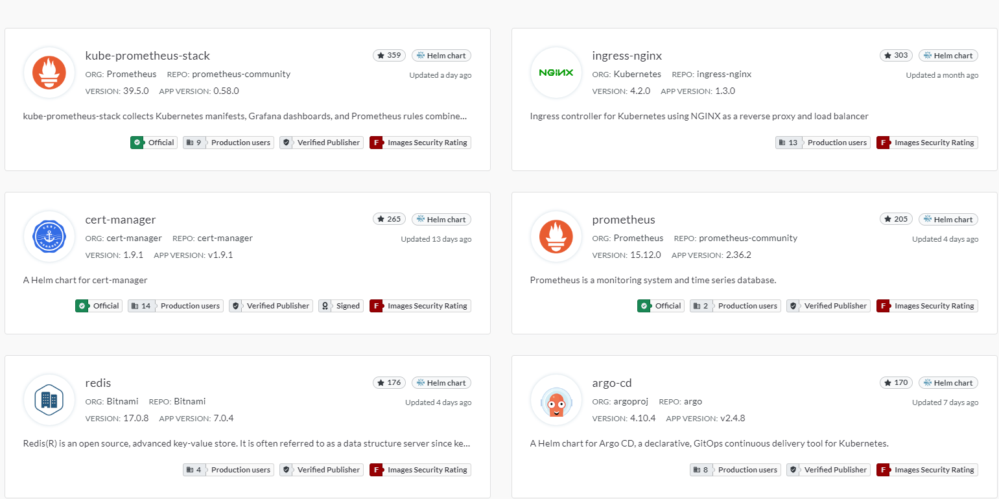
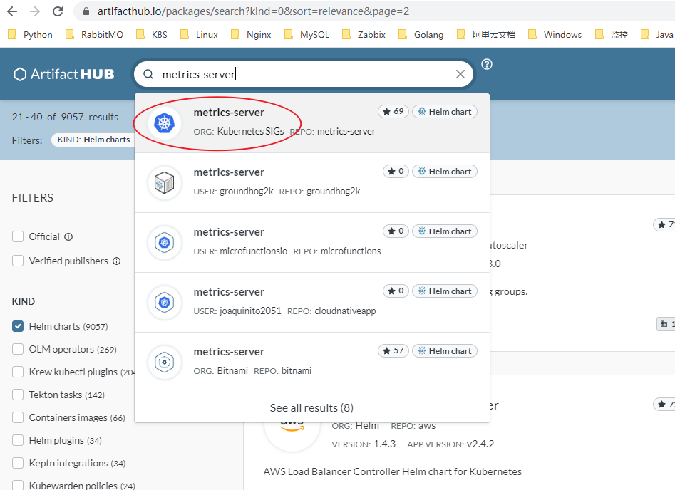
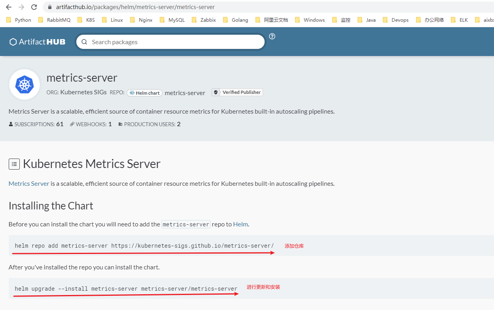

## Kubernetes1.24.3通过helm安装metrics-server

### 安装helm

#### 用二进制版本安装

每个Helm [版本](https://github.com/helm/helm/releases)都提供了各种操作系统的二进制版本，这些版本可以手动下载和安装。

1. 下载 [需要的版本](https://github.com/helm/helm/releases)
2. 解压(`tar -zxvf helm-v3.0.0-linux-amd64.tar.gz`)
3. 在解压目中找到`helm`程序，移动到需要的目录中(`mv linux-amd64/helm /usr/local/bin/helm`)

然后就可以执行客户端程序并 [添加稳定仓库](https://helm.sh/zh/docs/intro/quickstart/#初始化): `helm help`.

#### 使用脚本安装

Helm现在有个安装脚本可以自动拉取最新的Helm版本并在 [本地安装](https://raw.githubusercontent.com/helm/helm/main/scripts/get-helm-3)。

您可以获取这个脚本并在本地执行。它良好的文档会让您在执行之前知道脚本都做了什么。

```bash
$ curl -fsSL -o get_helm.sh https://raw.githubusercontent.com/helm/helm/main/scripts/get-helm-3
$ chmod 700 get_helm.sh
$ ./get_helm.sh
$ helm help
```

如果想直接执行安装，运行`curl https://raw.githubusercontent.com/helm/helm/main/scripts/get-helm-3 | bash`

### 相关概念

##### *Chart*

*hart* 代表着 Helm 包。它包含在 Kubernetes 集群内部运行应用程序，工具或服务所需的所有资源定义。你可以把它看作是 Homebrew formula，Apt dpkg，或 Yum RPM 在Kubernetes 中的等价物.

##### *Repository*

*Repository（仓库）* 是用来存放和共享 charts 的地方。它就像 Perl 的 [CPAN 档案库网络](https://www.cpan.org/) 或是 Fedora 的 [软件包仓库](https://src.fedoraproject.org/)，只不过它是供 Kubernetes 包所使用的。


##### *Release* 

*Release* 是运行在 Kubernetes 集群中的 chart 的实例。一个 chart 通常可以在同一个集群中安装多次。每一次安装都会创建一个新的 *release*。以 MySQL chart为例，如果你想在你的集群中运行两个数据库，你可以安装该chart两次。每一个数据库都会拥有它自己的 *release* 和 *release name*。


Helm 安装 *charts* 到 Kubernetes 集群中，每次安装都会创建一个新的 *release*。你可以在 Helm 的 chart *repositories* 中寻找新的 chart。


当您已经安装好了Helm之后，您可以添加一个chart 仓库。从 [Artifact Hub](https://artifacthub.io/packages/search?kind=0)中查找有效的Helm chart仓库.



当然你也可以使用 helm search查找 Charts

- `helm search hub` 从 [Artifact Hub](https://artifacthub.io/) 中查找并列出 helm charts。 Artifact Hub中存放了大量不同的仓库。
- `helm search repo` 从你添加（使用 `helm repo add`）到本地 helm 客户端中的仓库中进行查找。该命令基于本地数据进行搜索，无需连接互联网。


### 通过helm安装metrics-server

搜索`metrics-server`




搜索完成之后,就可以看到安装说明,如下图所示,页面上也会详细的说明配置参数.



这里由于我们无法直接下载到镜像`k8s.gcr.io/metrics-server/metrics-server`; 所以我们需要先将仓库fetch下来之后,进行values值的修改.

```bash
#添加仓库
$ helm repo add metrics-server https://kubernetes-sigs.github.io/metrics-server/
$ helm search repo -l metrics-server
NAME                            CHART VERSION   APP VERSION     DESCRIPTION
metrics-server/metrics-server   3.8.2           0.6.1           Metrics Server is a scalable, efficient source ...
metrics-server/metrics-server   3.8.1           0.6.1           Metrics Server is a scalable, efficient source ...
metrics-server/metrics-server   3.8.0           0.6.0           Metrics Server is a scalable, efficient source ...
metrics-server/metrics-server   3.7.0           0.5.2           Metrics Server is a scalable, efficient source ...
metrics-server/metrics-server   3.6.0           0.5.1           Metrics Server is a scalable, efficient source ...
metrics-server/metrics-server   3.5.0           0.5.0           Metrics Server is a scalable, efficient source ..
# fetch指定仓库,然后进行values值的修改
$ helm fetch metrics-server/metrics-server --version=3.8.2
$ tar zxvf metrics-server-3.8.2.tgz
```

这里注意,如果我们无法下载到metrics-server的tgz包,就是我们无法访问GitHub,这里我们可以通过修改HOSTS文件解决;然后再进行fetch.

参考链接地址:  https://zhuanlan.zhihu.com/p/272741266

```bash
$ vim /etc/hosts

# GitHub Start 
140.82.113.3      github.com
140.82.114.20     gist.github.com
151.101.184.133    assets-cdn.github.com
151.101.184.133    raw.githubusercontent.com
151.101.184.133    gist.githubusercontent.com
151.101.184.133    cloud.githubusercontent.com
151.101.184.133    camo.githubusercontent.com
151.101.184.133    avatars0.githubusercontent.com
199.232.68.133     avatars0.githubusercontent.com
199.232.28.133     avatars1.githubusercontent.com
151.101.184.133    avatars1.githubusercontent.com
151.101.184.133    avatars2.githubusercontent.com
199.232.28.133     avatars2.githubusercontent.com
151.101.184.133    avatars3.githubusercontent.com
199.232.68.133     avatars3.githubusercontent.com
151.101.184.133    avatars4.githubusercontent.com
199.232.68.133     avatars4.githubusercontent.com
151.101.184.133    avatars5.githubusercontent.com
199.232.68.133     avatars5.githubusercontent.com
151.101.184.133    avatars6.githubusercontent.com
199.232.68.133     avatars6.githubusercontent.com
151.101.184.133    avatars7.githubusercontent.com
199.232.68.133     avatars7.githubusercontent.com
151.101.184.133    avatars8.githubusercontent.com
199.232.68.133     avatars8.githubusercontent.com
# GitHub End
```


打开values文件

```bash
$ vim metrics-server/values.yaml
```

修改内容如下:

```yaml
image:
  repository: docker.io/bitnami/metrics-server  #这里指定dockerhub 我们可以下载到
  # Overrides the image tag whose default is v{{ .Chart.AppVersion }}
  tag: "0.6.1"  #这里填写镜像的tag,如上所示的0.6.1, 大家也可以去hub.docker.com 进行镜像地址确认
  pullPolicy: IfNotPresent
```

配置``--kubelet-insecure-tls`参数跳过证书校验`

具体要求,可参考[metrics的GitHub地址.](https://github.com/kubernetes-sigs/metrics-server)

Metrics Server 对集群和网络配置有特定要求。这些要求并不是所有集群发行版的默认要求。在使用 Metrics Server 之前，请确保您的集群分布支持这些要求：

- kube-apiserver 必须[启用聚合层](https://kubernetes.io/docs/tasks/access-kubernetes-api/configure-aggregation-layer/)。
- 节点必须启用 Webhook[身份验证和授权](https://kubernetes.io/docs/reference/access-authn-authz/kubelet-authn-authz/)。
- Kubelet 证书需要由集群证书颁发机构签名（或通过传递`--kubelet-insecure-tls`给 Metrics Server 来禁用证书验证）
- 容器运行时必须实现[容器度量 RPC](https://github.com/kubernetes/community/blob/master/contributors/devel/sig-node/cri-container-stats.md)（或具有[cAdvisor](https://github.com/google/cadvisor)支持）
- 网络应支持以下通信：
  - 控制平面到 Metrics Server。控制平面节点需要到达 Metrics Server 的 pod IP 和端口 10250（或节点 IP 和自定义端口，如果`hostNetwork`启用）。阅读有关[控制平面到节点通信的](https://kubernetes.io/docs/concepts/architecture/control-plane-node-communication/#control-plane-to-node)更多信息。
  - Metrics Server 到所有节点上的 Kubelet。Metrics 服务器需要到达节点地址和 Kubelet 端口。地址和端口在 Kubelet 中配置并作为 Node 对象的一部分发布。字段中的地址`.status.addresses`和端口`.status.daemonEndpoints.kubeletEndpoint.port`（默认为 10250）。Metrics Server 将根据`kubelet-preferred-address-types`命令行标志提供的列表（`InternalIP,ExternalIP,Hostname`清单中的默认值）选择第一个节点地址。


```yaml
defaultArgs:
  - --cert-dir=/tmp
  - --kubelet-preferred-address-types=InternalIP,ExternalIP,Hostname
  - --kubelet-use-node-status-port
  - --metric-resolution=15s


#这行进行修改
args:
- --kubelet-insecure-tls
```

进行安装

```bash
$ kubectl create ns metrics-server
$ helm install metrics-server -n metrics-server ./metrics-server
```

### 进行验证

```bash
$ kubectl -n metrics-server get pod -owide
NAME                              READY   STATUS    RESTARTS   AGE   IP           NODE         NOMINATED NODE   READINESS GATES
metrics-server-56c6866684-w6n9b   1/1     Running   0          49m   10.244.2.5   k8s-unode3   <none>           <none>
$ kubectl top node
NAME         CPU(cores)   CPU%   MEMORY(bytes)   MEMORY%
k8s-unode1   136m         6%     1800Mi          47%
k8s-unode2   46m          2%     888Mi           23%
k8s-unode3   45m          2%     889Mi           23%
k8s-unode4   40m          2%     785Mi           20%
```

