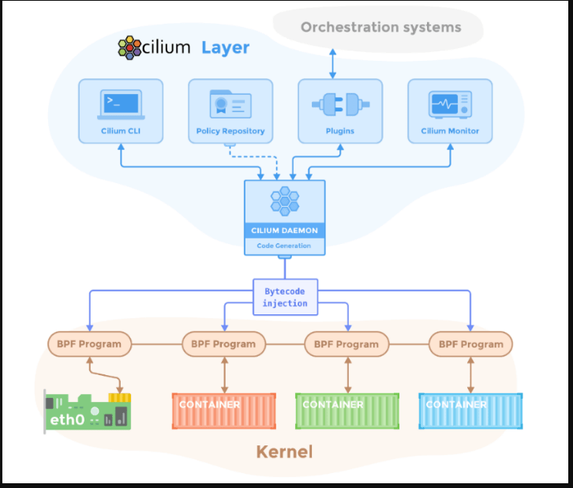
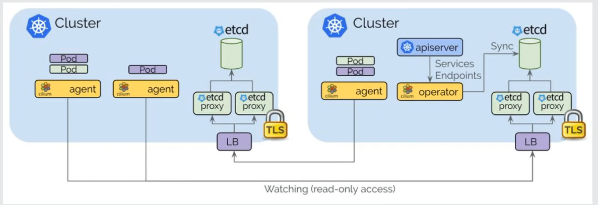
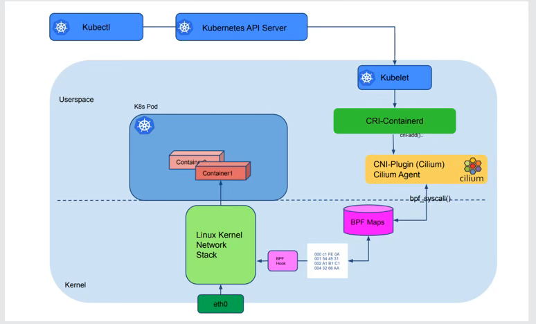

# cilium 概述

## cilium agent

1. 以node为单位，采用DaemonSet方式部署
2. 通过CNI插件与CRI和Kubernete叫
3. 采用IPAM地址分配方式
4. 生产eBPF程序，编译字节码，Attach到内核

## cilium operator

多k8s集群的通信是通过cilium operator来实现的。

agent 对应的管理单位是 k8s的node节点。

operator 对应的管理单位是k8s整个集群。

由上图可以看出`cilium agent`通过相互watch对端etcd集群中的网络数据，从而获取信息进行通信。

## cilium控制平面

如下图所示，创建一个pod的完整流程。

`kubectl`提交创建请求到`kubernetes api server`,然后`API Server`会将信息写入到集群的etcd当中；`kubelet`通过watch机制获取`API Server`的信息，然后调用`CRI-Containerd`,创建对应的`POD`,此时会创建容器的网络, 然后会调用网络插件`CNI-Plugin(cilium)`; 然后插件会调用`cilium agent`; 然后会调用`BPF Maps`,然后转换成二进制字节码，传给内网网络栈。从而完成容器网络的创建。